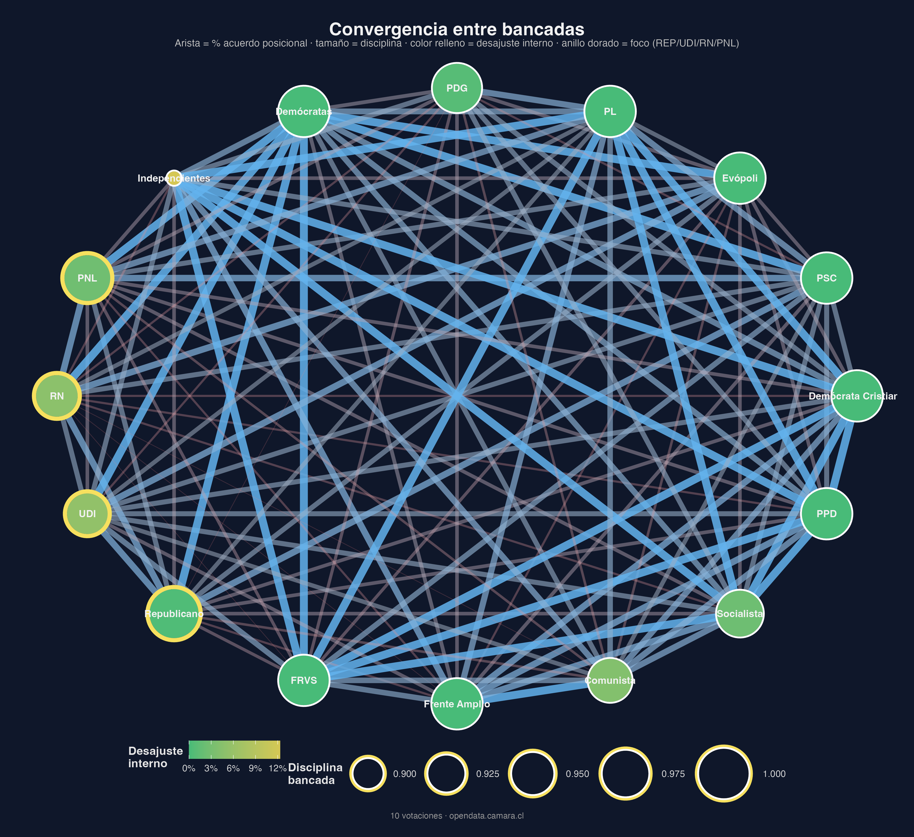

# Neogremialismo Data Collection Pipeline

## Contexto del proyecto

Programa de investigación Fondecyt sobre **neogremialismo** en Chile. Estudia cómo la derecha chilena contemporánea (Partido Republicano, UDI, PNL) articula políticas de mercado con una concepción conservadora del orden social, la autoridad y los valores.

## Stack técnico

-   Python 3.11+
-   requests, beautifulsoup4, lxml, zeep (SOAP)
-   pandas para procesamiento
-   sqlite3 para almacenamiento local
