```{r}
#| label: setup
suppressPackageStartupMessages({
  library(tidyverse)
  library(arrow)
  library(knitr)
})
root <- if (dir.exists("data/raw")) normalizePath(".") else normalizePath("..")
canon <- file.path(root, "data/processed/canon")
figs <- file.path(root, "outputs/imagenes")
source(file.path(root, "analysis/_helpers.R"), local = FALSE)
source(file.path(root, "analysis/_diccionario.R"), local = FALSE)

hip <- read_csv(file.path(canon, "resultados_hipotesis.csv"), show_col_types = FALSE)
puente <- read_csv(file.path(canon, "puente_eventos.csv"), show_col_types = FALSE)
proyectos <- read_parquet(file.path(canon, "proyectos.parquet"))
votaciones <- read_parquet(file.path(canon, "votaciones.parquet")) |>
  mutate(fecha = as.Date(fecha))
bcall <- read_csv(file.path(canon, "bcall_2026.csv"), show_col_types = FALSE) |>
  mutate(partido = toupper(partido))
bloque_bcall <- bcall |> filter(partido %in% BLOQUE_DERECHA)

prensa <- read_parquet(file.path(canon, "prensa.parquet")) |>
  mutate(fecha = as.Date(fecha))
prensa <- annotate_nombra_derecha(prensa)
prensa <- annotate_repertorios(prensa)
prensa_der <- prensa |> filter(nombra_derecha)

man <- read_csv(file.path(canon, "manifest.csv"), show_col_types = FALSE)
al_kast <- read_csv(file.path(canon, "discursos_kast_alusiones.csv"), show_col_types = FALSE)
prensa_kk <- read_csv(
  file.path(root, "data/processed/prensa/prensa_kast_kaiser_anio.csv"),
  show_col_types = FALSE
)
n_kast_disc <- unique(al_kast$n_discursos)[[1]]
n_prensa_unida <- sum(prensa_kk$n)
fmt_n <- function(x) format(as.integer(x), big.mark = ".", scientific = FALSE)

pct_cod <- function(df) {
  cols <- names(df)[grepl("^r_[ACD]", names(df))]
  df |>
    summarise(across(all_of(cols), ~ 100 * mean(.x, na.rm = TRUE))) |>
    pivot_longer(everything(), names_to = "col", values_to = "pct") |>
    mutate(codigo = sub("^r_", "", col))
}
rep_all <- pct_cod(prensa) |> mutate(subset = "corpus total")
rep_nom <- pct_cod(prensa_der) |> mutate(subset = "cuando nombra a la derecha")
rep_cmp <- bind_rows(rep_all, rep_nom) |>
  left_join(DICCIONARIO |> select(codigo, etiqueta, familia), by = "codigo")
```

# Pregunta {background-color="#0B3D91"}

## Qué se está contrastando

El **neogremialismo** no es solo “votar a la derecha”. Es si el gobierno Kast articula **mercado + orden/valores** (H1), absorbe o no repertorios **radicales** (H2), se distingue del **PNL** en el hemiciclo (H3) y **omite cuerpos intermedios** en la agenda formal (H4).

Cuatro pistas empíricas, siempre leídas contra las hipótesis:

| Pista | Pregunta | Fuente |
|-------|----------|--------|
| **B-Call** | ¿Dónde está cada diputado? ¿Quién es outlier *entre* y *dentro* de partidos? | roll-calls → d1 ideología, d2 volatilidad |
| **Boletines** | ¿Qué presentó Kast (`-05`)? ¿Qué está **promulgado**? ¿Cuánto varía el voto? | Cámara + BCN |
| **Discursos** | ¿Qué nombra Kast? ¿A quién alude? ¿Dice Kaiser? | Presidencia, cuerpo oral |
| **Prensa** | ¿Qué se dice **cuando se nombra** a la derecha? | 2015–2026 + diccionario A–D |

## Cuatro hipótesis

| | Hipótesis | Se sostiene si… | Se refuta si… |
|---|-----------|-----------------|---------------|
| **H1** | Racionalidad normativa: mercado *con* orden/familia | Co-ocurren A5 + A2/A3 | El discurso es solo técnico (LyD) o solo libertario (PNL) |
| **H2** | Radicalización: núcleo gremialista + C (seguridad, migración, cultura) | C aparece *junto* a A, no en su lugar | C reemplaza a A, o solo vive en redes |
| **H3** | REP ≠ PNL en votos | Divergencia por materia (Rice, acuerdo) | Votan siempre igual |
| **H4** | Selección liberal-individual | Agenda `-05` sin A1 (cuerpos intermedios) | Hay iniciativas comunitaristas sistemáticas |

## Diccionario (regla: co-ocurrencia)

El indicador no es una palabra suelta. Es **qué se junta** en la misma nota, discurso o boletín.

| Familia | Códigos | Ahora también captura… |
|---------|---------|------------------------|
| **A** gremialista | A1…A5 | A1: sociedad civil, tejido social, asociatividad |
| **C** radical | C1…C5 | C3 enfoque de género / woke; C4 casta / globalismo; C5 hispanidad / identidad |
| **D** libertario | D1 | Estado mínimo, PNL |
| **Nombrar** | filtro, no código | “la derecha”, oficialismo, gobierno Kast, bancadas, partidos |

Guía: **A5+A3 / A5+A2 → H1** · **A5+C → H2 híbrido** · **C sin A → radical puro** · **A5 sin A1 → H4**.

# Datos {background-color="#0B3D91"}

## Qué hay

```{r}
#| label: inventario
tibble(
  Pieza = c("Prensa", "Discursos Kast", "Votaciones", "Votos", "B-Call 2026", "Proyectos"),
  N = c(
    fmt_n(n_prensa_unida),
    fmt_n(n_kast_disc),
    fmt_n(man$n[man$tabla == "votaciones"]),
    fmt_n(man$n[man$tabla == "votos"]),
    fmt_n(nrow(bcall)),
    fmt_n(man$n[man$tabla == "proyectos"])
  ),
  Ventana = c(
    "2015–2026",
    "11 mar – 30 jul 2026",
    "hasta 22-jul-2026",
    "las mismas",
    "período 2026",
    "ingreso"
  )
) |> kable()
```

Una prensa. 145 discursos de gobierno (el scrape tiene 248, con Boric). Sin redes; votos congelados el 22-jul.

## Prensa, por año

```{r}
#| label: unida-anio
izq <- prensa_kk |> filter(year <= 2020)
der <- prensa_kk |> filter(year >= 2021)
tibble(
  Año = izq$year, Notas = fmt_n(izq$n),
  `Año ` = der$year, `Notas ` = fmt_n(der$n)
) |> kable()
```

**2024** 115 mil · **2025** 54 mil · **2026** 39 mil. La baja no es “menos política”: es cobertura.

## Tendencia: volumen

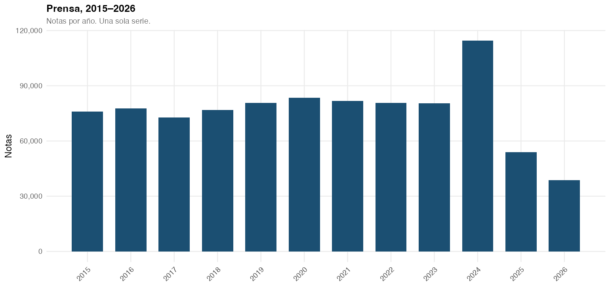{width="88%"}

Serie única, 2015–2026. Pico 2024; 2025–26 el recorte es más chico.

## Tendencia: Kast vs Kaiser

{width="90%"}

2021 y 2025 = ciclos. **2026: Kast es el 10 % de los titulares**; Kaiser se apaga (0,72 % → 0,23 %).

# B-Call: mapa y outliers {background-color="#0B3D91"}

## Cómo leer el gráfico (30 segundos)

B-Call (Toro-Maureira et al. 2025) resume **todos los votos** de cada diputado en dos números. Pivot: **José Carlos Meza** (REP) → d1 positivo = más cerca de la derecha.

| Eje | Nombre técnico | En cristiano |
|-----|----------------|--------------|
| **d1** (eje X) | posición ideológica | Izquierda ← 0 → derecha. El *dónde* se sienta en el hemiciclo virtual. |
| **d2** (eje Y) | volatilidad | **Bajo** = vota coherente con su posición. **Alto** = a veces vota como si fuera otro. Es la fisura. |

Outlier **entre partidos**: RN más al centro (d1 ~0.64) vs REP/PNL a la derecha (d1 ~0.74).  
Outlier **dentro del partido**: misma d1, **d2 alta** (Hube, Lilayu, Karlezi).

## Toda la Cámara, 2026

{width="88%"}

La fisura de H3 **no** es una nube REP y otra PNL. Es una sola nube derecha, con **altura** (d2) distinta.

## Zoom: solo REP · UDI · RN · PNL

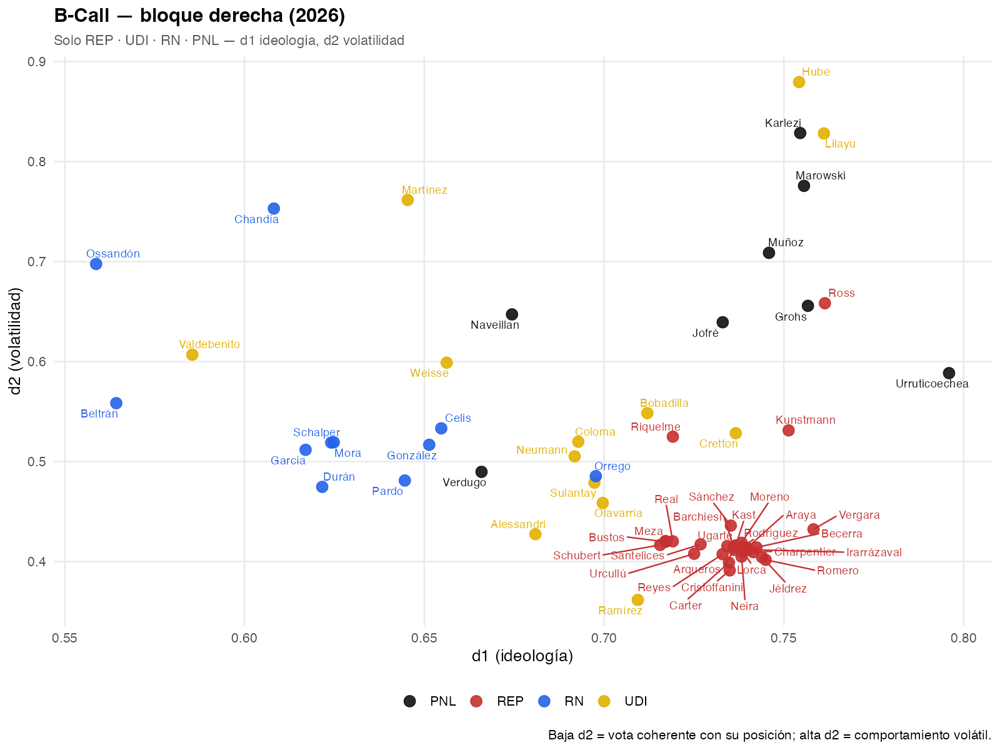{width="88%"}

**Entre partidos:** REP casi no se mueve (d1 0.75 ± 0.01; d2 0.43). RN está más al centro (d1 0.64). PNL tan a la derecha como REP, pero **más volátil** (d2 0.64). UDI es el que más se abre en d2 (0.35–0.88).

## Números: cohesión entre partidos

```{r}
#| label: bcall-entre
bloque_bcall |>
  group_by(Partido = partido) |>
  summarise(
    n = n(),
    `d1 medio (ideología)` = round(mean(d1), 3),
    `sd d1` = round(sd(d1), 3),
    `d2 medio (volatilidad)` = round(mean(d2), 3),
    `sd d2` = round(sd(d2), 3),
    .groups = "drop"
  ) |>
  arrange(desc(`d1 medio (ideología)`)) |>
  kable()
```

Lectura H3: **PNL no es un polo distinto de REP en d1**. La diferencia está en **d2** (PNL y UDI más volátiles) y en RN más moderado.

## Dentro de cada partido: los tres más volátiles

```{r}
#| label: bcall-dentro
bloque_bcall |>
  group_by(partido) |>
  slice_max(d2, n = 3) |>
  transmute(
    Partido = partido,
    Diputado = legislator,
    d1 = round(d1, 3),
    d2 = round(d2, 3)
  ) |>
  kable()
```

- **UDI:** Hube, Lilayu, Martínez — la fisura más alta del bloque.  
- **PNL:** Karlezi, Marowski, Muñoz — volatilidad de bancada, no de un solo “Kaiser”.  
- **REP:** Ross (único que se sale del núcleo); el resto está pegado a Kast/Meza.  
- **RN:** Ossandón, Chandía, Beltrán — más al *centro* (d1 baja) que volátiles extremos.

## Ranking de volatilidad (d2)

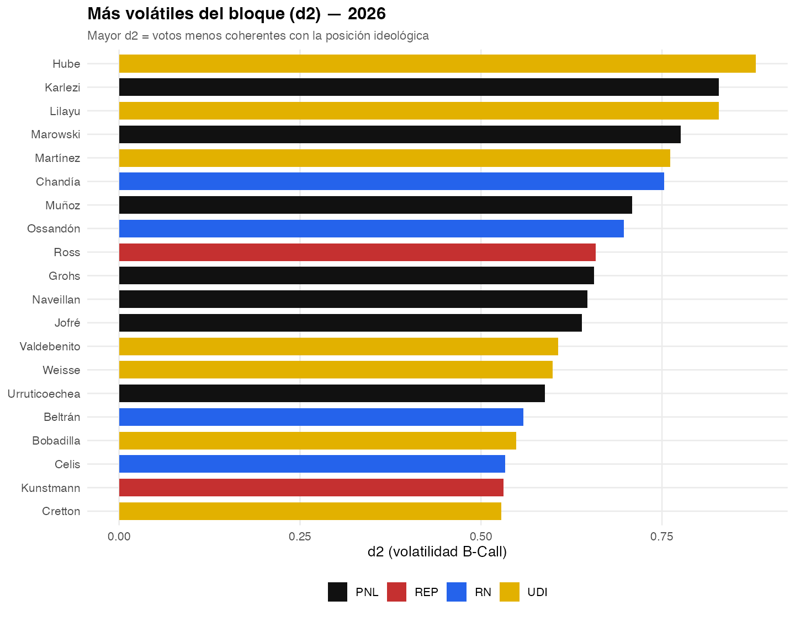{width="82%"}

H3 se juega aquí: si REP y PNL fueran doctrinas distintas, veríamos **dos nubes en d1**. Vemos **una nube** y una cola de nombres en d2.

## Densidades: ancho = disciplina

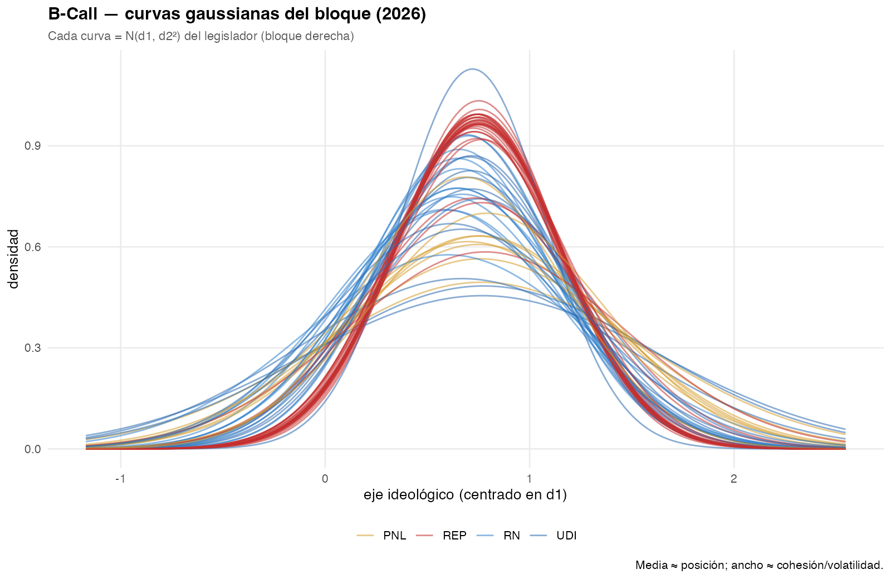{width="88%"}

Curvas **angostas y superpuestas** (REP) = disciplina. Curvas **anchas** (UDI/PNL altos) = el mismo diputado a veces vota como si no estuviera en su sitio.

## Cómo se llega a esa foto (GIF)

Cada frame suma un mes de votaciones desde el **11-mar-2026**. Las rutas son la trayectoria acumulada. El núcleo rojo se compacta; los puntos que suben son los outliers de d2.

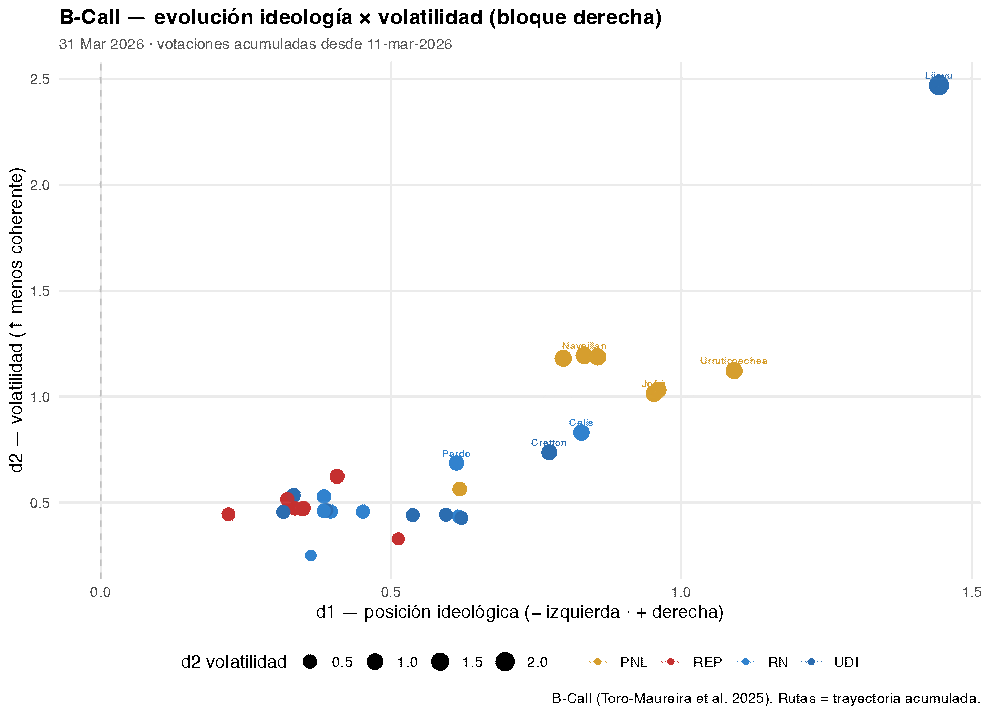{width="78%"}

## Datos (corte)

Votaciones hasta **2026-07-22**. Gobierno Kast desde **2026-03-11**.

```{r}
#| label: n-datos
tibble(
  Pieza = c("Prensa 2026 (filtro Kast)", "Discursos Kast", "Votaciones",
            "Votos", "Proyectos", "Mensajes `-05`"),
  N = c(
    fmt_n(nrow(prensa)), fmt_n(n_kast_disc), fmt_n(nrow(votaciones)),
    fmt_n(man$n[man$tabla == "votos"]), fmt_n(nrow(proyectos)),
    fmt_n(sum(proyectos$es_mensaje_ejecutivo %in% TRUE))
  )
) |> kable()
```

Bloque analizado: **REP 28 · UDI 13 · RN 11 · PNL 8** diputados.

# Boletines: presentado vs promulgado {background-color="#0B3D91"}

## Agenda formal: mensajes `-05`

Los boletines **`-05`** son mensajes del Presidente: lo que el gobierno *elige* presentar. En el canon hay **42** (varios de Boric). Bajo Kast (**desde 11-mar-2026**) solo **tres**.

**H4:** A1 (subsidiariedad / gremios / sociedad civil) = **0 %** de esos mensajes.

## Qué presentó Kast (y cuánto se votó)

| Boletín | Proyecto | Ingreso | Votos Cámara | Estado BCN |
|---------|----------|---------|--------------|------------|
| **18137-05** | Contener precio del **kerosene** (emergencia energética) | 24-mar | 9 | `candidato_bajo` (no hay ley matcheada) |
| **18216-05** | **PDL** — reconstrucción y desarrollo económico y social | 22-abr | **117** | `candidato_bajo` |
| **18296-05** | Mayor **endeudamiento** 2026 | 3-jun | **3** | **`norma_publicada`** (Ley Chile 1225909) |

**Variación:** el PDL concentra casi toda la energía legislativa (117 votaciones, cohesión plena). El endeudamiento son 3 votaciones y se **estrella en la sala**. El kerosene es un mensaje corto de precios. Nada de A1.

## ¿Qué hay promulgado?

BCN / Ley Chile, con match fuerte (`norma_publicada`): **8** normas en toda la base — **no** son “las leyes de Kast”. Solo **una** es mensaje `-05` de este gobierno: **18296-05**.

Las otras siete son boletines más viejos o de otras comisiones (armas, inclusión laboral, IMM, tarifa eléctrica, seguridad escolar, permisos…). El PDL (**18216-05**), el más votado, **aún no es ley** en el cruce BCN.

Lectura: “promulgado Kast” ≠ “votado Kast”. Lo que sale en el Diario Oficial es un **subconjunto chico** y sesgado a fiscalidad/seguridad, no a subsidiariedad.

## Watchlist: volumen de votaciones

{width="88%"}

## 18296-05 — lo único `-05` promulgado (y la fisura de sala)

Tres votaciones el **17-jun-2026**:

| ID | Resultado | Sí | No |
|----|-----------|----|----|
| 89178 | Aprobado | 94 | 52 |
| 89179 | Empate 73–73 | 73 | 73 |
| 89180 | Rechazado 72–74 | 72 | 74 |

El bloque derecha entra cohesionado (B-Call: misma nube). El proyecto **varía en el hemiciclo completo**, no entre REP y PNL. Es la fisura gobierno–oposición.

## 18216-05 — PDL: mucho voto, cero promulgación (aún)

117 votaciones; Rice del bloque ~1. **H3:** no hay grieta REP–PNL. **H4:** reconstrucción/desarrollo, no cuerpos intermedios. **H2:** la prensa de la ventana carga ~22 % de C, no A1.

{width="86%"}

## Repertorios *en* los textos de proyecto

{width="88%"}

# Votos y fisuras {background-color="#0B3D91"}

## H3 — cohesión Rice del bloque

Rice = 1 unanimidad, 0 división 50/50. En 2026 (votos a favor/en contra):

| Partido | Rice medio | Votaciones |
|---------|------------|------------|
| **REP** | 0.997 | 768 |
| **PNL** | 0.988 | 735 |
| **UDI** | 0.955 | 790 |
| **RN** | 0.942 | 786 |

{width="78%"}

## H3 — ¿REP se distingue del PNL?

**Acuerdo de moda REP–PNL: 91,8 %** (n = 4 702 votaciones en el canon).

{width="72%"}

**Lectura:** H3 queda **débil**. La distinción doctrinaria (gremialismo vs. libertarismo) **casi no se traduce en votos**. Si existe, hay que buscarla en *indicaciones*, materias específicas o disenso individual — no en el voto de bancada.

## Dónde sí hay fisura: disruptivos (no el partido)

La fisura no es REP vs. PNL. Es **diputados vs. moda del bloque**.

{width="88%"}

Kaiser (PNL, id 1135) es el caso de **disenso personal**, no de bancada. Encaja más con **D** (límite libertario) que con un cisma partidario.

La fisura observable es **individual** (B-Call d2) y, en el endeudamiento, **de sala**. Rice confirma la disciplina de bancada; B-Call dice *quién* se sale.

## Rice mensual REP

{width="88%"}

# Discursos de Kast {background-color="#0B3D91"}

## El recorte

**145** discursos, **11 mar – 30 jul 2026**. Se mide el **cuerpo oral**, no el titular de Presidencia (“S.E. … José Antonio Kast”), que haría “Kast” = 100 %.

Tipo: gira territorial y gestión (regiones, alcaldes, emergencias). No es un corpus de cadena nacional doctrinaria.

## Qué palabras nombra

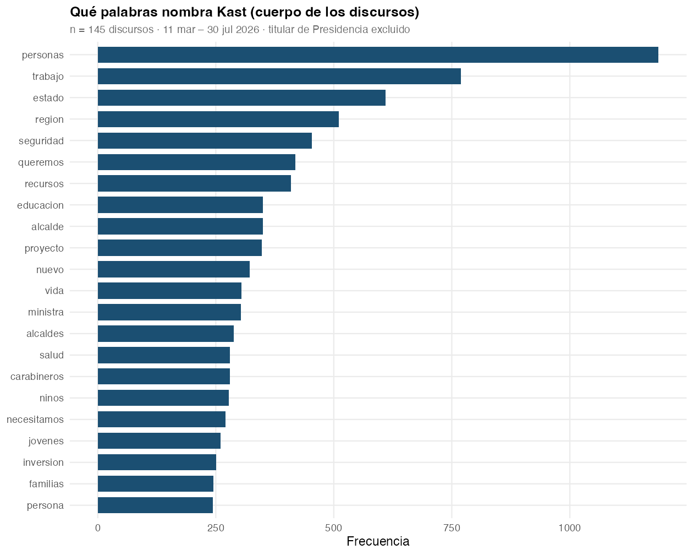{width="78%"}

**Personas, trabajo, Estado, región, seguridad.** Léxico de gira, no de guerra cultural.

## A qué hace alusión

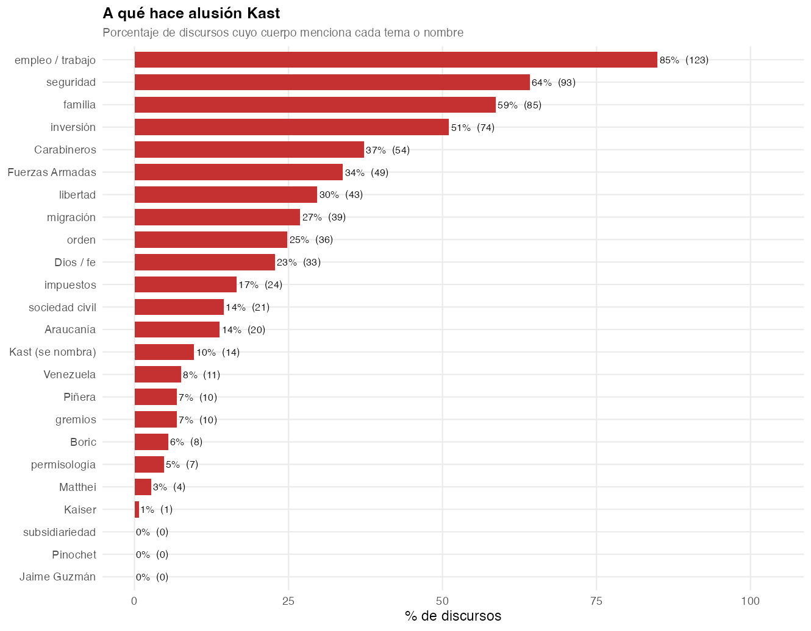{width="80%"}

Seguridad 64 % · familia 59 % · inversión 51 %. **Subsidiariedad, Pinochet, Guzmán = 0 %.** Kaiser = 1 discurso.

## Repertorios en la boca

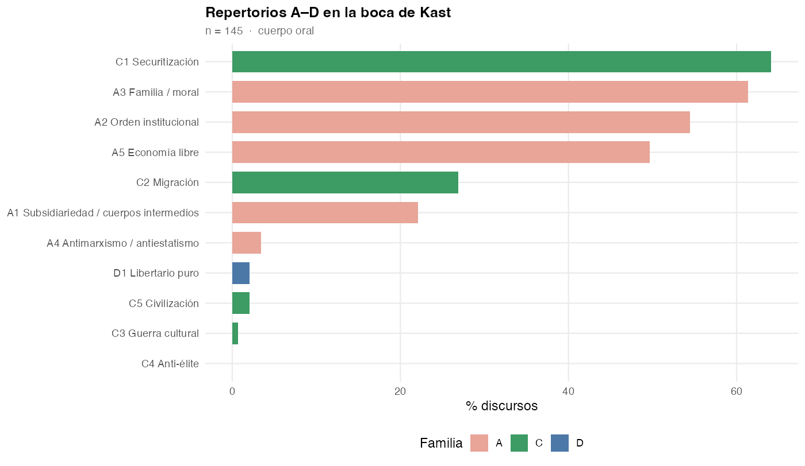{width="86%"}

H1 en la presidencia: C1 + A3 + A2 + A5. C3/C4/D1 casi no existen. A1 (22 %) entra por *sociedad civil / gremios*, no por la palabra subsidiariedad.

## ¿Se nombra? ¿Nombra a Kaiser?

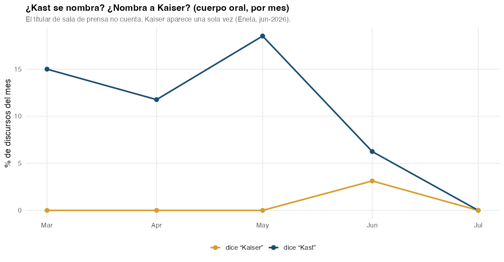{width="88%"}

Autonombrarse: 15 % en marzo → **0 % en julio**. Kaiser: **una vez** (Enela, jun-2026), recuerdo de 2021 con Mulet — no es alianza ni ataque.

# Prensa: qué se dice cuando se nombra a la derecha {background-color="#0B3D91"}

## El recorte (diccionario reforzado)

No usamos el corpus entero (deportes, “seguridad” genérica).  
**Nombra derecha** = Kast, Republicanos, UDI, RN, PNL, Kaiser, LyD, FJG **o** “la derecha”, oficialismo, gobierno Kast, bancada/coalición de derecha.

```{r}
#| label: nombra-n
tibble(
  Universo = c("Prensa 2026", "Cuando nombra a la derecha"),
  Notas = c(fmt_n(nrow(prensa)), fmt_n(nrow(prensa_der))),
  `%` = c(100, round(100 * nrow(prensa_der) / max(nrow(prensa), 1), 1))
) |> kable()
```

Ahí se contrastan H1/H2/H4: *qué repertorio acompaña al nombre*. Misma prensa; el recorte es temático, no de fuente.

## "Libertad" en titulares (2018–26)

En el título es **raro** (~0,3 % cada año). No es el vehículo principal del repertorio A5; A5 se dispara más con *inversión / emprendimiento / propiedad*.

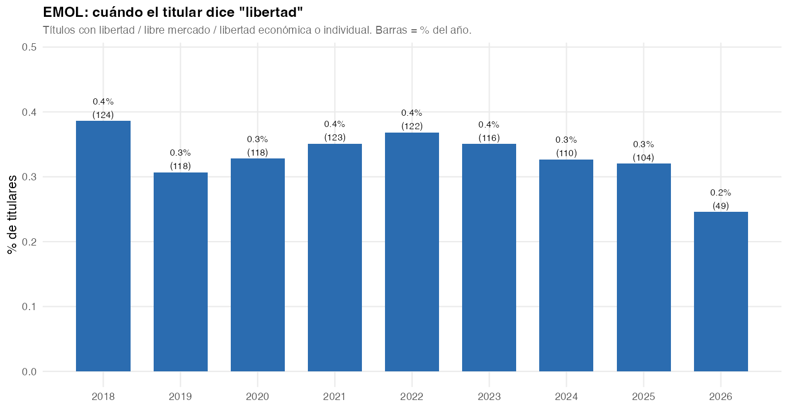{width="88%"}

## Libertad junto a la derecha

{width="88%"}

## Entrevistas (titular)

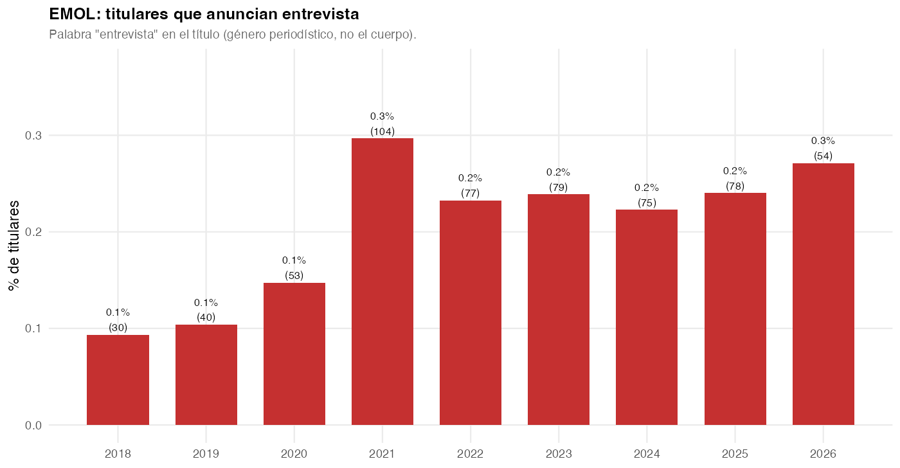{width="88%"}

Pocas en el título. En 2026 el texto completo (abajo) muestra más: el género vive en el cuerpo.

## 2026: libertad y entrevistas en el texto

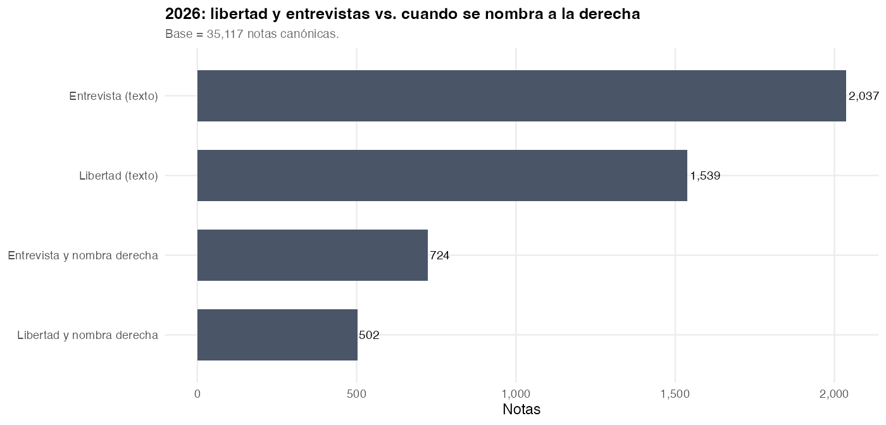{width="90%"}

## Por medio, 2026

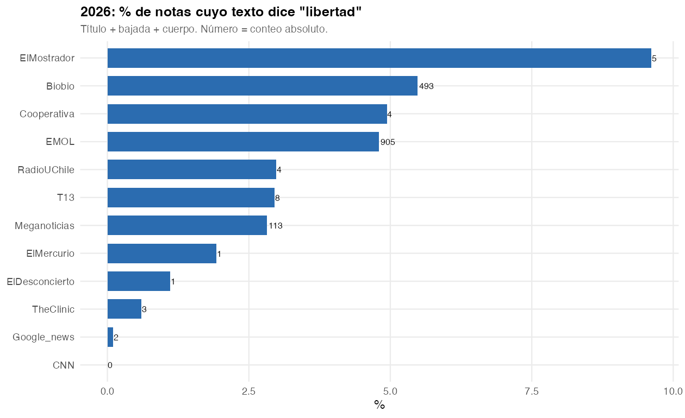{width="85%"}

## Códigos: total vs. cuando se nombra

```{r}
#| label: fig-nombra
#| fig-width: 11
#| fig-height: 5.2
rep_cmp |>
  filter(pct > 0.05) |>
  ggplot(aes(codigo, pct, fill = subset)) +
  geom_col(position = "dodge", width = 0.75) +
  facet_wrap(~familia, scales = "free_x", nrow = 1) +
  labs(
    title = "Repertorios A–D: corpus total vs. notas que nombran a la derecha",
    x = NULL, y = "% de notas", fill = NULL,
    caption = "Diccionario reforzado (A1 sociedad civil; C3–C5 guerra cultural / casta / identidad)."
  ) +
  theme_minimal(base_size = 13) +
  theme(legend.position = "bottom", panel.grid.minor = element_blank())
```

## Hipótesis en ese recorte

```{r}
#| label: nombra-h
co <- function(df) {
  tibble(
    `H1 A5+A3` = 100 * mean(df$co_H1_mercado_familia),
    `H1 A5+A2` = 100 * mean(df$co_H1_mercado_orden),
    `H2 familia C` = 100 * mean(df$r_C1 | df$r_C2 | df$r_C3 | df$r_C4 | df$r_C5),
    `H2 híbrido A5+C` = 100 * mean(df$co_H2_mercado_radical),
    `H4 A5 sin A1` = 100 * mean(df$co_H4_mercado_sin_A1),
    A1 = 100 * mean(df$r_A1)
  )
}
bind_rows(
  co(prensa) |> mutate(subset = "total"),
  co(prensa_der) |> mutate(subset = "nombra derecha")
) |>
  relocate(subset) |>
  mutate(across(where(is.numeric), ~ round(.x, 1))) |>
  kable()
```

Si H1 fuera mediático, A5+A3 debería **subir** al nombrar a la derecha. Si sube C y no A1, H2/H4 ganan en prensa y H1 se queda en discursos.

## Familias A vs C (serie)

{width="88%"}

## Eco de los boletines Kast (±7 días)

```{r}
#| label: puente
puente |>
  transmute(
    Evento = label,
    Fecha = fecha,
    Boletín = boletin,
    `Notas` = n_prensa,
    Discursos = n_discursos,
    Votos = n_votos_boletin,
    `% C` = round(pct_C_prensa, 1)
  ) |>
  kable()
```

{width="82%"}

# Lectura por hipótesis {background-color="#0B3D91"}

## H1 — Articulación normativa {background-color="#f7f3ee"}

**Se sostiene en discursos; se adelgaza en prensa y proyectos.**

- Discursos: seguridad 64 %, familia 59 %, inversión 51 %; **no dice** subsidiariedad ni Guzmán. Un tercio junta mercado con familia/orden (A5+A3 / A5+A2).
- Prensa: esa co-ocurrencia cae a ~3,5 %.
- Proyectos `-05`: el texto de la agenda es fiscal/reconstrucción, no “mercado como moral”.

El neogremialismo aparece como **gramática presidencial**, no como gramática de la ley ni de la noticia.

## H2 — Radicalización {background-color="#f7f3ee"}

**C circula; no coloniza el discurso oficial.**

- Prensa: C1–C3 en ~22 % (canon) y más en corpus “derecha”.
- Discursos: C *sin* A solo 9 %.
- Híbrido A5+C: ~2 % — poca fusión explícita.

No se refuta del todo (C no es solo “redes”), pero **tampoco** se confirma el reemplazo del núcleo gremialista. Es **convivencia asimétrica**: radical en medios, gremialista-selectivo en Presidencia.

## H3 — REP vs PNL {background-color="#f7f3ee"}

**Refutada en d1 (ideología); matizada en d2 (volatilidad).**

- Acuerdo de moda **91,8 %**. Rice REP 0.997 · PNL 0.988.
- B-Call: REP y PNL **misma longitud de d1** (~0.74). RN más al centro (0.64).
- Outliers **dentro**: UDI (Hube, Lilayu), PNL (Karlezi), REP (Ross). No hay dos polos partidarios.

## H4 — Selección liberal-individual {background-color="#f7f3ee"}

**La evidencia más limpia, también en lo promulgado.**

- Kast presentó **3** mensajes `-05`; **1** promulgado (endeudamiento). El PDL (117 votos) **no** es ley en BCN.
- A1 = 0 en esos mensajes. Al nombrar a la derecha en prensa, A1 sigue bajo.

## Mapa de hallazgos

```
                 DISCURSOS              PRENSA                 PROYECTOS / VOTOS
H1  mercado+valores     fuerte            débil (3.5%)           débil (texto fiscal)
H2  repertorio C        bajo (9% C-sin-A) fuerte (~22%)          eco en ventanas PDL
H3  REP ≠ PNL           —                 —                      no: 91.8% acuerdo
H4  sin A1              fuerte (42%)      A1 escaso              0% en 42 mensajes -05
```

**Tesis empírica corta:** el neogremialismo 2026 es **discursivo y selectivo**. La ley y el voto unifican al bloque; la prensa radicaliza el entorno; los boletines `-05` no reconstruyen subsidiariedad.

## Cuatro pistas, una frase cada una

::: incremental
- **B-Call.** Una nube derecha. La fisura es **altura** (d2), no dos partidos. GIF: el núcleo REP se compacta; UDI/PNL suben.
- **Boletines.** Presentó kerosene, PDL y deuda. Promulgó la deuda. El PDL se vota mucho y no sale. Nada de A1.
- **Discursos.** Trabajo, seguridad, familia, inversión. No nombra a Kaiser (1 vez, 2021). No dice subsidiariedad.
- **Prensa.** Cuando *nombra* a la derecha, sube C, no la co-ocurrencia H1. En 2026 Kast es el 10 % de los titulares; Kaiser se apaga.
:::

## Límites (para no sobreinterpretar)

- Votaciones **congeladas en 22-jul-2026** (API Cámara inestable).
- Diccionario = regex (ahora más A1/C3–C5 y filtro “nombra derecha”); Qualmer humano sigue pendiente.
- BCN: 8 normas publicadas; **1** mensaje `-05` Kast. El PDL no está en ese cruce.

## Reproducir

```bash
make analisis                         # ETL + run_todo.R
quarto render docs/presentacion_hallazgos.qmd
```

Figuras: `outputs/imagenes/bcall_*.png` + `bcall_evolucion_derecha.gif`.  
Indicadores: `data/processed/canon/resultados_hipotesis.csv`.  
Método: `docs/PROYECTO.qmd`.
