```{r}
#| label: setup
#| echo: false
suppressPackageStartupMessages({
  library(tidyverse)
  library(arrow)
  library(knitr)
})
root <- if (dir.exists("data/raw")) normalizePath(".") else normalizePath("..")
canon <- file.path(root, "data/processed/canon")
figs <- file.path(root, "outputs/imagenes")
source(file.path(root, "analysis/_helpers.R"), local = FALSE)
source(file.path(root, "analysis/_diccionario.R"), local = FALSE)

hip <- read_csv(file.path(canon, "resultados_hipotesis.csv"), show_col_types = FALSE)
puente <- read_csv(file.path(canon, "puente_eventos.csv"), show_col_types = FALSE)
proyectos <- read_parquet(file.path(canon, "proyectos.parquet"))
votaciones <- read_parquet(file.path(canon, "votaciones.parquet")) |>
  mutate(fecha = as.Date(fecha))
bcall <- read_csv(file.path(canon, "bcall_2026.csv"), show_col_types = FALSE) |>
  mutate(partido = toupper(partido))
bloque_bcall <- bcall |> filter(partido %in% BLOQUE_DERECHA)

prensa <- read_parquet(file.path(canon, "prensa.parquet")) |>
  mutate(fecha = as.Date(fecha))
prensa <- annotate_nombra_derecha(prensa)
prensa <- annotate_repertorios(prensa)
prensa_der <- prensa |> filter(nombra_derecha)

man <- read_csv(file.path(canon, "manifest.csv"), show_col_types = FALSE)
al_kast <- read_csv(file.path(canon, "discursos_kast_alusiones.csv"), show_col_types = FALSE)
prensa_kk <- read_csv(
  file.path(root, "data/processed/prensa/prensa_kast_kaiser_anio.csv"),
  show_col_types = FALSE
)
n_kast_disc <- unique(al_kast$n_discursos)[[1]]
n_prensa_unida <- sum(prensa_kk$n)
fmt_n <- function(x) format(as.integer(x), big.mark = ".", scientific = FALSE)

pct_cod <- function(df) {
  cols <- names(df)[grepl("^r_[ACD]", names(df))]
  df |>
    summarise(across(all_of(cols), ~ 100 * mean(.x, na.rm = TRUE))) |>
    pivot_longer(everything(), names_to = "col", values_to = "pct") |>
    mutate(codigo = sub("^r_", "", col))
}
rep_all <- pct_cod(prensa) |> mutate(subset = "corpus total")
rep_nom <- pct_cod(prensa_der) |> mutate(subset = "cuando nombra a la derecha")
rep_cmp <- bind_rows(rep_all, rep_nom) |>
  left_join(DICCIONARIO |> select(codigo, etiqueta, familia), by = "codigo")
```

## Etapas

::: {.pipeline}

::: {.step .step-done}
<div class="step-num">1</div>
<div class="step-title">Recolección de datos</div>
<div class="step-when">Julio – agosto</div>
<div class="step-who">Matías Deneken</div>
:::

<div class="pipe">
  <div class="pipe-label">análisis</div>
  <div class="pipe-arrow">→</div>
</div>

::: {.step .step-next}
<div class="step-num">2</div>
<div class="step-title">Análisis</div>
<div class="step-when">Fecha a definir</div>
<div class="step-who">Matías Díaz</div>
:::

:::

# Pregunta {background-color="#0B3D91"}

## Qué se está contrastando

El **neogremialismo** no es solo “votar a la derecha”. Es si el gobierno Kast articula **mercado + orden/valores**, absorbe o no repertorios **radicales**, se distingue del **PNL** en el hemiciclo y **omite cuerpos intermedios** en la agenda formal.

Eso se mide con un diccionario de **repertorios A–D** (siguiente lámina) y cuatro hipótesis.

| Pista | Pregunta | Fuente |
|-------|----------|--------|
| **Mapa de votos** | ¿Con quién votan? ¿Se mantienen o se salen? | Solo sí/no de la Cámara; **sin** etiquetas ni IA |
| **Boletines** | ¿Qué presentó Kast (`-05`)? ¿Qué está **promulgado**? ¿Cuánto varía el voto? | Cámara + BCN |
| **Discursos** | ¿Qué nombra Kast? ¿A quién alude? | Presidencia, cuerpo oral |
| **Prensa** | ¿Qué se dice **cuando se nombra** a la derecha? | 2015–2026 + repertorios A–D |

## Repertorios A–D (antes de las hipótesis)

Cuatro familias. **A, C y D** son sacos de vocabulario. **B no**: es la *articulación* (qué se junta en la misma pieza). No son partidos.

| | Nombre | En una frase |
|--|--------|----------------|
| **A** | Gremialista clásico | Mercado *con* orden, familia y cuerpos intermedios |
| **B** | Articulación neogremialista | A *junto*: economía libre + familia/orden → eso es H1 |
| **C** | Derecha radical | Seguridad permanente, migración, guerra cultural, anti-élite |
| **D** | Libertario puro | Individuo vs. Estado, *sin* gremios ni subsidiariedad |

Desde acá: **A** = gremialista · **B** = A articulado · **C** = radical · **D** = libertario.

## Códigos (el saco de cada letra)

| Familia | Código | Nombre |
|---------|--------|--------|
| **A** gremialista | A1 · A2 · A3 · A4 · A5 | cuerpos intermedios · orden · familia/moral · antiestatismo · economía libre |
| **B** articulación | no hay B1… | se *mide* como co-ocurrencia: **A5+A3**, **A5+A2** |
| **C** radical | C1 · C2 · C3 · C4 · C5 | securitización · migración · guerra cultural · anti-élite · civilización |
| **D** libertario | D1 | Estado mínimo, PNL |

Regla: no cuenta la palabra suelta; cuenta **qué se junta**. Guía: **A5+A3/A2 → H1 (B)** · **A5+C → H2 híbrido** · **C sin A → radical puro** · **A5 sin A1 → H4**.

## Cuatro hipótesis

Con ese alfabeto:

| | Hipótesis | Se sostiene si… | Se refuta si… |
|---|-----------|-----------------|---------------|
| **H1** | Racionalidad normativa: mercado *con* orden/familia (**B**) | Co-ocurren A5 + A2/A3 | El discurso es solo técnico (LyD) o solo libertario (D) |
| **H2** | Radicalización: núcleo gremialista (**A**) + radical (**C**) | C aparece *junto* a A, no en su lugar | C reemplaza a A, o solo vive en redes |
| **H3** | REP ≠ PNL en votos | Divergencia por materia (Rice, acuerdo) | Votan siempre igual |
| **H4** | Selección liberal-individual | Agenda `-05` sin A1 (cuerpos intermedios) | Hay iniciativas comunitaristas sistemáticas |

# Datos {background-color="#0B3D91"}

## Qué hay

```{r}
#| label: inventario
#| echo: false
tibble(
  Pieza = c("Prensa", "Discursos Kast", "Votaciones", "Votos", "Mapa de votos 2026", "Proyectos"),
  N = c(
    fmt_n(n_prensa_unida),
    fmt_n(n_kast_disc),
    fmt_n(man$n[man$tabla == "votaciones"]),
    fmt_n(man$n[man$tabla == "votos"]),
    fmt_n(nrow(bcall)),
    fmt_n(man$n[man$tabla == "proyectos"])
  ),
  Ventana = c(
    "2015–2026",
    "11 mar – 30 jul 2026",
    "hasta 17-ago-2026",
    "las mismas",
    "período 2026",
    "ingreso"
  )
) |> kable()
```

Una prensa. 145 discursos de gobierno (el scrape tiene 248, con Boric). Sin redes; votos hasta el 17-ago-2026.

## Prensa, por año

```{r}
#| label: unida-anio
#| echo: false
izq <- prensa_kk |> filter(year <= 2020)
der <- prensa_kk |> filter(year >= 2021)
tibble(
  Año = izq$year, Notas = fmt_n(izq$n),
  `Año ` = der$year, `Notas ` = fmt_n(der$n)
) |> kable()
```

**2024** 115 mil · **2025** 54 mil · **2026** 39 mil. La baja no es “menos política”: es cobertura.

## Tendencia: volumen

{width="88%"}

Serie única, 2015–2026. Pico 2024; 2025–26 el recorte es más chico.

## Tendencia: Kast vs Kaiser

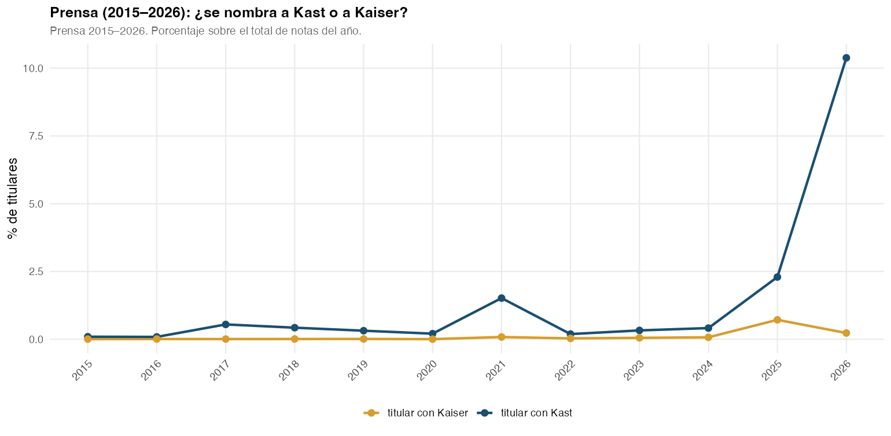{width="90%"}

2021 y 2025 son años de campaña. En **2026** Kast está en **1 de cada 10** titulares; Kaiser, que había picado en 2025 (0,72 %), baja a 0,23 %.

# El mapa de los votos {background-color="#0B3D91"}

## ¿Cómo se captura la tendencia de derecha?

**No está en los datos.** Nadie etiqueta “este diputado es de derecha”. Entra solo la planilla: **a favor / en contra / abstención**. (B-Call, Toro-Maureira et al. 2025.)

1. En **cada** votación mira quién votó con quién. La sala se parte en dos bandos.
2. A cada diputado, voto a voto: ¿cayó del mismo lado que *ese* bando, o del otro?
3. Con cientos de cortes aparece un eje (quienes coinciden vs. quienes se oponen). **Todavía no tiene izquierda ni derecha.**
4. José Carlos Meza (Republicanos) **solo gira el mapa**, como poner el norte arriba: el polo donde suele caer Meza queda a la **derecha**. No lo usa de juez ni de ranking.
5. **El promedio** de esas caídas → izquierda a derecha. **Cuánto varía** ese promedio → abajo hacia arriba (se mantiene o se sale).

| En el gráfico | Qué está viendo |
|---------------|-----------------|
| **← →** | Con quién suele votar (tendencia). |
| **↓ ↑** | Si ese patrón es estable o a veces se rompe. |

## Toda la Cámara, 2026

Cada punto es un diputado. El lugar lo ganó **votando**, no por etiqueta de partido.

{width="88%"}

La pregunta era si Republicanos y el Partido Nacional Libertario son **dos derechas**. En el mapa **no**: es **una** nube. Lo que cambia es quién se **estira hacia arriba** (vota menos parejo).

## Zoom: solo el bloque de Kast

Misma lectura: a la derecha = votan con el oficialismo; hacia arriba = se salen de su propio patrón.

**Colores:** Republicanos **rojo** · UDI **amarillo** · RN **azul** · PNL **negro**.

{width="88%"}

**Entre partidos:** Republicanos casi no se mueven. Renovación Nacional queda más al **centro**. Los libertarios tan a la derecha como Republicanos, pero **más inconstantes**. La UDI es la que más se abre hacia arriba.

## Números: ¿se parecen los partidos?

```{r}
#| label: bcall-entre
#| echo: false
bloque_bcall |>
  group_by(Partido = partido) |>
  summarise(
    Diputados = n(),
    `Qué tan a la derecha` = round(mean(d1), 2),
    `Qué tan inconstantes` = round(mean(d2), 2),
    .groups = "drop"
  ) |>
  arrange(desc(`Qué tan a la derecha`)) |>
  kable()
```

Más a la derecha no distingue a libertarios de Republicanos. Los distingue **quién se sale** (libertarios y UDI) y RN, más al centro.

## Dentro de cada partido: los tres que más se salen

```{r}
#| label: bcall-dentro
#| echo: false
bloque_bcall |>
  group_by(partido) |>
  slice_max(d2, n = 3) |>
  transmute(
    Partido = partido,
    Diputado = legislator,
    `A la derecha` = round(d1, 2),
    `Se sale` = round(d2, 2)
  ) |>
  kable()
```

Estos nombres **no** los elegimos: son, en cada partido, los tres que más rompen su propio patrón de voto.

- **UDI:** Hube, Lilayu, Martínez — los que más se salen de todo el bloque.  
- **Libertarios:** Karlezi, Marowski, Muñoz — se sale la bancada, no solo Kaiser.  
- **Republicanos:** Ross (el único que se despega); el resto vota pegado a Kast/Meza.  
- **RN:** Ossandón, Chandía, Beltrán — más al *centro* que inconstantes.

## Quién se sale más

Más alto = a veces vota **en contra** de lo que el resto de su zona votaría.

{width="82%"}

Si Republicanos y libertarios fueran doctrinas distintas, habría **dos nubes** de izquierda a derecha. Hay **una** nube y una cola de nombres hacia arriba.

## El ancho de cada diputado

Cada curva es una persona. El **centro** dice con quién vota; el **ancho** dice si se mantiene o se mueve.

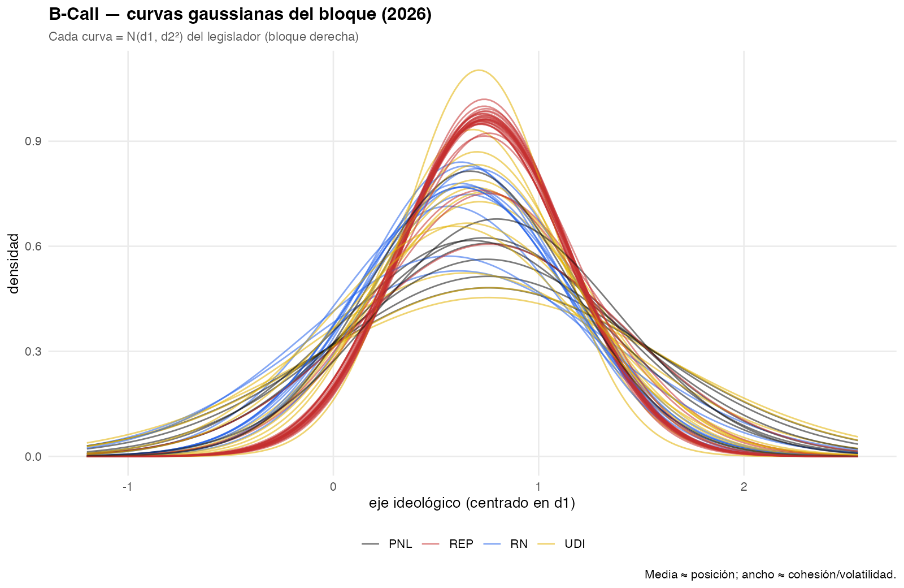{width="88%"}

Curvas **angostas y pegadas** (Republicanos) = votan juntos y siempre igual. Curvas **anchas** (UDI y libertarios) = el mismo diputado a veces vota como si no estuviera en su sitio.

## Cómo se arma el mapa (GIF)

No es un ranking que dibujemos a mano cada mes. Cada fotograma **rehace el mapa** con los votos acumulados desde el **11 de marzo de 2026**. El punto se mueve porque **cambió cómo ha votado**.

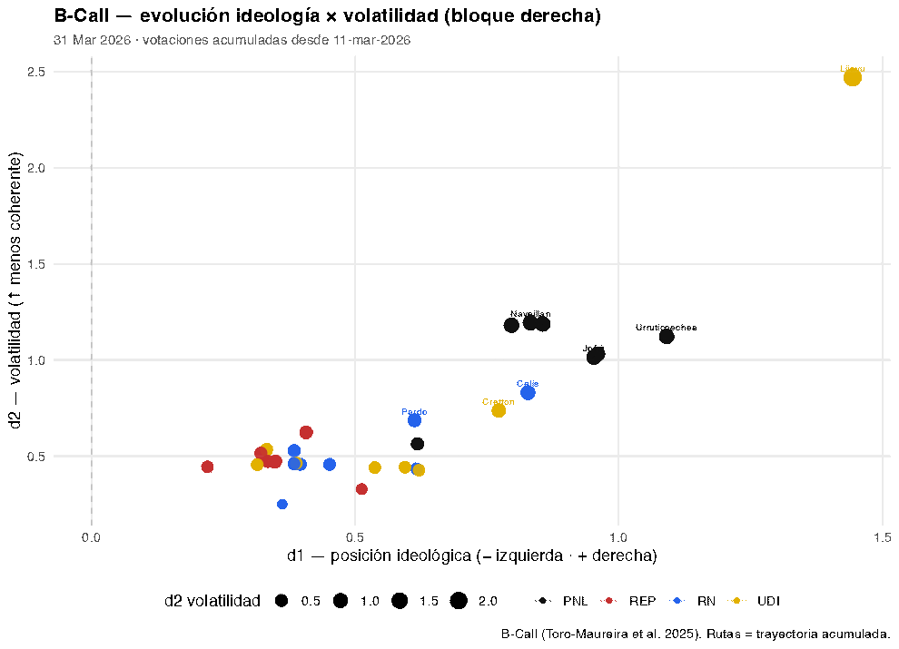{width="78%"}

## Datos (corte)

Votaciones hasta **2026-08-17**. Gobierno Kast desde **2026-03-11**.

```{r}
#| label: n-datos
#| echo: false
tibble(
  Pieza = c("Prensa 2026 (filtro Kast)", "Discursos Kast", "Votaciones",
            "Votos", "Proyectos", "Mensajes `-05`"),
  N = c(
    fmt_n(nrow(prensa)), fmt_n(n_kast_disc), fmt_n(nrow(votaciones)),
    fmt_n(man$n[man$tabla == "votos"]), fmt_n(nrow(proyectos)),
    fmt_n(sum(proyectos$es_mensaje_ejecutivo %in% TRUE))
  )
) |> kable()
```

Bloque analizado: **REP 28 · UDI 13 · RN 11 · PNL 8** diputados.

# Boletines: presentado vs promulgado {background-color="#0B3D91"}

## Agenda formal: mensajes `-05`

Los boletines **`-05`** son mensajes del Presidente: lo que el gobierno *elige* presentar. En el canon hay **42** (varios de Boric). Bajo Kast (**desde 11-mar-2026**) solo **tres**.

**H4:** A1 (subsidiariedad / gremios / sociedad civil) = **0 %** de esos mensajes.

## Qué presentó Kast (y cuánto se votó)

| Boletín | Proyecto | Ingreso | Votos Cámara | ¿Ya es ley? |
|---------|----------|---------|--------------|-------------|
| **18137-05** | Contener precio del **kerosene** (emergencia energética) | 24-mar | 9 | **No** — sigue en trámite |
| **18216-05** | **PDL** — reconstrucción y desarrollo económico y social | 22-abr | **120** | **No** — sigue en trámite |
| **18296-05** | Mayor **endeudamiento** 2026 | 3-jun | **3** | **Sí** — publicada en Ley Chile |

El cruce con la BCN busca si el boletín ya tiene una **norma promulgada**. “Sigue en trámite” = no hay ley publicada (no es un ranking de calidad). Solo el endeudamiento cruzó ese umbral.

**Variación:** el PDL concentra casi toda la energía legislativa (120 votaciones, cohesión plena). El endeudamiento son 3 votaciones y se **estrella en la sala**. El kerosene es un mensaje corto de precios. Nada de subsidiariedad / cuerpos intermedios.

## ¿Qué hay promulgado?

BCN / Ley Chile, con match fuerte (norma ya publicada): **8** normas en toda la base — **no** son “las leyes de Kast”. Solo **una** es mensaje `-05` de este gobierno: **18296-05**.

Las otras siete son boletines más viejos o de otras comisiones (armas, inclusión laboral, IMM, tarifa eléctrica, seguridad escolar, permisos…). El PDL (**18216-05**), el más votado, **aún no es ley** en el cruce BCN.

Lectura: “promulgado Kast” ≠ “votado Kast”. Lo que sale en el Diario Oficial es un **subconjunto chico** y sesgado a fiscalidad/seguridad, no a subsidiariedad.

## Watchlist: volumen de votaciones

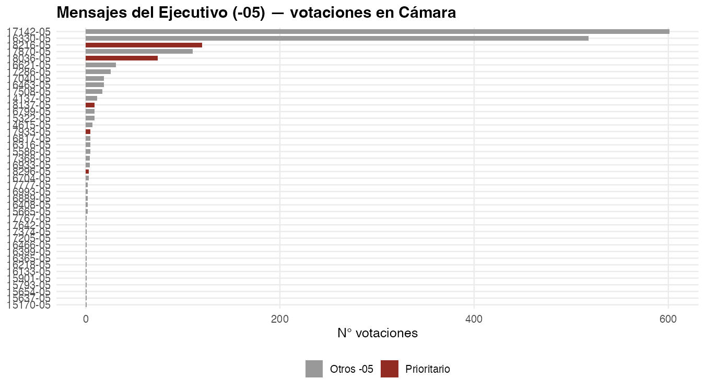{width="88%"}

## 18296-05 — lo único `-05` promulgado (y la fisura de sala)

Tres votaciones el **17-jun-2026**:

| ID | Resultado | Sí | No |
|----|-----------|----|----|
| 89178 | Aprobado | 94 | 52 |
| 89179 | Empate 73–73 | 73 | 73 |
| 89180 | Rechazado 72–74 | 72 | 74 |

En el mapa de votos el bloque ya estaba **junto** (votan parecido). Acá el proyecto **se parte en toda la sala**, no entre Republicanos y libertarios. Es gobierno vs oposición, no una grieta interna.

## 18216-05 — PDL: mucho voto, cero promulgación (aún)

120 votaciones; Rice del bloque ~1. **H3:** no hay grieta REP–PNL. **H4:** reconstrucción/desarrollo, no cuerpos intermedios. **H2:** la prensa de la ventana carga ~22 % de C, no A1.

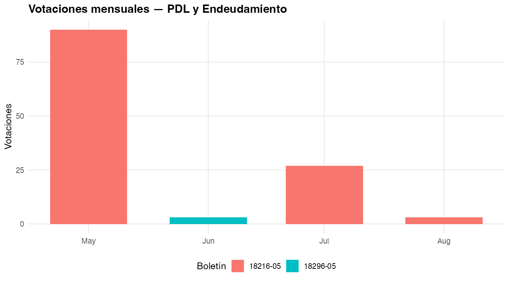{width="86%"}

## Repertorios en los textos de proyecto

Cada barra es un **repertorio** (no una sigla): *economía libre*, *orden institucional*, *familia*, *securitización*, etc. Compara **todos** los proyectos vs. los **mensajes del Presidente**.

{width="88%"}

# Votos y fisuras {background-color="#0B3D91"}

## ¿La bancada vota junta?

1 = todos del partido votaron igual. 0 = el partido se partió por la mitad. En 2026:

| Partido | Qué tan juntos | Votaciones |
|---------|----------------|------------|
| **Republicanos** | 0.997 | 768 |
| **Libertarios** | 0.988 | 735 |
| **UDI** | 0.955 | 790 |
| **RN** | 0.942 | 786 |

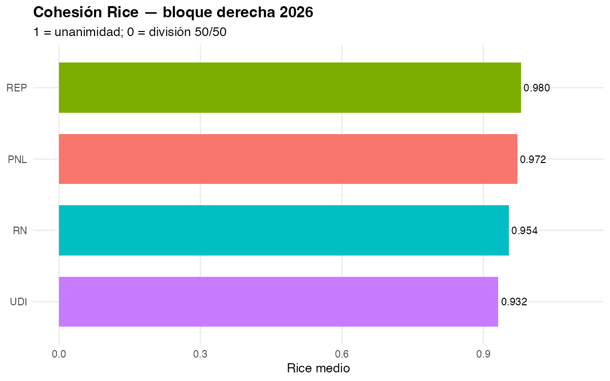{width="78%"}

## ¿Republicanos y libertarios votan distinto?

**En el 91,8 % de las votaciones eligieron el mismo lado** (4 702 votaciones).

{width="72%"}

La idea de “dos derechas” **casi no se ve en el voto**. Si hay diferencia, está en indicaciones o en diputados sueltos, no en la bancada.

## Dónde sí hay fisura: disruptivos (no el partido)

La fisura no es REP vs. PNL. Es **diputados vs. moda del bloque**.

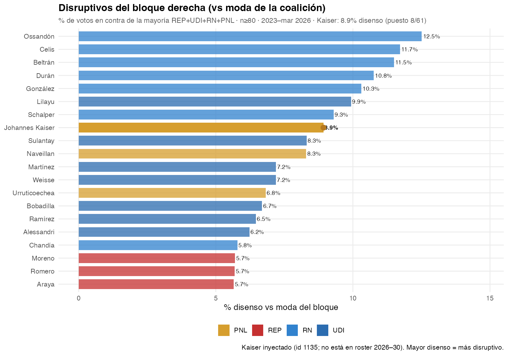{width="88%"}

Kaiser (PNL, id 1135) es el caso de **disenso personal**, no de bancada. Encaja más con **D** (límite libertario) que con un cisma partidario.

La fisura no es de partido: es de **personas** (quién se sale en el mapa) y, en la deuda, de **toda la sala**. El voto de bancada cierra filas; el mapa dice **quién**, a veces, no.

## Republicanos, mes a mes

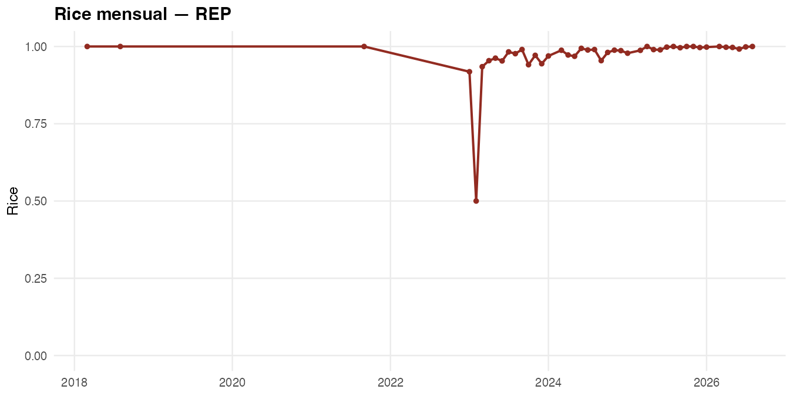{width="88%"}

# Discursos de Kast {background-color="#0B3D91"}

## El recorte

**145** discursos, **11 mar – 30 jul 2026**. Se mide el **cuerpo oral**, no el titular de Presidencia (“S.E. … José Antonio Kast”), que haría “Kast” = 100 %.

Tipo: gira territorial y gestión (regiones, alcaldes, emergencias). No es un corpus de cadena nacional doctrinaria.

## Qué palabras nombra

Stopwords extra (p. ej. *necesita\**, *querem\**, *haciendo*, *haber*): queda el léxico de **tema**, no el de la oralidad.

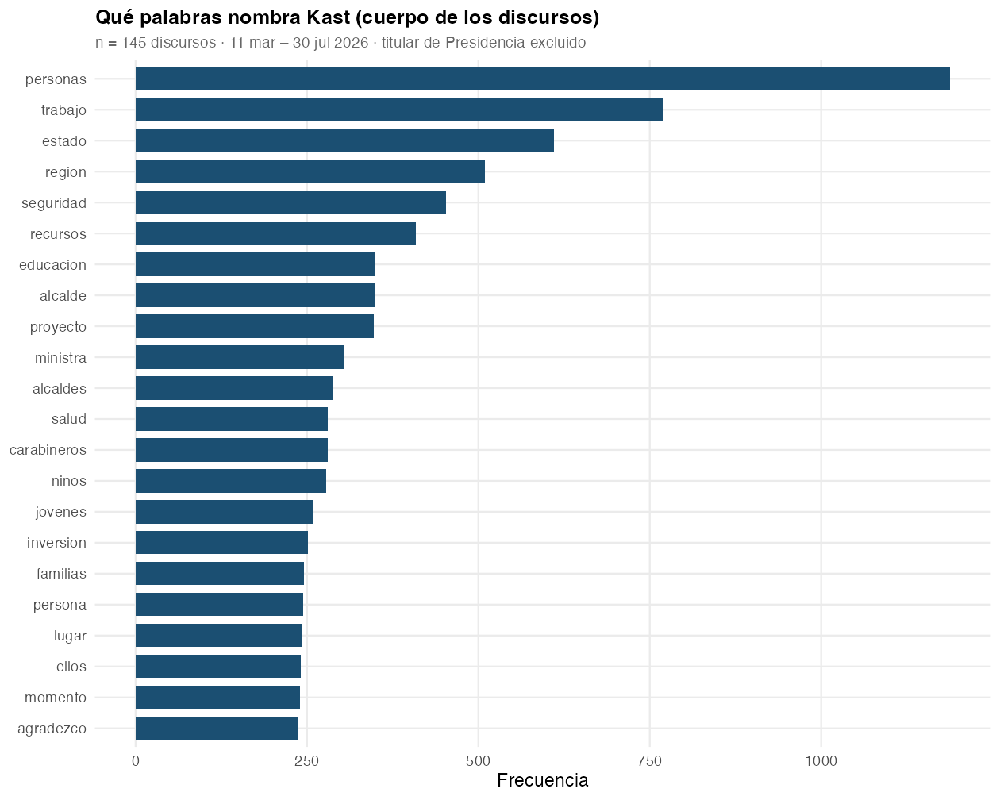{width="78%"}

**Personas, trabajo, Estado, región, seguridad.** Léxico de gira, no de guerra cultural.

## A qué hace alusión

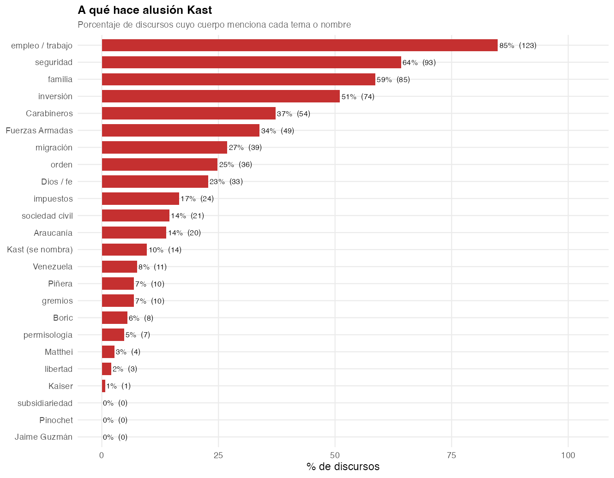{width="80%"}

Seguridad 64 % · familia 59 % · inversión 51 %. **Subsidiariedad, Pinochet, Guzmán = 0 %.** Kaiser = 1 discurso.

## Repertorios en la boca

Mismo alfabeto: **A** gremialista · **B** = A *junto* (no hay barra B) · **C** radical · **D** libertario.

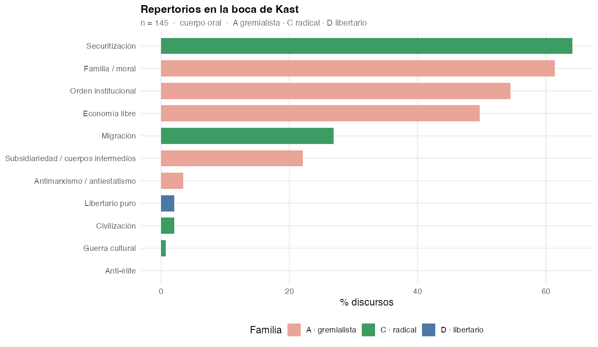{width="88%"}

Dominan **securitización (C1)**, **familia (A3)**, **orden (A2)** y **economía libre (A5)**. Guerra cultural / anti-élite / libertario casi no aparecen. “Cuerpos intermedios” entra por *sociedad civil / gremios*, no por la palabra subsidiariedad.

# Prensa: qué se dice cuando se nombra a la derecha {background-color="#0B3D91"}

## El recorte (diccionario reforzado)

No usamos el corpus entero (deportes, “seguridad” genérica).  
**Nombra derecha** = Kast, Republicanos, UDI, RN, PNL, Kaiser, LyD, FJG **o** “la derecha”, oficialismo, gobierno Kast, bancada/coalición de derecha.

```{r}
#| label: nombra-n
#| echo: false
tibble(
  Universo = c("Prensa 2026", "Cuando nombra a la derecha"),
  Notas = c(fmt_n(nrow(prensa)), fmt_n(nrow(prensa_der))),
  `%` = c(100, round(100 * nrow(prensa_der) / max(nrow(prensa), 1), 1))
) |> kable()
```

Ahí se contrastan H1/H2/H4: *qué repertorio acompaña al nombre*. Misma prensa; el recorte es temático, no de fuente.

## "Libertad" en titulares (2018–26)

En el título es **raro** (~0,3 % cada año). No es el vehículo principal del repertorio A5; A5 se dispara más con *inversión / emprendimiento / propiedad*.

{width="88%"}

## Libertad junto a la derecha

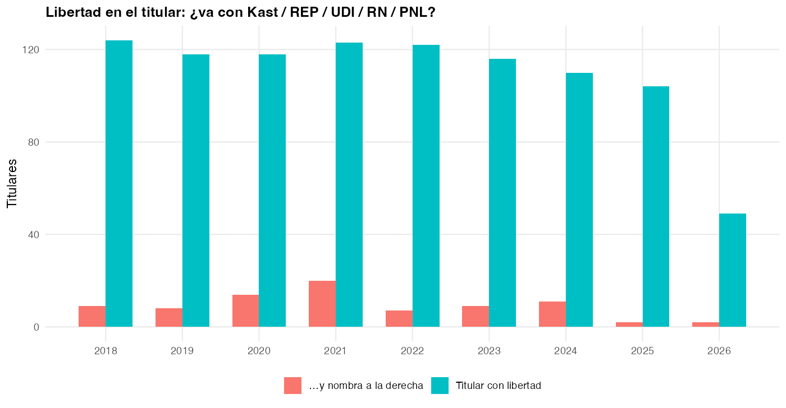{width="88%"}

## Entrevistas (titular)

{width="88%"}

Pocas en el título. En 2026 el texto completo (abajo) muestra más: el género vive en el cuerpo.

## 2026: libertad y entrevistas en el texto

{width="90%"}

## Por medio, 2026

{width="85%"}

## Códigos: total vs. cuando se nombra

```{r}
#| label: fig-nombra
#| echo: false
#| fig-width: 11
#| fig-height: 5.2
rep_cmp |>
  filter(pct > 0.05) |>
  mutate(
    familia = recode(familia,
      A = "A · gremialista",
      C = "C · radical",
      D = "D · libertario"
    )
  ) |>
  ggplot(aes(etiqueta, pct, fill = subset)) +
  geom_col(position = "dodge", width = 0.75) +
  facet_wrap(~familia, scales = "free_x", nrow = 1) +
  labs(
    title = "Repertorios: corpus total vs. notas que nombran a la derecha",
    x = NULL, y = "% de notas", fill = NULL,
    caption = "Eje: nombre del repertorio (no A1/C1)."
  ) +
  theme_minimal(base_size = 12) +
  theme(
    legend.position = "bottom",
    panel.grid.minor = element_blank(),
    axis.text.x = element_text(angle = 35, hjust = 1, size = 9)
  )
```

## Hipótesis en ese recorte

```{r}
#| label: nombra-h
#| echo: false
co <- function(df) {
  tibble(
    `H1 A5+A3` = 100 * mean(df$co_H1_mercado_familia),
    `H1 A5+A2` = 100 * mean(df$co_H1_mercado_orden),
    `H2 familia C` = 100 * mean(df$r_C1 | df$r_C2 | df$r_C3 | df$r_C4 | df$r_C5),
    `H2 híbrido A5+C` = 100 * mean(df$co_H2_mercado_radical),
    `H4 A5 sin A1` = 100 * mean(df$co_H4_mercado_sin_A1),
    A1 = 100 * mean(df$r_A1)
  )
}
bind_rows(
  co(prensa) |> mutate(subset = "total"),
  co(prensa_der) |> mutate(subset = "nombra derecha")
) |>
  relocate(subset) |>
  mutate(across(where(is.numeric), ~ round(.x, 1))) |>
  kable()
```

Si H1 fuera mediático, A5+A3 debería **subir** al nombrar a la derecha. Si sube C y no A1, H2/H4 ganan en prensa y H1 se queda en discursos.

## Eco de los boletines Kast (±7 días)

```{r}
#| label: puente
#| echo: false
puente |>
  transmute(
    Evento = label,
    Fecha = fecha,
    Boletín = boletin,
    `Notas` = n_prensa,
    Discursos = n_discursos,
    Votos = n_votos_boletin,
    `% C` = round(pct_C_prensa, 1)
  ) |>
  kable()
```

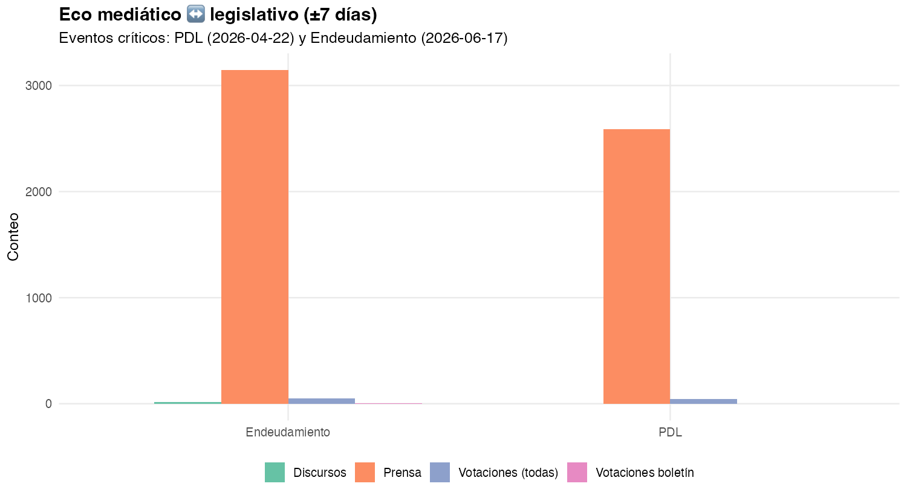{width="82%"}

# Lectura por hipótesis {background-color="#0B3D91"}

## H1 — Articulación normativa {background-color="#f7f3ee"}

**Se sostiene en discursos; se adelgaza en prensa y proyectos.**

- Discursos: seguridad 64 %, familia 59 %, inversión 51 %; **no dice** subsidiariedad ni Guzmán. Un tercio junta mercado con familia/orden (A5+A3 / A5+A2).
- Prensa: esa co-ocurrencia cae a ~3,5 %.
- Proyectos `-05`: el texto de la agenda es fiscal/reconstrucción, no “mercado como moral”.

El neogremialismo aparece como **gramática presidencial**, no como gramática de la ley ni de la noticia.

## H2 — Radicalización {background-color="#f7f3ee"}

**El repertorio radical (C: seguridad, migración, cultura) vive en la noticia; casi no en la boca de Kast.**

- En la **prensa 2026**, ~22 % de las notas traen C. Si la nota **nombra** a Kast o a la derecha, esa cifra **sube**.
- En los **discursos de Kast**, el radicalismo *sin* familia/orden/mercado (C sin A) es solo **9 %**.
- Textos que juntan **mercado y C** en la misma pieza: **~2 %**. Casi no hay fusión explícita.

C no es “solo Twitter”. Pero **tampoco** reemplaza al núcleo gremialista en Presidencia. Medios radicalizan; Kast no.

## H3 — REP vs PNL {background-color="#f7f3ee"}

**Los votos no arman dos derechas. El mapa no los sentó: salen de cómo votaron.**

- Republicanos y libertarios coinciden en el **91,8 %** de las votaciones. Casi nunca se parten.
- En el mapa quedan **igual de a la derecha**. Renovación Nacional, más al centro.
- Quienes se salen son **nombres**, no partidos: en la UDI Hube y Lilayu; en los libertarios Karlezi; en Republicanos, Ross.

## H4 — Selección liberal-individual {background-color="#f7f3ee"}

**La evidencia más limpia, también en lo promulgado.**

- Kast presentó **3** mensajes `-05`; **1** promulgado (endeudamiento). El PDL (120 votos) **no** es ley en BCN.
- A1 = 0 en esos mensajes. Al nombrar a la derecha en prensa, A1 sigue bajo.

## Mapa de hallazgos

```
                 DISCURSOS              PRENSA                 PROYECTOS / VOTOS
H1  mercado+valores     fuerte            débil (3.5%)           débil (texto fiscal)
H2  repertorio C        bajo (9% C-sin-A) fuerte (~22%)          eco en ventanas PDL
H3  REP ≠ PNL           —                 —                      no: 91.8% acuerdo
H4  sin A1              fuerte (42%)      A1 escaso              0% en 42 mensajes -05
```

**Tesis empírica corta:** el neogremialismo 2026 es **discursivo y selectivo**. La ley y el voto unifican al bloque; la prensa radicaliza el entorno; los boletines `-05` no reconstruyen subsidiariedad.

## Cuatro pistas, una frase cada una

::: incremental
- **Mapa de votos.** Los votos (no nosotros) dejan **una** nube derecha. La fisura es quién **se sale**, no Republicanos vs libertarios.
- **Boletines.** Presentó kerosene, PDL y deuda. Promulgó la deuda. El PDL se vota mucho y no sale.
- **Discursos.** Trabajo, seguridad, familia, inversión. No nombra a Kaiser (1 vez, 2021). No dice subsidiariedad.
- **Prensa.** Si la nota nombra a Kast/la derecha, sube el repertorio **radical** (C), no el cruce mercado+familia (H1). En 2026 Kast está en **1 de cada 10** titulares; Kaiser, después del pico 2025, casi no aparece.
:::

## Bosquejo

El neogremialismo es **discursivo y performativo**: se dice y se escenifica **por encima** de lo que decide la Cámara.

- En Presidencia hay gramática **A/B** (familia, orden, mercado) y seguridad. En el hemiciclo el bloque **vota junto**; no hay dos derechas.
- Lo que se presenta y lo que se promulga es **fiscal / reconstrucción**, no subsidiariedad ni cuerpos intermedios.
- La prensa, al nombrar a la derecha, carga **C** (radical), no la articulación neogremialista.

La Cámara **unifica**; el discurso **distingue**. El neogremialismo 2026 todavía no es una regla de voto ni de ley: es una *performance* presidencial.
