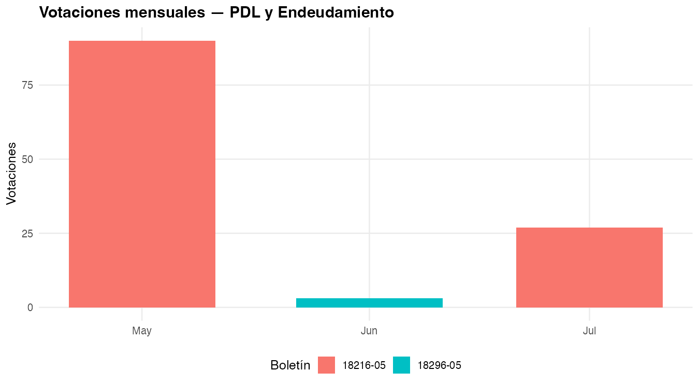
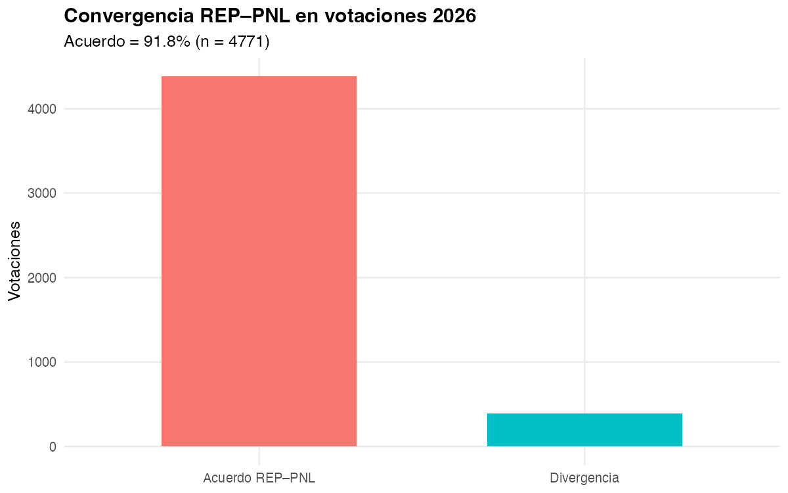
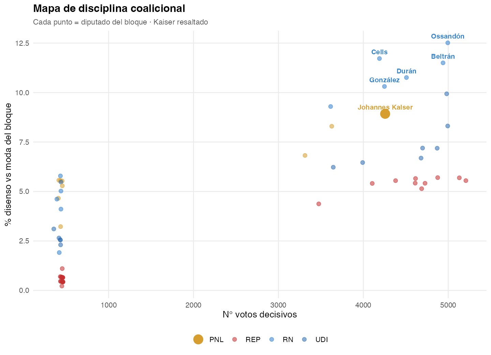
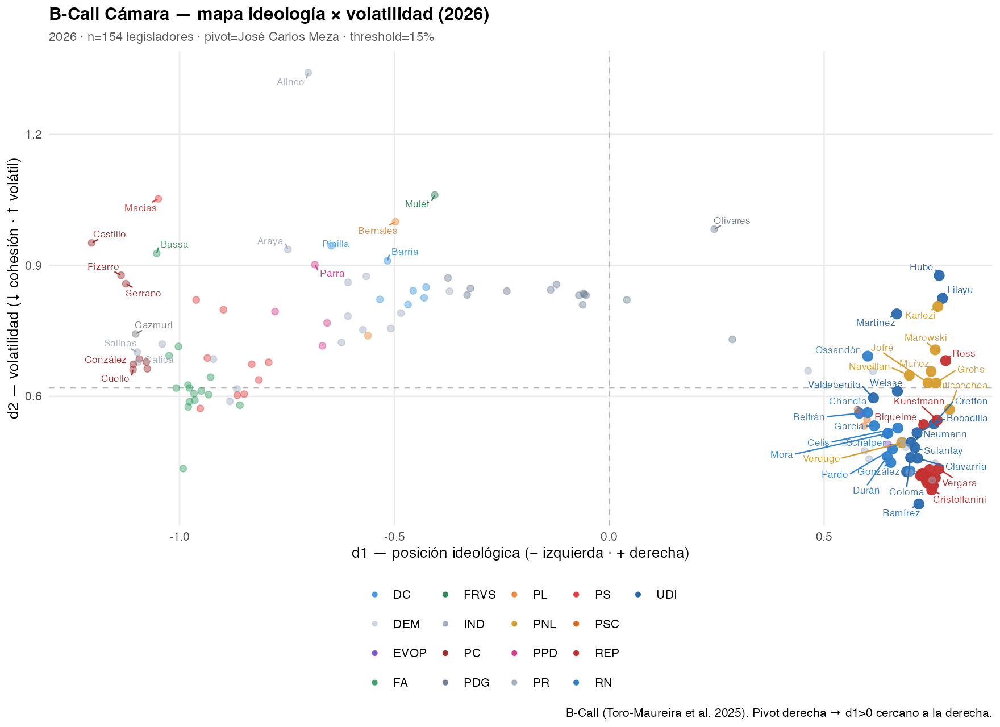
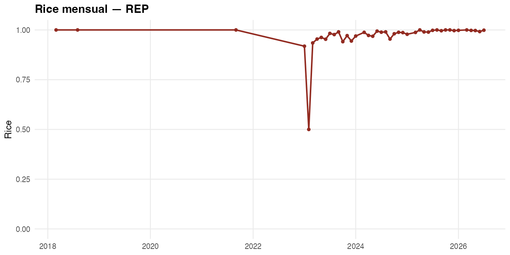
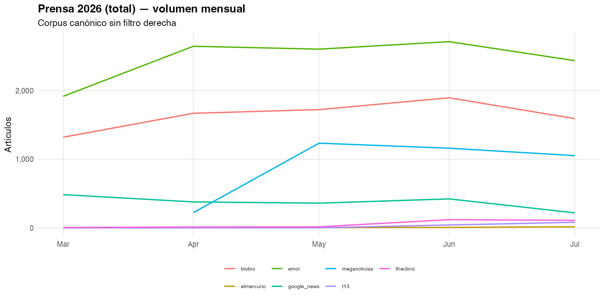
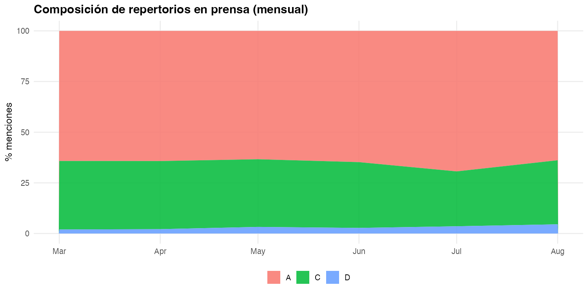
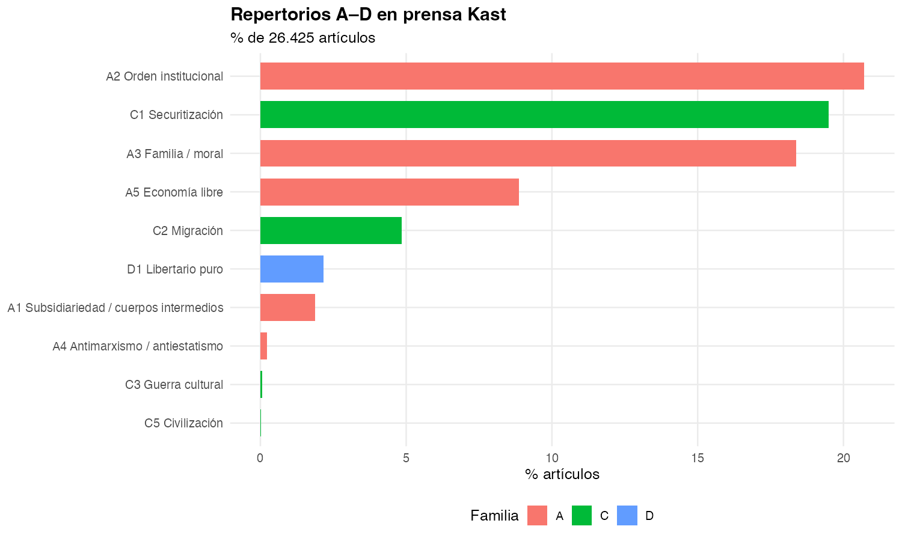
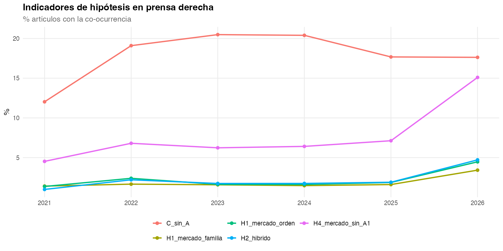
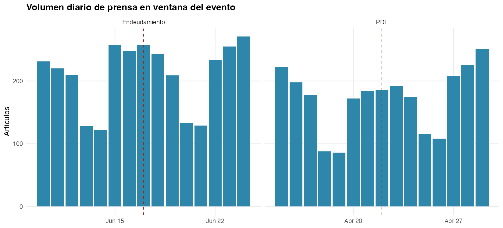

```{r}
#| label: setup
suppressPackageStartupMessages({
  library(tidyverse)
  library(arrow)
  library(knitr)
})
root <- if (dir.exists("data/raw")) normalizePath(".") else normalizePath("..")
canon <- file.path(root, "data/processed/canon")
figs <- file.path(root, "outputs/imagenes")
hip <- read_csv(file.path(canon, "resultados_hipotesis.csv"), show_col_types = FALSE)
puente <- read_csv(file.path(canon, "puente_eventos.csv"), show_col_types = FALSE)
proyectos <- read_parquet(file.path(canon, "proyectos.parquet"))
votaciones <- read_parquet(file.path(canon, "votaciones.parquet")) |>
  mutate(fecha = as.Date(fecha))
```

# Pregunta

## Qué se está contrastando

El **neogremialismo** no es solo “votar a la derecha”. Es si el gobierno Kast articula **mercado + orden/valores** (H1), absorbe o no repertorios **radicales** (H2), se distingue del **PNL** en el hemiciclo (H3) y **omite cuerpos intermedios** en la agenda formal (H4).

Tres pistas empíricas, siempre leídas contra las hipótesis:

| Pista | Pregunta | Fuente |
|-------|----------|--------|
| **Proyectos** | ¿Qué manda el Ejecutivo (`-05`)? | Cámara + BCN |
| **Votos / fisuras** | ¿El bloque vota unido? ¿Dónde se rompe? | `votaciones` / `votos` |
| **Prensa** | ¿Qué repertorios circulan alrededor de esa agenda? | corpus Kast + diccionario A–D |

## Cuatro hipótesis

| | Hipótesis | Se sostiene si… | Se refuta si… |
|---|-----------|-----------------|---------------|
| **H1** | Racionalidad normativa: mercado *con* orden/familia | Co-ocurren A5 + A2/A3 | El discurso es solo técnico (LyD) o solo libertario (PNL) |
| **H2** | Radicalización: núcleo gremialista + C (seguridad, migración, cultura) | C aparece *junto* a A, no en su lugar | C reemplaza a A, o solo vive en redes |
| **H3** | REP ≠ PNL en votos | Divergencia por materia (Rice, acuerdo) | Votan siempre igual |
| **H4** | Selección liberal-individual | Agenda `-05` sin A1 (cuerpos intermedios) | Hay iniciativas comunitaristas sistemáticas |

## Diccionario (regla: co-ocurrencia)

El indicador no es una palabra suelta. Es **qué se junta en la misma unidad**.

| Familia | Códigos | Tema |
|---------|---------|------|
| **A** gremialista | A1 subsidiariedad · A2 orden · A3 familia · A4 antiestatismo · A5 mercado | Núcleo clásico |
| **C** radical | C1 seguridad · C2 migración · C3 cultura · C4 anti-élite · C5 civilización | Derecha contemporánea |
| **D** libertario | D1 Estado mínimo / PNL | Contraste H3 |

Guía: **A5+A3 / A5+A2 → H1** · **A5+C → H2 híbrido** · **C sin A → radical puro** · **A5 sin A1 → H4**.

## Datos (corte)

Corpus canónico (`data/processed/canon/`). Votaciones hasta **2026-07-22**. Gobierno Kast desde **2026-03-11**.

```{r}
#| label: n-datos
tibble(
  dominio = c("Prensa (canon)", "Discursos Presidencia", "Votaciones Cámara",
              "Votos individuales", "Proyectos / boletines", "Mensajes Ejecutivo (-05)"),
  n = c(
    35117L, 248L, 5837L, 779622L, 612L,
    sum(proyectos$es_mensaje_ejecutivo %in% TRUE)
  )
) |> kable()
```

Bloque analizado: **REP 28 · UDI 13 · RN 11 · PNL 8** diputados.

# Proyectos de ley

## Agenda formal: mensajes `-05`

Los boletines **`-05`** son mensajes del Presidente: la agenda que el gobierno *elige* presentar. Hay **42** en el canon; casi todos son **macro-fiscal / reconstrucción / reajuste**, no “cuerpos intermedios”.

**H4 en una frase:** A1 (subsidiariedad / gremios / juntas de vecinos) aparece en **0 %** de esos 42 mensajes.

## Watchlist: dónde se vota

{width="92%"}

## Casos ancla 2026

Identificar proyectos = identificar *dónde* se juega cada hipótesis.

| Boletín | Proyecto | Votaciones | Ventana | Hipótesis |
|---------|----------|------------|---------|-----------|
| **18216-05** | Reconstrucción nacional y desarrollo económico y social (**PDL**) | **117** (may–jul 2026) | ±7d: 2 589 notas | H1/H4 (mercado-Estado) · H2 (eco C en prensa) |
| **18296-05** | Autoriza mayor **endeudamiento** 2026 | **3** (17-jun) | ±7d: 3 146 notas | H1 (orden fiscal) · fisura de sala |
| **18036-05** | Reajuste remuneraciones sector público | 74 (ene 2026) | pre-Kast | Agenda salarial, no A1 |
| **18137-05** | Contención precio **kerosene** (emergencia energética) | 9 (24–25 mar) | primer mes Kast | Intervención de precios |
| **17933-05** | Beneficios personas mayores / reavalúo | 5 (ene 2026) | pre-Kast | Tributario municipal |

## 18216-05 — PDL (el proyecto más votado del gobierno)

117 votaciones en Cámara; cohesión del bloque **casi plena** (Rice REP 0.999 · PNL 0.988 · UDI 0.993 · RN 0.979).

Lectura H3: **no hay fisura doctrinaria REP–PNL** en el PDL. Si hay diferencia, no está en el voto general de este mensaje.

Lectura H4: es un mensaje de **reconstrucción / desarrollo**, no de cuerpos intermedios.

{width="88%"}

## 18296-05 — Endeudamiento: la fisura está en la *sala*, no en el bloque

Tres votaciones el **17-jun-2026**:

| ID | Resultado | Sí | No |
|----|-----------|----|----|
| 89178 | Aprobado | 94 | 52 |
| 89179 | Empate 73–73 | 73 | 73 |
| 89180 | Rechazado 72–74 | 72 | 74 |

El bloque derecha entra cohesionado; el proyecto **se estrella en el hemiciclo**. Hipótesis: la fisura relevante aquí es **gobierno vs. oposición**, no REP vs. PNL.

Norma publicada en Ley Chile (`1225909`) — de la watchlist `-05`, el único con match BCN fuerte.

## Repertorios *en* los proyectos

{width="90%"}

**H4:** en mensajes `-05`, **A1 = 0**. La agenda formal selecciona mercado/Estado/fiscalidad y deja fuera subsidiariedad comunitaria.

# Votos y fisuras

## H3 — cohesión Rice del bloque

Rice = 1 unanimidad, 0 división 50/50. En 2026 (votos a favor/en contra):

| Partido | Rice medio | Votaciones |
|---------|------------|------------|
| **REP** | 0.997 | 768 |
| **PNL** | 0.988 | 735 |
| **UDI** | 0.955 | 790 |
| **RN** | 0.942 | 786 |

{width="78%"}

## H3 — ¿REP se distingue del PNL?

**Acuerdo de moda REP–PNL: 91,8 %** (n = 4 702 votaciones en el canon).

{width="72%"}

**Lectura:** H3 queda **débil**. La distinción doctrinaria (gremialismo vs. libertarismo) **casi no se traduce en votos**. Si existe, hay que buscarla en *indicaciones*, materias específicas o disenso individual — no en el voto de bancada.

## Dónde sí hay fisura: disruptivos (no el partido)

La fisura no es REP vs. PNL. Es **diputados vs. moda del bloque**.

{width="88%"}

Kaiser (PNL, id 1135) es el caso de **disenso personal**, no de bancada. Encaja más con **D** (límite libertario) que con un cisma partidario.

## Mapa de disciplina

{width="90%"}

Patrón: **REP y PNL más disciplinados**; RN/UDI un poco más heterogéneos (Rice 0.94–0.96). Las fisuras son **personas**, no familias doctrinarias.

## Ideología × volatilidad (B-Call, 2026)

{width="82%"}

El bloque se compacta en ideología; la **volatilidad** (cambiar de lado entre votaciones) es el eje que identifica a los mismos disruptivos. Complementa H3: no hay dos polos REP/PNL, hay un **núcleo denso** y unos pocos *swingers*.

## Rice mensual REP

{width="90%"}

REP permanece **casi unánime** a lo largo de 2026. No hay mes en que el partido “se parta” con el PDL o el endeudamiento.

# Prensa

## Qué circula en el corpus Kast

Prensa canónica = **total 2026**, sin filtro “Kast”. Repertorios A–D sobre ~28 mil notas con texto.

{width="90%"}

## Familias A vs C en el tiempo

{width="90%"}

**H2:** C1–C3 (seguridad, migración, cultura) está en **~22 %** de la prensa canónica. No es marginal. La pregunta es si *reemplaza* a A o convive.

## Códigos en prensa (detalle)

{width="88%"}

Seguridad (C1) y mercado/orden (A2/A5) dominan. **A1 (cuerpos intermedios) es escaso** — eco mediático de H4: tampoco la prensa habla de gremios/subsidiariedad cuando cubre al gobierno.

## H1 y H2: prensa vs discursos

Los mismos códigos, dos géneros.

| Indicador | Prensa | Discursos Presidencia | Lectura |
|-----------|--------|------------------------|---------|
| H1 A5∩A3 (mercado+familia) | **3,5 %** (serie derecha 2021–26) | **33,6 %** (n=110) | H1 vive en **discurso oficial**, no en la nota |
| H1 A5∩A2 (mercado+orden) | — | **31,8 %** | Articulación normativa en Presidencia |
| H2 C1–C3 | **21,9 %** (canon) / 36,8 % (derecha 21–26) | C sin A: **9,1 %** | Radicalidad **más prensa que discurso** |
| H2 híbrido A5∩C | **2,2 %** | bajo | Poca hibridación explícita en la misma unidad |
| H4 A5 sin A1 | **8,4 %** prensa / **41,8 %** discursos | Mercado **sin** subsidiariedad, sobre todo en discursos |

## Disputa de repertorios (2021–2026)

{width="90%"}

La era Kast no “inventa” C: la securitización ya estaba. Lo distintivo 2026 es el **desacople**: discursos con H1 (A5+A2/A3), prensa con C, proyectos sin A1.

## Puente: eco mediático de los proyectos

Ventana **±7 días** alrededor del evento legislativo.

```{r}
#| label: puente
puente |>
  transmute(
    Evento = label,
    Fecha = fecha,
    Boletín = boletin,
    `Notas prensa` = n_prensa,
    Discursos = n_discursos,
    `Votos en boletín` = n_votos_boletin,
    `% C en prensa` = round(pct_C_prensa, 1)
  ) |>
  kable()
```

{width="85%"}

## Prensa diaria en las ventanas

{width="90%"}

En ambas ventanas, **~22–23 %** de las notas cargan C. El PDL (117 votos, 0 discursos en la ventana) es un **hecho legislativo cubierto en clave de seguridad/coyuntura**, no de subsidiariedad. El endeudamiento sí arrastra **14 discursos**.

# Lectura por hipótesis

## H1 — Articulación normativa {background-color="#f7f3ee"}

**Se sostiene en discursos; se adelgaza en prensa y proyectos.**

- Discursos: un tercio junta mercado con familia (A5+A3) u orden (A5+A2).
- Prensa: esa co-ocurrencia cae a ~3,5 %.
- Proyectos `-05`: el texto de la agenda es fiscal/reconstrucción, no “mercado como moral”.

El neogremialismo aparece como **gramática presidencial**, no como gramática de la ley ni de la noticia.

## H2 — Radicalización {background-color="#f7f3ee"}

**C circula; no coloniza el discurso oficial.**

- Prensa: C1–C3 en ~22 % (canon) y más en corpus “derecha”.
- Discursos: C *sin* A solo 9 %.
- Híbrido A5+C: ~2 % — poca fusión explícita.

No se refuta del todo (C no es solo “redes”), pero **tampoco** se confirma el reemplazo del núcleo gremialista. Es **convivencia asimétrica**: radical en medios, gremialista-selectivo en Presidencia.

## H3 — REP vs PNL {background-color="#f7f3ee"}

**Por ahora, refutada en el voto de bancada.**

- Acuerdo de moda **91,8 %**.
- Rice 2026: REP 0.997 · PNL 0.988 (ambos más cohesivos que UDI/RN).
- En el PDL (117 votaciones) la cohesión es aún más alta.

La fisura observable es **individual** (disruptivos / Kaiser / B-Call d2), no una grieta doctrinaria entre partidos. Siguiente test: indicaciones y materias (seguridad vs. impuestos), no el voto general.

## H4 — Selección liberal-individual {background-color="#f7f3ee"}

**La evidencia más limpia.**

- **0 / 42** mensajes `-05` con A1.
- Discursos: **41,8 %** A5 sin A1.
- Prensa: A1 casi ausente; el eco del PDL no es comunitarista.

La agenda que el gobierno *presenta* selecciona mercado, reconstrucción y caja fiscal. Los cuerpos intermedios no están en el boletín.

## Mapa de hallazgos

```
                 DISCURSOS              PRENSA                 PROYECTOS / VOTOS
H1  mercado+valores     fuerte            débil (3.5%)           débil (texto fiscal)
H2  repertorio C        bajo (9% C-sin-A) fuerte (~22%)          eco en ventanas PDL
H3  REP ≠ PNL           —                 —                      no: 91.8% acuerdo
H4  sin A1              fuerte (42%)      A1 escaso              0% en 42 mensajes -05
```

**Tesis empírica corta:** el neogremialismo 2026 es **discursivo y selectivo**. La ley y el voto unifican al bloque; la prensa radicaliza el entorno; los boletines `-05` no reconstruyen subsidiariedad.

## Tres pistas, una frase cada una

::: incremental
- **Proyectos.** Identificar `18216-05` (PDL, 117 votos) y `18296-05` (endeudamiento, 3 votos y empate/rechazo). El resto de `-05` es reajuste, kerosene, presupuesto. Ninguno es A1.
- **Votos / fisuras.** El bloque no se parte por partido. Se parte por **personas** (disruptivos) y, en endeudamiento, por **la sala**.
- **Prensa.** Cubre esos proyectos con ~22 % de repertorio C. No traduce H1. El puente ±7 días muestra volumen, no conversión doctrinaria.
:::

## Límites (para no sobreinterpretar)

- Votaciones **congeladas en 22-jul-2026** (API Cámara inestable).
- Diccionario = regex; Qualmer (codificación humana) sigue pendiente.
- H3 puede revivir en **indicaciones** o en Senado (hoy 0 votaciones Senado).
- BCN: 612 boletines indexados, **8** normas publicadas confiables — el cruce ley-texto es todavía flaco.
- Prensa “total” incluye notas no políticas; los % de C son techo/piso según el filtro.

## Reproducir

```bash
make analisis                         # ETL + run_todo.R
quarto render docs/presentacion_hallazgos.qmd
```

Figuras: `outputs/imagenes/canon_*.png`, `coalicion_*.png`, `bcall_*.png`.  
Indicadores: `data/processed/canon/resultados_hipotesis.csv`.  
Método: `docs/PROYECTO.qmd`.
