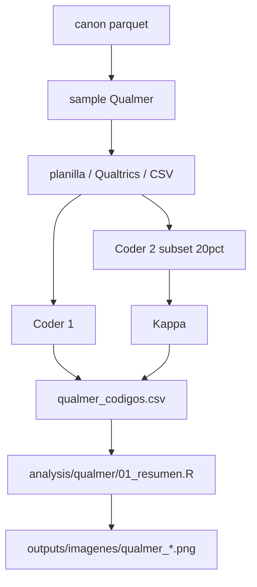

# Qué es Qualmer

**Qualmer** es el protocolo cualitativo del proyecto: una capa humana sobre el diccionario automático A–D ([`analysis/_diccionario.R`](../analysis/_diccionario.R)).

| Capa | Qué hace | Salida |
|------|----------|--------|
| **Automática** | Regex A1–A5, C1–C5, D1 sobre `texto` | `menciones_repertorio.parquet` |
| **Qualmer** | Codificación interpretativa por unidad | `data/processed/canon/qualmer_codigos.csv` |

La regla del proyecto se mantiene: el neogremialismo no se mide por frecuencia aislada, sino por **co-ocurrencia** y por el **perfil** de la unidad.

---

# Unidades de análisis

Cualquier texto del corpus canónico:

| Tipo | Fuente canónica | `unidad_id` |
|------|-----------------|-------------|
| Noticia | `canon/prensa.parquet` | url |
| Discurso | `canon/discursos.parquet` | id_discurso |
| Proyecto / materia | `canon/proyectos.parquet` + títulos en votaciones | boletin / votacion_id |
| Otro texto | pegado manual (columna, entrevista, tuit) | `manual:<id>` |

**Unidad de codificación:** párrafo o pieza completa si es corta (<400 palabras). En noticias largas: lead + 2 párrafos centrales.

---

# Muestreo (replicabilidad)

1. Partir de hits automáticos en `menciones_repertorio` (o de eventos críticos ±7 días).
2. Por estrato, muestrear **n = 50** unidades (o el 10% si el estrato es menor):
   - prensa Kast con C1–C3
   - prensa con A5
   - discursos Kast
   - proyectos `-05`
3. Reservar **20%** del sample para doble codificación (Kappa ≥ 0.70).

Semilla fija: `set.seed(20260311)` en el script de sample.

---

# Libro de códigos Qualmer

## Bloque 1 — Repertorios (multi-label, 0/1)

Mismos códigos que el diccionario automático. El coder **confirma o corrige** el hit:

- `A1`…`A5`, `C1`…`C5`, `D1`
- `auto_hit` (qué dijo la máquina) vs `coder_hit` (juicio humano)
- `discrepancia` = 1 si difieren

## Bloque 2 — Ficha interpretativa (una opción por ítem)

1. **Sujeto del mercado:** `individuo` / `familia` / `empresa` / `comunidad` / `ausente`
2. **Vínculo social:** `cohesivo` / `liberador` / `neutro`
3. **Antagonista:** `ineficiencia` / `opresion` / `degradacion` / `ideologia` / `ausente`
4. **Papel del orden:** `condicion` / `paralelo` / `ausente` / `civilizatorio`
5. **Jerarquías:** `merito` / `familia_trad` / `contribuyente` / `neutro`
6. **Lo colectivo:** `activo` / `mencionado` / `vacio` / `amenazado`

## Bloque 3 — Perfil (una etiqueta)

| Perfil | Criterio rápido |
|--------|-----------------|
| `neogremialista_pleno` | A5 + (A2\|A3) + orden como condición |
| `neogremialista_selectivo` | A5 + algo de A, sin articulación estable |
| `liberal_tecnico` | A5 dominante, sin A1/A3 ni C |
| `libertario` | D1 / Estado mínimo, sin A1 |
| `derecha_radical` | C sin A (o C dominante) |
| `hibrido_H2` | A5 + C* |

## Bloque 4 — Memorando (texto libre, 1–3 frases)

Por qué ese perfil; cita corta (≤25 palabras).

---

# Plantilla CSV

Archivo objetivo: `data/processed/canon/qualmer_codigos.csv`

```text
unidad_id,tipo,fecha,coder_id,fecha_codigo,
A1,A2,A3,A4,A5,C1,C2,C3,C4,C5,D1,
sujeto_mercado,vinculo_social,antagonista,papel_orden,jerarquias,colectivo,
perfil,memo,auto_A5,auto_C1,discrepancia
```

Valores de repertorio: `0` / `1` / `NA` (no aplica / ilegible).

---

# Flujo de trabajo



1. Generar sample desde canónicos (script abajo).
2. Codificar en planilla (Excel/Sheets) o CSV.
3. Exportar a `qualmer_codigos.csv`.
4. Correr resumen R (perfiles × tipo; acuerdo auto vs humano; Kappa).
5. Citar en `docs/informe_analisis.qmd` (sección Qualmer).

---

# Contraste con hipótesis

| H | Qué mira Qualmer |
|---|------------------|
| **H1** | Perfil `neogremialista_*` y ficha (mercado + familia/orden) |
| **H2** | Perfil `derecha_radical` / `hibrido_H2`; C en discurso oficial vs solo prensa |
| **H3** | En textos de agenda legislativa: ¿PNL = `libertario` vs REP = `neogremialista`? |
| **H4** | Ausencia de A1 y de `colectivo=activo` en `-05` y discursos |

La capa automática da **tasas**; Qualmer da **validez de constructo** y memos citables.

---

# Script de muestreo (propuesta)

Guardar como `analysis/qualmer/00_sample.R` cuando se implemente:

```r
# Pseudocódigo
# 1. Leer menciones_repertorio + prensa/discursos
# 2. set.seed(20260311)
# 3. Estratos → slice_sample(n = 50)
# 4. write_csv → data/processed/canon/qualmer_sample.csv
#    columnas: unidad_id, tipo, fecha, texto_snippet, auto_codigos
```

No hace falta herramienta paga: CSV + dos coders bastan. Si más adelante se usa QualCoder / Dedoose, el libro de códigos Qualmer se importa igual.

---

# Confiabilidad y auditoría

- Doble código 20%; reportar Cohen’s Kappa por bloque (repertorios; perfil).
- Umbral: Kappa ≥ 0.70 en perfil; ≥ 0.60 en repertorios multi-label (más ruidosos).
- Discrepancias: reunión de calibración; actualizar memo del libro (no cambiar códigos a posteriori sin versión).
- Versionar el libro: `qualmer_v1` en el CSV (`libro_version`).

---

# Entregables al cerrar una ronda

1. `qualmer_sample.csv` — unidades a codificar  
2. `qualmer_codigos.csv` — códigos finales  
3. `qualmer_kappa.csv` — acuerdo intercoder  
4. Figuras `qualmer_perfiles.png`, `qualmer_auto_vs_humano.png`  
5. 8–12 citas memorizadas para el informe / paper  

---

# Relación con el pipeline actual

```bash
make analisis   # capas automáticas
# luego Qualmer (manual + scripts qualmer/)
quarto render docs/informe_analisis.qmd
```

Qualmer **no reemplaza** el orquestador canónico; lo valida y profundiza donde el regex es ciego (ironía, negación, “no somos libertarios”, citas de terceros).
