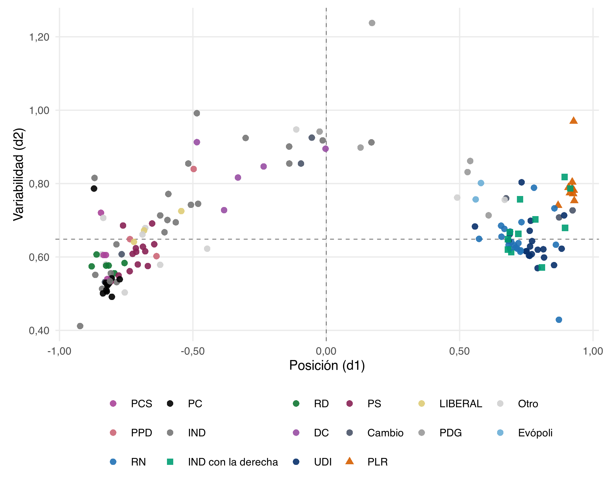

# Introducción {#sec-intro}

En la Cámara de Diputados de Chile, la división entre izquierda y derecha es la que más ordena el voto. Desde el plebiscito de 1988, la competencia partidaria se organizó en dos bloques (Tironi y Agüero, 1999; Torcal y Mainwaring, 2003), y en las votaciones nominales la coalición pesó más que el partido (Alemán y Saiegh, 2007). Esa división sigue ahí: en la escala de B-Call de 2022 a 2026, los partidos de derecha quedan a unas dos desviaciones estándar de la mediana de la izquierda (@tbl-camara).

Lo que cambió es la derecha. En la elección de consejeros constitucionales del 7 de mayo de 2023, el Partido Republicano (PLR) obtuvo 35,5% de los votos y Chile Vamos (ChV), la coalición de la derecha convencional, 21%. En marzo de 2026, José Antonio Kast asumió la presidencia. El ascenso de la derecha radical obliga a preguntar cómo responde la derecha convencional: si converge con ella o se diferencia.

Este artículo plantea la pregunta en dos niveles. El primero es conocido: la izquierda y la derecha se diferencian, y esa diferencia sirve de vara. El segundo es el que importa para entender a la derecha radical: cuánto se diferencian las derechas entre sí, medidas con esa vara, y en qué. Si la distancia entre el PLR y ChV es una fracción menor de la que separa a la derecha de la izquierda, el PLR es una variante dentro del bloque; si se le acerca, es una segunda división.

La literatura sobre cómo responde la derecha convencional al ascenso de la radical mide sus estrategias con lo que los partidos dicen, sobre todo en sus programas (Meguid, 2008; Abou-Chadi y Krause, 2020; Krause et al., 2023). Los estudios que miran el voto parlamentario miden cuánto coinciden o se enfrentan los partidos (Santos et al., 2025), pero no qué implicaba cada voto. Con eso no se puede distinguir si dos partidos votan juntos porque comparten el contenido o porque comparten una posición frente al gobierno, dos lógicas que el voto nominal mezcla (Hix y Noury, 2016). El caso chileno agrega un problema: la derecha radical no es un partido de nicho externo, sino una escisión de la derecha convencional, y se ha anticipado que esa cercanía facilita la cooperación (Díaz et al., 2023) sin que se haya examinado en el comportamiento legislativo.

Para responder, analizamos las votaciones nominales sobre indicaciones entre 2016 y 2026. Codificamos con un modelo de lenguaje qué implica votar Sí a cada una, estimamos la posición de los diputados con B-Call y expresamos cada brecha entre las derechas como fracción de la brecha entre la derecha convencional y la izquierda.

El argumento es que la diferencia entre las derechas tiene dos planos que conviene separar: el contenido de lo que se vota y la táctica con que se vota. En el contenido, las derechas son casi un mismo bloque. En la dimensión principal, su distancia es de 2% a 24% de la que las separa de la izquierda, y en economía y orden el texto las mueve igual. La excepción es lo valórico, donde la brecha llega a la mitad de la vara, aunque con pocas votaciones. En la táctica, el PLR se distingue por la intensidad de su oposición al presupuesto del Ejecutivo, y ChV lo sigue solo a medias.

El artículo hace tres aportes, uno por cada vacío:

- **Conceptual.** Separa dos planos del voto legislativo, el contenido y la táctica, que el voto nominal mezcla. Así, la pregunta deja de ser si la derecha convencional converge con la radical y pasa a ser en qué plano lo hace y cuánto.
- **Empírico.** Lleva la pregunta del programa al voto, en un caso donde la derecha radical es una escisión de la convencional, y mide la distancia entre las derechas con la vara de la división entre izquierda y derecha.
- **Metodológico.** Mide qué implica votar Sí a cada indicación con un modelo de lenguaje validado contra un segundo modelo, y aplica B-Call dentro de la derecha, una extensión que Toro-Maureira et al. (2025) proponen en su conclusión pero no evalúan. La Ley de Presupuestos funciona como un diseño casi de panel: las mismas partidas se votan cada año.

La teoría está en @sec-niveles y @sec-teoria, y las expectativas en @sec-expectativas. @sec-datos describe datos y métodos, @sec-resultados presenta los resultados y @sec-discusion los discute a la luz del proyecto Fondecyt «La derecha en disputa».

## Dos niveles de diferencia {#sec-niveles}

La distancia entre partidos es un concepto relativo: importa cuán lejos están dos partidos en comparación con el resto del sistema (Sartori, 1976). Por eso este artículo mide la distancia entre las derechas con la vara de la división principal.

En Chile, esa división tiene una raíz conocida. La dictadura produjo una fisura entre autoritarismo y democracia que, desde el plebiscito de 1988, ordenó a los partidos en dos bloques (Tironi y Agüero, 1999) y eclipsó a las demás divisiones (Torcal y Mainwaring, 2003). En la Cámara, la pertenencia a la coalición ordenó el voto más que la posición de cada partido (Alemán y Saiegh, 2007).

El PLR nace dentro de uno de esos bloques. Kast no es un outsider: militó veinte años en la UDI antes de renunciar en 2016 y fundar el PLR en 2019, y ambos partidos comparten redes. Si la división principal sigue ordenando el voto, la distancia entre el PLR y ChV debería ser una fracción menor de la que separa a la derecha de la izquierda.

Que sea menor no significa que sea nula. La derecha chilena nunca fue homogénea: combina conservadurismo moral, socialcristianismo y liberalismo económico, y sus dirigentes difieren en su visión del Estado, con diferencias que cruzan a los partidos (Alenda, 2020). Tampoco ha votado siempre igual en la oposición: entre 2002 y 2006, la UDI aprobó cerca del 11% de los proyectos del Ejecutivo y RN cerca del 36% (Toro Maureira, 2007). La diferencia dentro de la derecha puede estar en el programa o en la forma de hacer oposición.

En el programa, hay razones para esperar que la diferencia esté en lo valórico. Rovira Kaltwasser (2019) muestra que RN, la UDI y Evópoli moderaron sus programas en economía y en temas morales, y sugiere que esa moderación dejó huérfano a un segmento del electorado que una derecha radical podía captar. Pero, según el mismo autor, la moderación económica fue selectiva: ChV mantuvo, por ejemplo, la defensa del sistema privado de pensiones. Y Díaz et al. (2023) describen al PLR como autoritario, nativista y populista, pero con posiciones económicas neoliberales claras. Si ambos tienen razón, las derechas deberían coincidir en economía y separarse en lo moral.

## Contenido y táctica {#sec-teoria}

Los estudios sobre la derecha radical describen su normalización: deja de ser marginal y sus temas entran al sentido común y a la agenda de otros partidos (Mudde, 2019). Gidron y Ziblatt (2019) sostienen que su éxito no se entiende sin las decisiones de la derecha mainstream.

Para esas decisiones hay una tipología conocida: desdén, conflicto y convergencia o adaptación (Meguid, 2008; Bale et al., 2010; Downs, 2001). Con el desdén, el partido convencional le resta relevancia al tema del radical; con el conflicto, toma la posición contraria; con la convergencia, adopta su posición y le disputa el tema. En Europa occidental, la derecha convencional ha enfrentado a la radical con resultados dispares, y su cambio más claro es la adopción de posiciones más restrictivas en inmigración (Bale y Rovira Kaltwasser, 2021).

En Chile, el desdén y el conflicto son poco probables, por la cercanía de origen entre ambos partidos. La pregunta relevante es cuánto y en qué converge ChV, y si esa convergencia varía con el calendario electoral.

Proponemos que la convergencia puede ocurrir en dos planos. El contenido es la respuesta a la dirección de lo que se vota: dos partidos convergen si votan igual ante el mismo texto. La táctica es cómo se vota más allá del contenido: la intensidad de la oposición al Ejecutivo, el voto de protesta (como las rebajas simbólicas del presupuesto) y la disciplina. Un partido puede converger en un plano y diferenciarse en el otro.

La distinción tiene apoyo en dos literaturas. Hix y Noury (2016) muestran que el voto legislativo mezcla la posición de izquierda o derecha con la posición frente al gobierno, y que el peso de cada una depende de las instituciones. Y los partidos populistas hacen oposición de otra forma: en el parlamento neerlandés participan menos en la elaboración de políticas y algo más en el control del gobierno, incluido el voto contra sus proyectos (Louwerse y Otjes, 2019). Si el PLR se comporta así, debería distinguirse más en la táctica que en el contenido.

Para el partido radical, el Fondecyt plantea una estrategia dual: moderación para legitimarse en el sistema político y fortalecimiento ideológico para movilizar a su núcleo. En el voto, la primera se vería como convergencia en contenido con la derecha convencional, y la segunda como diferenciación en táctica y en los temas de la batalla cultural.

## Expectativas {#sec-expectativas}

1. **Jerarquía de distancias.** En la dimensión principal de la Cámara, la distancia entre el PLR y ChV es una fracción menor de la distancia entre la derecha y la izquierda.
2. **Convergencia en contenido.** En orden, nación y economía, un texto que va hacia el polo de derecha mueve el Sí de ambas derechas en magnitudes similares.
3. **Diferenciación valórica.** El contenido conservador mueve más el Sí del PLR que el de ChV.
4. **Diferenciación táctica.** A igual contenido, el PLR se opone más a las iniciativas de un Ejecutivo de izquierda.
5. **Oscilación electoral (H5 del Fondecyt).** El acuerdo de ChV con el PLR cae en momentos de competencia entre ambos, como las municipales y regionales de 2024, y sube cuando importa coordinarse, como la presidencial de 2025.

# Datos y métodos {#sec-datos}

**Universo.** Votaciones nominales sobre indicaciones en la Sala de la Cámara, del 11 de marzo de 2016 al 10 de marzo de 2026, tomadas de una base de 3.809 votaciones de indicaciones desde 2010. El voto se codifica Sí = 1, No = −1 y abstención = 0; la ausencia queda fuera.

**Bloques.** Derecha tradicional: UDI, RN y Evópoli. Nueva derecha: PLR (REP en los datos) y, desde 2025-26, PNL.^[En la historiografía chilena, «nueva derecha» designó a la derecha que la dictadura y sus reformas de mercado reconfiguraron, la UDI y RN (Pollack, 1999). Aquí el término solo distingue a los partidos fundados desde 2019.] Un independiente cuenta como derecha si vota con la mayoría de la derecha en al menos el 75% de las votaciones en que derecha e izquierda se dividen.

**Contenido.** Un modelo de lenguaje (OpenAI, gpt-6-luna) lee solo el texto de la indicación, con los autores enmascarados. Codifica qué implica votar Sí en cinco ejes (económico, subsidiariedad, valórico, orden y nación), además del tema, la naturaleza del cambio, si es presupuestario y si el texto es evaluable. Cada eje se reduce a +1 (polo de derecha), −1 o 0.

**Validación.** Un segundo modelo (DeepSeek) codifica 300 textos de validación. Kappa en la escala reducida: económico 0,68, valórico 0,72, orden 0,71, nación 0,72 y subsidiariedad 0,42. Subsidiariedad queda como provisional hasta la codificación humana de sus 31 desacuerdos. La figura A1 compara ese kappa con el del código anterior.

**Posiciones.** B-Call (Toro-Maureira et al., 2025) por período y por año legislativo, en dos universos: toda la Cámara y solo la derecha. En el universo de la derecha, el pivote es un diputado republicano desde 2022, y d1 positivo significa cercanía a la nueva derecha. Se excluye a quien vota en menos del 15% de las votaciones (el paper usa 10%).

**Modelos.** Modelos lineales de probabilidad del voto Sí, con efectos fijos por diputado y errores agrupados por votación. Predictores: dirección del texto en cada eje, autoría × gobierno, tipo de votación y tema. En el presupuesto, efectos fijos por partida.

**Cuánto se diferencian.** Para responder cuánto, expresamos cada brecha entre las derechas como fracción de la brecha entre la derecha convencional y la izquierda en la misma medida:

$$
R = \frac{\text{nueva} - \text{tradicional}}{\text{tradicional} - \text{izquierda}}
$$

Con R = 0, las derechas no se distinguen; con R = 1, se separan tanto como la derecha convencional de la izquierda. Si R es positivo, la nueva derecha queda más lejos de la izquierda que la tradicional; si es negativo, más cerca. Lo calculamos en la posición dentro de la escala de la Cámara, con la UDI como referencia de la derecha tradicional, y en el efecto del contenido sobre el Sí. No lo calculamos cuando la brecha entre izquierda y derecha es menor de 10 puntos, porque el cociente se vuelve inestable.

## B-Call: uso y cautelas {#sec-bcall}

B-Call resume cada voto como su desvío del promedio de la votación, estandarizado y con signo (Toro-Maureira et al., 2025). d1 es el promedio de esos desvíos (posición) y d2 su desviación estándar (cohesión). Tres puntos del paper importan para este análisis.

1. El signo depende de dos grupos definidos de antemano. Cada votación se orienta comparando el voto promedio de un grupo «izquierdo» y uno «derecho», definidos por conocimiento previo o por agrupamiento. En la Cámara esa división es natural. Dentro de la derecha, si los dos grupos coinciden con PLR y ChV, cada votación se orienta para separarlos, y parte de la distancia se produce por construcción, más con un grupo chico (7 a 9 republicanos). Antes de leerla como fractura hace falta una prueba de permutación, y revisar en el código de `bcall_auto` cómo arma los grupos.
2. El paper abre la puerta al modelo dentro de un grupo, pero no lo prueba. Su conclusión propone aplicar B-Call dentro de partidos o bancadas, con d1 como ideología interna y d2 como cohesión respecto del grupo, y deja la versión jerárquica como trabajo futuro. Este artículo aplica esa propuesta.
3. d2 está subusado. La cohesión es el aporte central de B-Call, y la disciplina es una táctica en sí misma. Falta comparar el d2 de PLR, UDI, RN y Evópoli por año. El paper advierte que los legisladores extremos tienden a ser más volátiles, así que la comparación debe controlar por d1.

Como en el paper, los modelos de distintos años se comparan solo de forma descriptiva: d1 se lee dentro de cada modelo. La medida comparable en el tiempo es el índice LLM. El paper ubica además a José Antonio Kast en 2014–2017 como el diputado más a la derecha y uno de los menos cohesivos, antes de su salida de la UDI: un antecedente útil para la sección de contexto.

Para leer la posición de un año a otro, este artículo no compara el d1 crudo. Expresa la mediana de cada partido en desviaciones estándar de los diputados de ese año, con el cero en la mediana de la izquierda (PC, PS, FA y PPD). Esa escala es la del panel A de @fig-posicion y la que usa R en la posición.

# Resultados {#sec-resultados}

Los resultados van en dos niveles. Primero, qué separa a la izquierda de la derecha; después, cuánto se separan las derechas entre sí, en el contenido y en la táctica.

## Izquierda y derecha: la división que ordena la Cámara {#sec-division}

En la dimensión principal de la Cámara, las dos derechas son un mismo bloque. El mapa clásico de B-Call lo muestra de una vez (@fig-mapa): cada diputado del período 2022-2026, con la posición en el eje horizontal y la variabilidad en el vertical. UDI, RN, Evópoli y PLR quedan en el mismo extremo, lejos de la izquierda.

{#fig-mapa fig-align="center" width="100%"}

En una escala comparable entre años (cero = mediana de la izquierda; unidad = desviación estándar de los diputados de ese año), UDI, RN y Evópoli quedan cerca de 2 toda la década, y el PLR también desde que tiene bancada (@tbl-camara y @fig-posicion).

| Año legislativo | PLR | UDI | RN | Evópoli | PLR − UDI |
|---|---:|---:|---:|---:|---:|
| 2022-23 | 2,44 | 2,14 | 1,99 | 1,70 | +0,30 |
| 2023-24 | 2,13 | 2,18 | 2,07 | 2,00 | −0,05 |
| 2024-25 | 2,47 | 2,00 | 1,99 | 1,70 | +0,47 |
| 2025-26 | 2,10 | 2,15 | 2,02 | 2,05 | −0,05 |

: B-Call de toda la Cámara, eje de todas las indicaciones. Antes de 2022 el PLR tiene uno o dos diputados. Evópoli tiene dos diputados de 2022-23 a 2025-26; la @fig-posicion no los dibuja. {#tbl-camara}

{#fig-posicion fig-align="center" width="100%"}

El contenido muestra en qué consiste esa división (@tbl-si y @fig-efecto). Ante un texto conservador, la izquierda baja 31 puntos su probabilidad de votar Sí y las derechas la suben entre 19 y 43. Ante uno soberanista, la izquierda baja 30 y las derechas suben entre 16 y 28. Ante uno pro-mercado, la izquierda baja 9 y las derechas suben 4. El orden es la excepción: la izquierda no reacciona a su contenido, y no es un eje que polarice la Cámara. La división entre izquierda y derecha es, sobre todo, valórica y de nación.

| Polo del Sí | Nueva | Tradicional | IND con la derecha | Izquierda |
|---|---:|---:|---:|---:|
| Conservador | +43 | +19 | +25 | −31 |
| Soberanista | +16 | +28 | +17 | −30 |
| Orden y castigo | +14 | +13 | +11 | 0 |
| Pro-mercado | +4 | +4 | +4 | −9 |
| Provisión privada (provisional) | −7 | 0 | −3 | −6 |

: Puntos porcentuales de probabilidad de votar Sí cuando el texto va hacia el polo nombrado, frente a un texto que no toca el eje. Votos: nueva 4.035; tradicional 31.899; IND con la derecha 6.493; izquierda 27.566. {#tbl-si}

{#fig-efecto fig-align="center" width="100%"}

## ¿Cuánto se diferencian las derechas? {#sec-cuanto}

Medida con esa vara, la distancia entre las derechas es chica en casi todo (@tbl-cuanto).

| Medida | Nueva − tradicional | Tradicional − izquierda | R |
|---|---:|---:|---:|
| Posición en la Cámara, 2022-23 | +0,30 | 2,14 | 0,14 |
| Posición en la Cámara, 2023-24 | −0,05 | 2,18 | −0,02 |
| Posición en la Cámara, 2024-25 | +0,47 | 2,00 | 0,24 |
| Posición en la Cámara, 2025-26 | −0,05 | 2,15 | −0,02 |
| Sí ante texto conservador | +24 | 50 | 0,48 |
| Sí ante texto soberanista | −12 | 58 | −0,21 |
| Sí ante texto de orden | +1 | 13 | 0,08 |
| Sí ante texto pro-mercado | 0 | 13 | 0,00 |

: Distancia entre las derechas como fracción de la distancia entre la derecha tradicional y la izquierda (R). Posición: desviaciones estándar, con la UDI como derecha tradicional (@tbl-camara). Contenido: puntos porcentuales (@tbl-si). Provisión privada no se calcula: su kappa es 0,42 y la brecha entre izquierda y derecha es de 6 puntos. {#tbl-cuanto}

- **Dimensión principal.** La brecha entre el PLR y la UDI va de 2% a 24% de la que separa a la UDI de la izquierda. Se abre en 2022-23 (14%) y en 2024-25 (24%), y casi desaparece en 2023-24 y 2025-26. El año 2024-25 es el del presupuesto con mayor oposición republicana (@sec-presupuesto).
- **Economía y orden.** El contenido no distingue a las derechas: R es 0 ante el texto pro-mercado y 0,08 ante el de orden. La ventaja pro-mercado del PLR en 2024-25 (índice 0,86 frente a 0,65 de la UDI) está en el presupuesto del Ejecutivo: +25 puntos ahí y +3 fuera de él. Es una diferencia de táctica, no de contenido.
- **Nación.** R es negativo (−0,21), pero no indica una derecha tradicional más soberanista. Hay techo: ante un texto soberanista, las dos derechas votan Sí casi siempre, y eso comprime el coeficiente de la nueva.
- **Valórico.** Es el único eje de contenido donde las derechas se separan de verdad: R = 0,48, la mitad de la vara. En logit, el efecto marginal es +45 en la nueva y +16 en la tradicional. Pero la brecha a nivel de votación (+17 puntos, p = 0,024) no pasa la corrección de Holm en los cinco ejes (p = 0,118), y entre 2022 y 2026 hay solo 10 votaciones valóricas.

Estos cocientes comparan estimaciones puntuales de modelos separados por bloque. Falta su intervalo de confianza, con bootstrap por votación.

::: {.callout-note}
## Pendiente: acuerdo entre partidos

La medida más directa de cuánto se diferencian es el porcentaje de votaciones en que coinciden las mayorías de dos partidos. Falta calcularlo por año legislativo para los pares UDI–PLR, RN–PLR, Evópoli–PLR y UDI–PS, junto con la cohesión de cada partido según el índice de acuerdo de Hix, Noury y Roland (2005). Permitirá decir, en una cifra, con qué frecuencia la UDI vota como el PLR y con qué frecuencia como el PS.
:::

Dentro de la derecha, el B-Call propio da una imagen más fuerte. La distancia estandarizada entre nueva y tradicional sube de 0,77 (2022-23) a 2,99 (2023-24) y 2,71 (2024-25), con solapamiento casi nulo. Las dos medidas no se contradicen, pero no miden lo mismo:

- La distancia interna se mide en desviaciones de un grupo muy cohesionado, así que una diferencia chica se vuelve grande.
- Parte de ella puede venir de cómo B-Call orienta cada votación entre dos grupos (@sec-bcall).
- No se mueven juntas: en 2023-24, el año de mayor distancia interna (2,99), en la escala de la Cámara quedan a 0,05.

La lectura prudente: hay una diferencia secundaria y consistente dentro de la derecha, pero no una fractura en el eje que ordena la Cámara.

## La táctica: el presupuesto {#sec-presupuesto}

ChV endurece su voto en las mismas partidas, pero el PLR se endurece más rápido y la brecha se abre hasta el presupuesto 2025. En el de 2026 vuelven a acercarse.

| Ley | Partido | % No | % igual al PLR | % Sí a rebajas | Votaciones |
|---|---|---:|---:|---:|---:|
| 2023 | PLR | 33 | 99 | 84 | 290 |
| 2023 | UDI | 28 | 82 | 82 | 290 |
| 2023 | RN | 24 | 78 | 85 | 290 |
| 2023 | Evópoli | 30 | 67 | 67 | 286 |
| 2024 | PLR | 51 | 99 | 97 | 517 |
| 2024 | UDI | 45 | 76 | 82 | 517 |
| 2024 | RN | 41 | 70 | 63 | 517 |
| 2024 | Evópoli | 47 | 68 | 44 | 504 |
| 2025 | PLR | 67 | 100 | 100 | 601 |
| 2025 | UDI | 46 | 73 | 95 | 601 |
| 2025 | RN | 46 | 70 | 83 | 601 |
| 2025 | Evópoli | 43 | 64 | 40 | 589 |
| 2026 | PLR | 53 | 100 | no hubo | 110 |
| 2026 | PNL | 48 | 96 | no hubo | 110 |
| 2026 | UDI | 43 | 91 | no hubo | 110 |
| 2026 | RN | 42 | 88 | no hubo | 110 |
| 2026 | Evópoli | 40 | 80 | no hubo | 106 |

: Leyes de Presupuestos 2023 a 2026, votadas en noviembre del año anterior. «% igual al PLR» es el porcentaje de votos del partido que coincide con la mayoría republicana. {#tbl-presupuesto}

{#fig-presupuesto fig-align="center" width="100%"}

- Con la partida fija, el No de la UDI sube 17 puntos en 2024 y 16 en 2025 (p < 0,001): un endurecimiento real, en la dirección del PLR.
- Aun así, el acuerdo de la UDI con la mayoría republicana baja de 82% a 73%, porque el No del PLR pasa de 33% a 67%.
- Las rebajas simbólicas dividen a ChV: el PLR y la UDI las apoyan cada vez más (100% y 95% en 2025), mientras Evópoli baja de 67% a 40%.
- El acercamiento de 2026 tiene advertencias: son 110 votaciones, ninguna rebaja simbólica, y la partida se extrajo solo en el 73%. Falta descomponer si se moderó el PLR, se endureció ChV o cambiaron las partidas votadas.

La lectura propuesta es endurecimiento en paralelo, no contagio: ChV sigue al PLR a medias. En la tipología de Meguid (2008), es una acomodación parcial en la táctica opositora.

::: {.callout-note}
## Pendiente: la vara en el presupuesto

Para calcular R también en la táctica falta el % de No de la izquierda en las mismas votaciones, por ley y con la partida fija.
:::

# Discusión {#sec-discusion}

La respuesta a la pregunta del título tiene dos partes. La izquierda y la derecha se diferencian en lo valórico, en nación y, menos, en economía, y esa división sigue ordenando la Cámara. Las derechas se diferencian mucho menos: casi nada en la dimensión principal, en economía y en orden; algo en lo valórico, y sobre todo en la táctica. Cuatro de las cinco expectativas encuentran apoyo; la valórica queda como sugerente.

| Expectativa | Resultado | Lectura |
|---|---|---|
| 1. Jerarquía de distancias | Brecha PLR–UDI de 2% a 24% de la brecha UDI–izquierda | Se cumple |
| 2. Convergencia en contenido | R de 0 en pro-mercado y 0,08 en orden; nación con techo en ambas | Se cumple |
| 3. Diferenciación valórica | R = 0,48; conservador +43 frente a +19; Holm p = 0,118 | Sugerente |
| 4. Diferenciación táctica | Presupuesto del Ejecutivo: PLR +25 pp sobre la UDI; No del PLR de 33% a 67% | Se cumple, solo en el presupuesto |
| 5. Oscilación electoral | Acuerdo de la UDI con el PLR: 82, 76, 73 y 91% | Primera evidencia; falta fechar |

: Expectativas y lectura. {#tbl-expectativas}

El resultado calza con una división principal que sigue siendo la de los dos bloques (Tironi y Agüero, 1999; Alemán y Saiegh, 2007). El PLR no abre una segunda división en el voto: es una variante dentro del bloque de derecha, más dura en la táctica. En el contenido, el resultado es coherente con lo que anticipaban Díaz et al. (2023): la relación fluida entre ambas derechas facilita la cooperación.

Los datos matizan la tesis de la sobreadaptación (Rovira Kaltwasser, 2019). Si ChV moderó su programa en economía, esa moderación no aparece en el voto sobre indicaciones: ante el mismo texto, ChV y el PLR votan igual. Sí aparece, débil, en lo valórico. Hay dos lecturas posibles. Una es que la moderación de ChV fue más de programa que de voto, salvo en lo moral. La otra es que las indicaciones no capturan los temas en que ChV se moderó. Esa brecha entre lo que los partidos dicen y lo que votan es justo la que este artículo propone medir.

Que la diferencia esté en la táctica tampoco es una anomalía. La derecha chilena ya se dividió por la forma de hacer oposición: entre 2002 y 2006, la UDI aprobó cerca del 11% de los proyectos del Ejecutivo y RN cerca del 36% (Toro Maureira, 2007). En Europa, los partidos populistas hacen oposición con menos colaboración legislativa y más control del gobierno (Louwerse y Otjes, 2019). Lo nuevo en Chile es quién ocupa el polo duro: en 2002–2006 era la UDI; hoy es el PLR, y la UDI lo sigue a medias.

Los resultados apoyan la hipótesis general del Fondecyt en el plano parlamentario. El PLR combina dos estrategias: vota como la derecha convencional en casi todo el contenido, lo que sirve a su legitimación institucional, y se diferencia en la táctica opositora y, débilmente, en lo valórico, lo que refuerza su núcleo doctrinario.

Para ChV, los datos se parecen más a una acomodación parcial que a la convergencia o la diferenciación puras. Endurece su oposición sin alcanzar al PLR y mantiene su propia respuesta valórica.

La H5 encuentra una primera evidencia en el presupuesto. El acuerdo con el PLR cae hasta el presupuesto 2025, tramitado en torno a las municipales y regionales de 2024, y sube en el de 2026, tramitado durante la campaña presidencial de 2025. Es coherente con una oscilación según el calendario electoral, pero falta fechar la tramitación y contrastarlo con el seguimiento de prensa del proyecto.

Evópoli es el caso que el Fondecyt anticipa como reactivación de sensibilidades moderadas: se aleja de las rebajas simbólicas y tiene el índice valórico más bajo de la derecha (0,25 a 0,40 desde 2022, aunque con 3 a 5 votos por año). En la escala de la Cámara, Evópoli queda además más cerca del centro en 2022-23 y 2024-25 (1,70, frente a cerca de 2 de UDI y RN). RN y la UDI se mueven juntas casi siempre. El índice por partido y año está en la figura A2.

## Límites

- **La táctica se mide casi solo con el presupuesto.** El No republicano al presupuesto puede leerse también como contenido, por ejemplo como austeridad fiscal. La partida fija controla el tema, no la motivación. Falta una segunda señal táctica: el voto ante indicaciones del Ejecutivo fuera del presupuesto, a igual contenido, y la disciplina (d2).
- **La vara.** R es un cociente de estimaciones puntuales y todavía no tiene intervalo. Tampoco se calcula donde la brecha entre izquierda y derecha es chica.
- **Contagio valórico.** El salto de UDI y RN en el índice valórico (0,48 a 0,77 en 2024-25) viene de proyectos distintos. Donde la misma glosa vuelve, el voto no cambia: con el tipo de texto fijo, el índice sería 0,52.
- **Tendencias dentro de la legislatura.** Entre 2022 y 2026 hay solo 10 votaciones valóricas, y los efectos por año no se distinguen de cero (2024-25: +20 puntos, p = 0,64).
- **Efecto del gobierno frente al efecto PLR.** Bajo Boric no hubo votaciones valóricas del Ejecutivo, y la baja de los reelectos compara proyectos distintos (19 votaciones frente a 9).
- **Cierre de la brecha.** Con el texto fijo, 2024-25 no cierra la brecha entre bloques (+4 puntos, p = 0,34; 531 votaciones).
- **Universo.** La guerra cultural casi no pasa por las indicaciones. Fuera de ellas el texto disponible es pobre, y 1.124 resoluciones no traen el cuerpo.
- **Validación externa.** Falta contrastar la escala de la Cámara con los puntos ideales de Fábrega (2025), que cubren 2002–2026.

## Cierre

La izquierda y la derecha siguen siendo los dos polos de la Cámara. Entre las derechas, la distancia es una fracción de esa división: no se separan por lo que votan, sino por cómo lo votan. En el contenido, ChV y el PLR forman un solo bloque, con una brecha valórica que todavía es débil. En la táctica, el PLR empuja una oposición más dura y ChV la acompaña a medias. Esa combinación calza con la estrategia dual que el Fondecyt atribuye a la derecha radical, y con una derecha convencional que se acomoda sin mimetizarse.

# Apéndice {.unnumbered}

{fig-align="center" width="92%"}

{fig-align="center" width="92%"}

# Referencias {.unnumbered}

::: {.referencias}
Abou-Chadi, T. y Krause, W. (2020). The causal effect of radical right success on mainstream parties' policy positions: A regression discontinuity approach. *British Journal of Political Science*, 50(3), 829–847. https://doi.org/10.1017/S0007123418000029

Alemán, E. y Saiegh, S. M. (2007). Legislative preferences, political parties, and coalition unity in Chile. *Comparative Politics*, 39(3), 253–272.

Alenda, S. (ed.) (2020). *Anatomía de la derecha chilena: Estado, mercado y valores en tiempos de cambio*. Fondo de Cultura Económica.

Bale, T., Green-Pedersen, C., Krouwel, A., Luther, K. R. y Sitter, N. (2010). If you can't beat them, join them? Explaining social democratic responses to the challenge from the populist radical right in Western Europe. *Political Studies*, 58(3), 410–426.

Bale, T. y Rovira Kaltwasser, C. (eds.) (2021). *Riding the populist wave: Europe's mainstream right in crisis*. Cambridge University Press.

Díaz, C., Rovira Kaltwasser, C. y Zanotti, L. (2023). The arrival of the populist radical right in Chile: José Antonio Kast and the «Partido Republicano». *Journal of Language and Politics*, 22(3), 342–359. https://doi.org/10.1075/jlp.22131.dia

Downs, W. M. (2001). Pariahs in their midst: Belgian and Norwegian parties react to extremist threats. *West European Politics*, 24(3), 23–42.

Fábrega, J. (2025). Ideological positions in the Chilean Chamber of Deputies (2002–2026): A legislative roll-call dataset. *Data in Brief*, 63, 112163. https://doi.org/10.1016/j.dib.2025.112163

Gidron, N. y Ziblatt, D. (2019). Center-right political parties in advanced democracies. *Annual Review of Political Science*, 22, 17–35.

Hix, S. y Noury, A. (2016). Government-opposition or left-right? The institutional determinants of voting in legislatures. *Political Science Research and Methods*, 4(2), 249–273.

Hix, S., Noury, A. y Roland, G. (2005). Power to the parties: Cohesion and competition in the European Parliament, 1979–2001. *British Journal of Political Science*, 35(2), 209–234.

Krause, W., Cohen, D. y Abou-Chadi, T. (2023). Does accommodation work? Mainstream party strategies and the success of radical right parties. *Political Science Research and Methods*, 11(1), 172–179.

Louwerse, T. y Otjes, S. (2019). How populists wage opposition: Parliamentary opposition behaviour and populism in Netherlands. *Political Studies*, 67(2), 479–495.

Meguid, B. M. (2008). *Party competition between unequals: Strategies and electoral fortunes in Western Europe*. Cambridge University Press.

Mudde, C. (2019). *The far right today*. Polity.

Pollack, M. (1999). *The new right in Chile, 1973–97*. Macmillan.

Rovira Kaltwasser, C. (2019). La (sobre)adaptación programática de la derecha chilena y la irrupción de la derecha populista radical. *Colombia Internacional*, 99, 29–61. https://doi.org/10.7440/colombiaint99.2019.02

Santos, N., Serra-Silva, S. y Silva, T. (2025). The role of radical right parties in escalating parliamentary conflict: Policy issues and party responses in Portugal. *Frontiers in Political Science*, 7, 1553921. https://doi.org/10.3389/fpos.2025.1553921

Sartori, G. (1976). *Parties and party systems: A framework for analysis*. Cambridge University Press.

Tironi, E. y Agüero, F. (1999). ¿Sobrevivirá el nuevo paisaje político chileno? *Estudios Públicos*, 74, 151–168.

Torcal, M. y Mainwaring, S. (2003). The political recrafting of social bases of party competition: Chile, 1973–95. *British Journal of Political Science*, 33(1), 55–84.

Toro Maureira, S. (2007). Conducta legislativa ante las iniciativas del Ejecutivo: unidad de los bloques políticos en Chile. *Revista de Ciencia Política*, 27(1), 23–41.

Toro-Maureira, S., Reutter, J., Valenzuela, L., Alcatruz, D. y Valenzuela, M. (2025). B-Call: Integrating ideological position and voting cohesion in legislative behavior. *Frontiers in Political Science*, 7, 1670089.
:::
