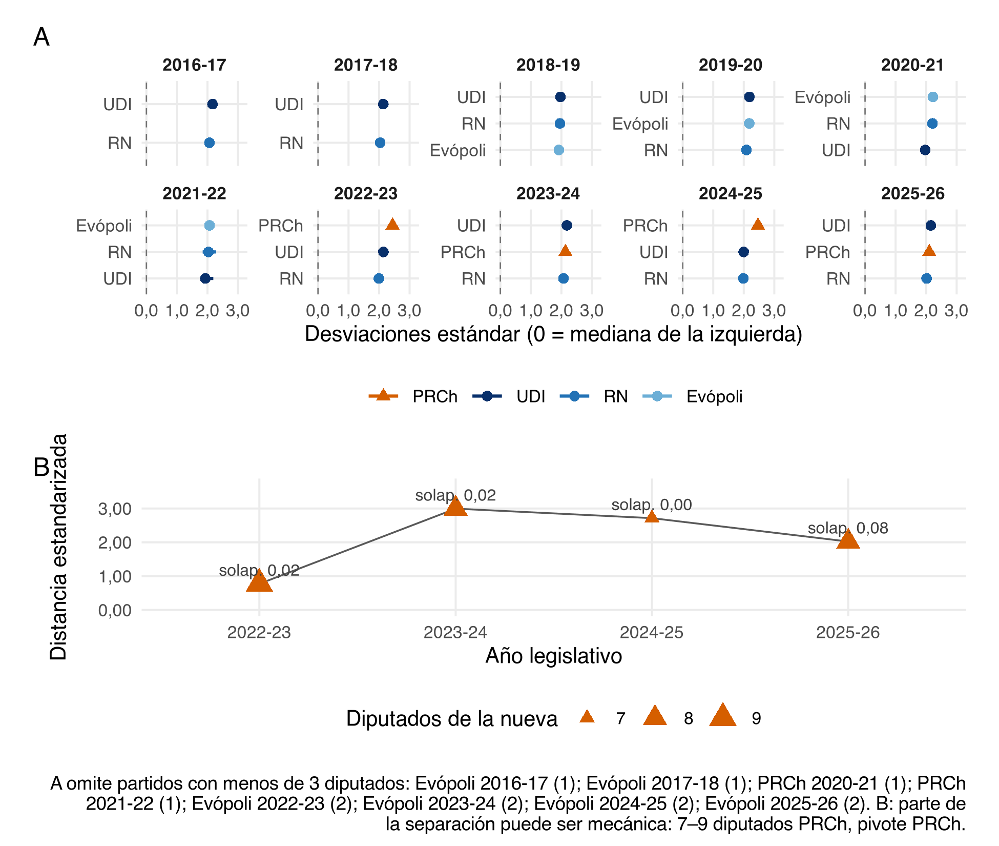
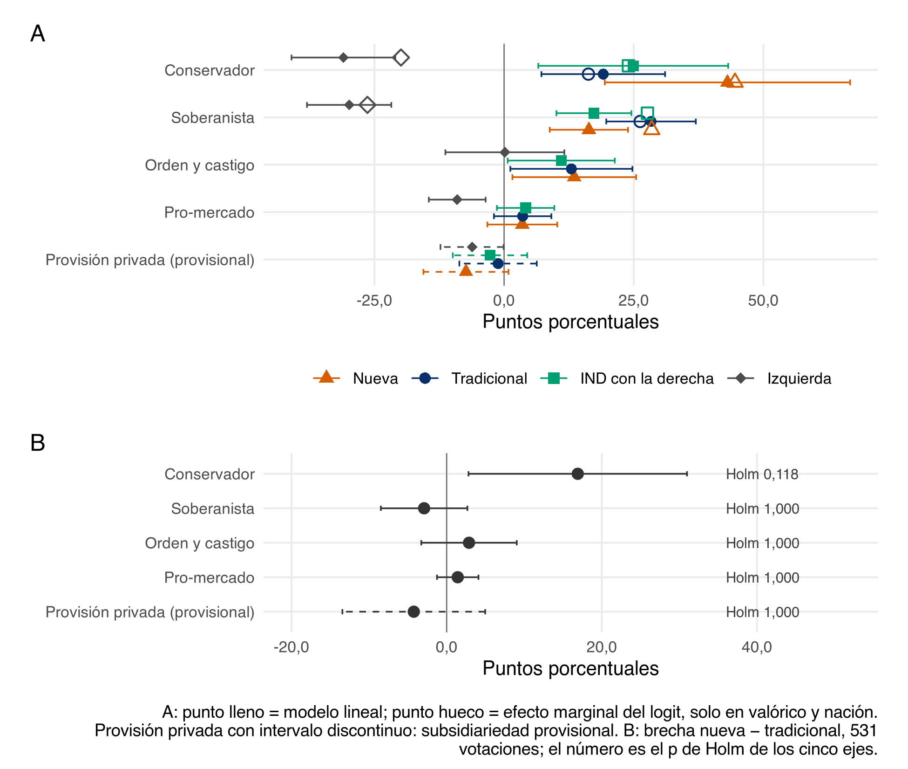
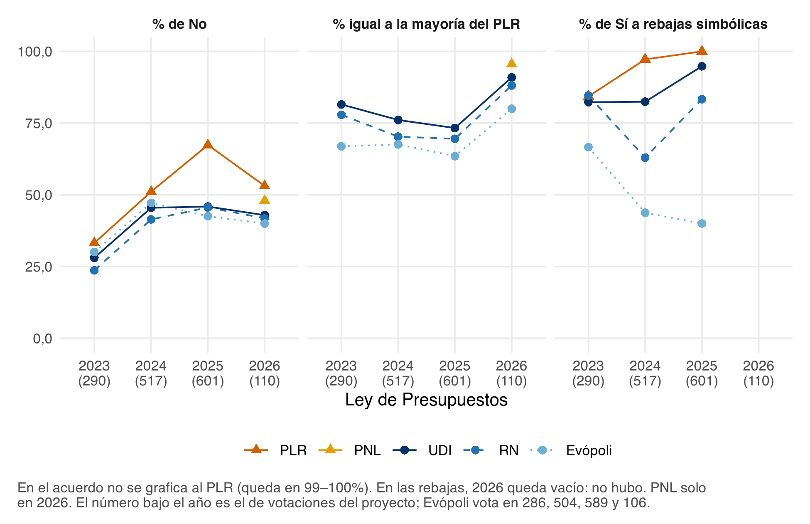
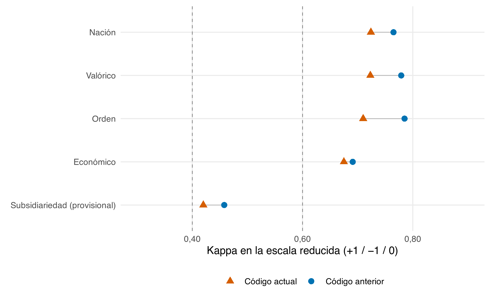
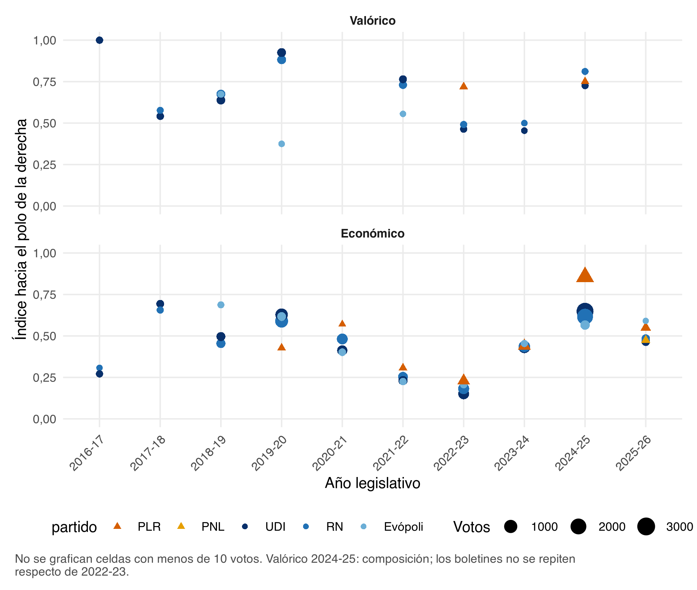

# Introducción {#sec-intro}

En la Cámara de Diputados de Chile, la división entre izquierda y derecha es la que más ordena el voto. Desde el plebiscito de 1988, la competencia partidaria se organizó en dos bloques (Tironi y Agüero, 1999; Torcal y Mainwaring, 2003), y en las votaciones nominales la coalición pesó más que el partido (Alemán y Saiegh, 2007). Esa división sigue ahí: en la escala de B-Call de 2022 a 2026, los partidos de derecha quedan a unas dos desviaciones estándar de la mediana de la izquierda (@tbl-camara).

Lo que cambió es la derecha. En la elección de consejeros constitucionales del 7 de mayo de 2023, el Partido Republicano (PLR) obtuvo 35,5% de los votos y Chile Vamos (ChV), la coalición de la derecha convencional, 21%. En diciembre de 2025, José Antonio Kast ganó la elección presidencial, y asumió el 11 de marzo de 2026, un día después del cierre de nuestros datos.^[Falta citar los resultados oficiales del Servel. El argumento no descansa en este hecho: los datos terminan antes del nuevo gobierno.] El ascenso de la derecha radical obliga a preguntar cómo responde la derecha convencional: si converge con ella o se diferencia.

El problema tiene dos niveles, y el segundo es el que este artículo viene a medir. El primero es conocido: la izquierda y la derecha se diferencian, y esa diferencia es la vara. El segundo es cuánto se diferencian las derechas entre sí, medidas con esa vara, y en qué plano. Si la distancia entre el PLR y ChV es una fracción menor de la que separa a la derecha de la izquierda, el PLR es una variante dentro del bloque. Si se le acerca, abre una segunda división. Esa fracción es R. La vara se ve en el mapa de la Cámara (@fig-mapa), en la escala anual (@tbl-camara y el panel A de @fig-posicion) y en el cociente de @tbl-cuanto. Los dos planos en los que la distancia puede abrirse son el contenido, en @tbl-si y @fig-efecto, y la táctica, en @tbl-presupuesto y @fig-presupuesto.

El vacío de la literatura es anterior a esa medición. Los trabajos sobre cómo responde la derecha convencional al ascenso de la radical miran lo que los partidos dicen, sobre todo en sus programas (Meguid, 2008; Abou-Chadi y Krause, 2020; Krause et al., 2023). Un programa puede moderarse mientras el voto muestra otra cosa. Los estudios que sí miran el voto parlamentario miden cuánto coinciden o se enfrentan los partidos (Santos et al., 2025), y se detienen antes de preguntar qué implicaba cada voto. Sin esa pieza, un Sí compartido puede ser contenido compartido o una misma posición frente al gobierno, las dos lógicas que el voto nominal mezcla (Hix y Noury, 2016). El caso chileno deja el vacío más a la vista: la derecha radical es una escisión de la convencional, y se ha anticipado que esa cercanía facilita la cooperación (Díaz et al., 2023) sin examinarla en el comportamiento legislativo. Este artículo cierra ese vacío al codificar qué implica votar Sí (@tbl-codigo) y, con eso, separar el efecto del texto (@fig-efecto) de la intensidad de la oposición (@fig-presupuesto).

Para hacerlo, usamos las votaciones nominales sobre indicaciones entre 2016 y 2026. Un modelo de lenguaje codifica qué implica votar Sí a cada una, B-Call estima la posición de los diputados y cada brecha entre las derechas se expresa como fracción de la brecha entre la derecha convencional y la izquierda.

La respuesta de ChV puede darse en dos planos. El contenido es votar parecido cuando el texto va hacia la derecha. La táctica es la intensidad con que se hace oposición al Ejecutivo. Los resultados no tienen la misma solidez, y cada uno se lee en una pieza distinta de la evidencia. El hallazgo sólido es la convergencia en contenido. En la dimensión principal, la distancia entre las derechas es de 2% a 24% de la que las separa de la izquierda (@tbl-cuanto y el panel A de @fig-posicion), y en economía y orden el texto las mueve igual (@tbl-si y @fig-efecto). En el mapa, el PLR queda en el mismo extremo que la UDI (@fig-mapa): es una variante dentro de la derecha. El hallazgo tentativo en lo valórico es el único eje de contenido donde las derechas se separan. La brecha llega a la mitad de la vara, descansa en pocas votaciones y no pasa la corrección del panel B de @fig-efecto. El hallazgo tentativo en la oposición al Ejecutivo es que el PLR vota más en contra del presupuesto y ChV lo sigue a medias (@tbl-presupuesto y @fig-presupuesto). @sec-robustez deja abierto si esa diferencia es táctica o si viene de la posición del PLR en la Cámara.

Esos tres resultados llenan el vacío en tres pasos. En lo conceptual, el artículo separa el contenido de la táctica, de modo que la pregunta pasa a ser en qué plano converge ChV y cuánto. En lo empírico, lleva la pregunta del programa al voto, en una escisión de la propia derecha, y mide esa distancia con la vara de @tbl-camara. En lo metodológico, codifica qué implica votar Sí con un modelo validado contra un segundo modelo (@tbl-codigo y la figura A1) y aplica B-Call dentro de la derecha, la extensión que Toro-Maureira et al. (2025) proponen en su conclusión y no evalúan. La Ley de Presupuestos acerca el diseño a un panel, porque las mismas partidas se votan cada año (@tbl-presupuesto).

La teoría está en @sec-niveles y @sec-teoria, y las expectativas en @sec-expectativas. @sec-datos describe datos y métodos, @sec-resultados presenta los resultados y @sec-discusion los discute a la luz del proyecto Fondecyt «La derecha en disputa». @sec-robustez reúne las pruebas pendientes.

## Dos niveles de diferencia {#sec-niveles}

La distancia entre partidos es un concepto relativo: importa cuán lejos están dos partidos en comparación con el resto del sistema (Sartori, 1976). Por eso este artículo mide la distancia entre las derechas con la vara de la división principal.

En Chile, esa división tiene una raíz conocida. La dictadura produjo una fisura entre autoritarismo y democracia que, desde el plebiscito de 1988, ordenó a los partidos en dos bloques (Tironi y Agüero, 1999) y eclipsó a las demás divisiones (Torcal y Mainwaring, 2003). En la Cámara, la pertenencia a la coalición ordenó el voto más que la posición de cada partido (Alemán y Saiegh, 2007).

El PLR nace dentro de uno de esos bloques. Kast no es un outsider: militó veinte años en la UDI antes de renunciar en 2016 y fundar el PLR en 2019, y ambos partidos comparten redes. Si la división principal sigue ordenando el voto, la distancia entre el PLR y ChV debería ser una fracción menor de la que separa a la derecha de la izquierda.

Que sea menor no significa que sea nula. La derecha chilena nunca fue homogénea: combina conservadurismo moral, socialcristianismo y liberalismo económico, y sus dirigentes difieren en su visión del Estado, con diferencias que cruzan a los partidos (Alenda, 2020). Tampoco ha votado siempre igual en la oposición: entre 2002 y 2006, la UDI aprobó cerca del 11% de los proyectos del Ejecutivo y RN cerca del 36% (Toro Maureira, 2007). La diferencia dentro de la derecha puede estar en el programa o en la forma de hacer oposición.

En el programa, hay razones para esperar que la diferencia esté en lo valórico. Rovira Kaltwasser (2019) muestra que RN, la UDI y Evópoli moderaron sus programas en economía y en temas morales, y sugiere que esa moderación dejó huérfano a un segmento del electorado que una derecha radical podía captar. Pero, según el mismo autor, la moderación económica fue selectiva: ChV mantuvo, por ejemplo, la defensa del sistema privado de pensiones. Y Díaz et al. (2023) describen al PLR como autoritario, nativista y populista, pero con posiciones económicas neoliberales claras. Si ambos tienen razón, las derechas deberían coincidir en economía y separarse en lo moral.

## Contenido y táctica {#sec-teoria}

Los estudios sobre la derecha radical describen su normalización: deja de ser marginal y sus temas entran al sentido común y a la agenda de otros partidos (Mudde, 2019). Gidron y Ziblatt (2019) sostienen que su éxito no se entiende sin las decisiones de la derecha mainstream.

Para esas decisiones hay una tipología conocida: desdén, conflicto y convergencia o adaptación (Meguid, 2008; Bale et al., 2010; Downs, 2001). Con el desdén, el partido convencional le resta relevancia al tema del radical; con el conflicto, toma la posición contraria; con la convergencia, adopta su posición y le disputa el tema. En Europa occidental, la derecha convencional ha enfrentado a la radical con resultados dispares, y su cambio más claro es la adopción de posiciones más restrictivas en inmigración (Bale y Rovira Kaltwasser, 2021).

En Chile, el desdén y el conflicto son poco probables, por la cercanía de origen entre ambos partidos. La pregunta relevante es cuánto y en qué converge ChV, y si esa convergencia varía con el calendario electoral.

Proponemos que la convergencia puede ocurrir en dos planos. El contenido es la respuesta a la dirección de lo que se vota: dos partidos convergen si votan igual ante el mismo texto. La táctica es cómo se vota más allá del contenido. Un partido puede converger en un plano y diferenciarse en el otro.

La distinción tiene apoyo en dos literaturas. Hix y Noury (2016) muestran que el voto legislativo mezcla la posición de izquierda o derecha con la posición frente al gobierno, y que el peso de cada una depende de las instituciones. Y los partidos populistas hacen oposición de otra forma: en el parlamento neerlandés participan menos en la elaboración de políticas y algo más en el control del gobierno, incluido el voto contra sus proyectos (Louwerse y Otjes, 2019). Si el PLR se comporta así, debería distinguirse más en la táctica que en el contenido.

### Qué es táctica y qué no {#sec-tactica}

La táctica necesita una definición operativa, porque si no se vuelve el residuo de todo lo que el contenido no explica. La definimos como **la intensidad de la oposición al Ejecutivo a igual contenido del texto**. Esa intensidad puede verse al votar en contra de lo que propone el Ejecutivo, al apoyar votos de protesta como las rebajas simbólicas del presupuesto, en la disciplina interna y los votos contra la propia coalición, en la abstención y la ausencia estratégicas, en herramientas de control como interpelaciones o mociones de rechazo, y en la presentación de indicaciones y la participación en comisiones. Este artículo mide solo las dos primeras, y solo en el presupuesto. Son el porcentaje de No y el apoyo a rebajas simbólicas de @tbl-presupuesto y @fig-presupuesto. El resto queda fuera de las figuras, y por eso la táctica de este documento es una táctica presupuestaria.

Una oposición más dura puede venir además de la posición del partido en la Cámara, y cada explicación deja una huella que estas figuras todavía no separan. Si el PLR queda fuera de la negociación, su No debería concentrarse en lo pactado con el gobierno. Si pesa el tamaño, una bancada chica paga menos por votar en contra, y el No debería ser mayor cuando el margen es amplio que cuando la votación es estrecha. ChV coordina su voto como coalición y gobernó hasta 2022, mientras el PLR vota fuera de ella y no ha gobernado, de modo que en 2022–2026 las dos derechas están en la oposición con una situación distinta frente al gobierno. El calendario electoral premia la diferenciación y es una causa posible de esa táctica: es la expectativa 5, que se lee en el panel central de @fig-presupuesto. Mientras estas explicaciones no se descarten, la diferencia en la oposición al Ejecutivo se presenta como tentativa.

Para el partido radical, el Fondecyt plantea una estrategia dual: moderación para legitimarse en el sistema político y fortalecimiento ideológico para movilizar a su núcleo. En el voto, la primera se vería como convergencia en contenido con la derecha convencional, y la segunda como diferenciación en táctica y en los temas de la batalla cultural.

## Expectativas {#sec-expectativas}

De ese problema salen cinco expectativas, y cada una tiene una tabla o una figura donde se lee el resultado. @tbl-expectativas las retoma al final, ya con la lectura.

La primera fija la jerarquía de distancias. En la dimensión principal de la Cámara, la distancia entre el PLR y ChV debería ser una fracción menor de la que separa a la derecha de la izquierda. Esa fracción es R. Se calcula con la posición de @tbl-camara, se ve en el panel A de @fig-posicion y se resume en las primeras filas de @tbl-cuanto. Si R se mantiene cerca de cero, el PLR es una variante del bloque. Si se acerca a uno, abre una segunda división, y el mapa de @fig-mapa dejaría de mostrar un solo extremo de derecha.

Las tres siguientes dicen en qué plano puede abrirse esa distancia, que es justo el vacío que el voto coincidente no puede cerrar. En orden, nación y economía, un texto hacia el polo de derecha debería mover el Sí de ambas derechas en magnitudes parecidas. Esa convergencia en contenido aparece cuando las derechas se superponen en @tbl-si y en el panel A de @fig-efecto, y cuando R queda cerca de cero en las filas de contenido de @tbl-cuanto. En lo valórico, el texto conservador debería mover más el Sí del PLR que el de ChV. Esa brecha se juzga en la fila conservadora de @tbl-si y en el panel B de @fig-efecto, que compara a las dos derechas en las mismas votaciones y corrige por los cinco ejes. En la táctica, a igual contenido, el PLR debería oponerse más a las iniciativas de un Ejecutivo de izquierda. La medida disponible es el presupuesto: el porcentaje de No y las rebajas simbólicas de @tbl-presupuesto y @fig-presupuesto.

La quinta es la oscilación electoral, la H5 del Fondecyt. El acuerdo de ChV con el PLR debería caer cuando compiten, como en las municipales y regionales de 2024, y subir cuando importa coordinarse, como en la presidencial de 2025. Esa serie es el panel central de @fig-presupuesto, el porcentaje de votos que coincide con la mayoría republicana.

# Datos y métodos {#sec-datos}

**Universo.** Votaciones nominales sobre indicaciones en la Sala de la Cámara, del 11 de marzo de 2016 al 10 de marzo de 2026, tomadas de una base de 3.809 votaciones de indicaciones desde 2010. El voto se codifica Sí = 1, No = −1 y abstención = 0; la ausencia queda fuera.

**Bloques.** Derecha tradicional: UDI, RN y Evópoli. Nueva derecha: PLR (REP en los datos) y, desde 2025-26, PNL.^[En la historiografía chilena, «nueva derecha» designó a la derecha que la dictadura y sus reformas de mercado reconfiguraron, la UDI y RN (Pollack, 1999). Aquí el término solo distingue a los partidos fundados desde 2019.] Un independiente cuenta como derecha si vota con la mayoría de la derecha en al menos el 75% de las votaciones en que derecha e izquierda se dividen.

**Qué se codifica.** Un modelo de lenguaje (OpenAI, gpt-6-luna) lee solo el texto sometido a votación. La autoría va enmascarada como «[autoría omitida]». No usa el proyecto, el gobierno, el partido ni cómo salió la votación. La pregunta es una: qué implica votar Sí.

El libro de códigos es una lista cerrada de palabras. El modelo tiene que copiarlas al pie de la letra, y la codificación humana usa las mismas. Primero escribe un resumen de hasta 25 palabras. Después marca si el texto permite saber qué cambia. Si está cortado o es solo una referencia («1° y 4°, con indicaciones de la Comisión de Hacienda»), no es evaluable y los cinco ejes quedan en «No aplica».

Sobre ese texto codifica, con palabras cerradas, el objeto de lo que se vota (indicación, artículo con indicación, admisibilidad, texto sin indicación u otro), la operación (agregar, intercalar, reemplazar, suprimir, varias u otra) y la naturaleza del cambio. El cambio es sustantivo si altera derechos, obligaciones, sanciones, montos o el alcance de la norma; técnico si solo corrige la redacción; procedimental si solo cambia plazos o trámites. Codifica también el tema de la indicación, que puede diferir del tema del proyecto entero y va de la macroeconomía y la tributación a la migración, los pueblos indígenas o las relaciones internacionales, o queda como no determinable. Marca si el texto es de presupuesto (no, rebaja simbólica, reasignación o glosa) y la confianza de la lectura: alta si el texto es claro, media si hubo que inferir y baja si es fragmentario. Junto con la confianza copia una frase literal de evidencia, de hasta 20 palabras. Esas piezas describen el texto. La que entra a @tbl-si y a @fig-efecto es otra: la dirección del Sí.

La dirección del Sí se codifica en cinco ejes. Cada uno tiene dos polos y tres salidas residuales. «Neutral» solo si el texto toca el eje y el cambio no mueve la balanza. «Mixta» solo si empuja de forma explícita en las dos direcciones. «No aplica» si el texto no toca esa materia. No se usa Neutral por duda: se elige la dirección más probable y se baja la confianza.

| Eje | +1, polo de derecha | −1 | Cuándo se usa el eje |
|---|---|---|---|
| Económico | Pro-mercado | Pro-Estado | Regulación, tributos, empresas y cargas a privados |
| Subsidiariedad | Provisión privada | Provisión estatal | Solo si el texto regula quién provee un derecho social o la autonomía del prestador. No se infiere desde la macroeconomía |
| Valórico | Conservadora | Progresista | Solo lo moral: familia, vida, sexualidad, religión o derechos de los padres. Un subsidio familiar no va aquí |
| Orden | Orden y castigo | Garantías | Delitos, penas, policías, Fuerzas Armadas o la protesta |
| Nación | Soberanista | Pluralista | Solo si el texto nombra migración, pueblos indígenas, plurinacionalidad, símbolos o soberanía |

: Palabras del libro de códigos. La codificación humana tiene que usar estas mismas categorías, sin parafrasearlas. {#tbl-codigo}

Tres reglas cambian la palabra que se elige. Si se vota suprimir una norma, el Sí va en la dirección contraria a lo suprimido: suprimir una exención es Pro-Estado; suprimir una pena es Garantías. Si se vota la admisibilidad, se codifica el contenido de esa indicación. Una rebaja a un monto simbólico, como $1.000, es «Rebaja simbólica» y el eje económico queda en «No aplica», salvo que el texto diga una política.

En el análisis, cada eje se reduce a un número. La palabra del polo de derecha vale +1 y la contraria −1. Neutral, Mixta y No aplica valen 0. Si la confianza es Baja, el eje también vale 0: solo entran Alta y Media.

**Validación.** DeepSeek codifica 300 textos con el mismo libro de códigos. El kappa se calcula en la escala reducida (+1 / −1 / 0): económico 0,68, valórico 0,72, orden 0,71, nación 0,72 y subsidiariedad 0,42. Subsidiariedad queda provisional hasta que una persona codifique, a ciegas y con las mismas palabras, sus 31 desacuerdos. La figura A1 compara ese kappa con el del código anterior.

**Posiciones.** B-Call (Toro-Maureira et al., 2025) por período y por año legislativo, en dos universos: toda la Cámara y solo la derecha. En el universo de la derecha, el pivote es un diputado republicano desde 2022, y d1 positivo significa cercanía a la nueva derecha. Se excluye a quien vota en menos del 15% de las votaciones (el paper usa 10%).

**Modelos.** Modelos lineales de probabilidad del voto Sí, con efectos fijos por diputado y errores agrupados por votación. Predictores: dirección del texto en cada eje, autoría × gobierno, tipo de votación y tema. En el presupuesto, efectos fijos por partida.

**Cuánto se diferencian.** Para responder cuánto, expresamos cada brecha entre las derechas como fracción de la brecha entre la derecha convencional y la izquierda en la misma medida:

$$
R = \frac{\text{nueva} - \text{tradicional}}{\text{tradicional} - \text{izquierda}}
$$

Con R = 0, las derechas no se distinguen; con R = 1, se separan tanto como la derecha convencional de la izquierda. Si R es positivo, la nueva derecha queda más lejos de la izquierda que la tradicional; si es negativo, más cerca. Lo calculamos en la posición dentro de la escala de la Cámara, con la UDI como referencia de la derecha tradicional, y en el efecto del contenido sobre el Sí. No lo calculamos cuando la brecha entre izquierda y derecha es menor de 10 puntos, porque el cociente se vuelve inestable.

## B-Call: uso y cautelas {#sec-bcall}

B-Call resume cada voto como su desvío del promedio de la votación, estandarizado y con signo (Toro-Maureira et al., 2025). d1 es el promedio de esos desvíos (posición) y d2 su desviación estándar (cohesión). Tres rasgos del método cambian la lectura de @fig-mapa y de @fig-posicion, y conviene tenerlos presentes antes de tratar una distancia como fractura.

El primero es el signo. Cada votación se orienta comparando el voto promedio de un grupo «izquierdo» y uno «derecho», definidos por conocimiento previo o por agrupamiento. En la Cámara esa división es natural, y por eso @fig-mapa se lee como la división entre izquierda y derecha. Dentro de la derecha, si los dos grupos coinciden con el PLR y ChV, cada votación se orienta para separarlos. Parte de la distancia del panel B de @fig-posicion se produce entonces por construcción, y más con un grupo de 7 a 9 republicanos. Antes de leer ese panel como una fractura hace falta una prueba de permutación, y revisar en el código de `bcall_auto` cómo arma los grupos.

El segundo es que el paper de B-Call abre la puerta al modelo dentro de un grupo y deja la prueba para después. Su conclusión propone aplicar B-Call dentro de partidos o bancadas, con d1 como ideología interna y d2 como cohesión respecto del grupo, y trata la versión jerárquica como trabajo futuro. El panel B de @fig-posicion es esa aplicación: una distancia calculada solo entre las derechas, distinta de la distancia a la izquierda que muestra el panel A.

El tercero es que d2, la cohesión, queda subusado, aunque es el aporte central de B-Call. La disciplina es una táctica en sí misma, y falta comparar el d2 de PLR, UDI, RN y Evópoli por año. El paper advierte que los legisladores extremos tienden a ser más volátiles, así que esa comparación debe controlar por d1. @fig-mapa muestra la variabilidad en el eje vertical para un solo período, y no la sigue entre las derechas a lo largo de la década.

Como en el paper, los modelos de distintos años se comparan solo de forma descriptiva: d1 se lee dentro de cada modelo. La medida comparable en el tiempo es el índice LLM. El paper ubica además a José Antonio Kast en 2014–2017 como el diputado más a la derecha y uno de los menos cohesivos, antes de su salida de la UDI: un antecedente útil para la sección de contexto.

Para leer la posición de un año a otro, este artículo no compara el d1 crudo. Expresa la mediana de cada partido en desviaciones estándar de los diputados de ese año, con el cero en la mediana de la izquierda (PC, PS, FA y PPD). Esa escala es la del panel A de @fig-posicion y la que usa R en la posición.

# Resultados {#sec-resultados}

Los resultados van en dos niveles. Primero, qué separa a la izquierda de la derecha; después, cuánto se separan las derechas entre sí, en el contenido y en la táctica.

## Izquierda y derecha: la división que ordena la Cámara {#sec-division}

En la dimensión principal de la Cámara, las dos derechas son un mismo bloque. El mapa clásico de B-Call lo muestra para el período 2022-2026 (@fig-mapa).

{#fig-mapa fig-align="center" width="100%"}

Cada punto de @fig-mapa es un diputado. El eje horizontal es su posición (d1) y el vertical la variabilidad de su voto (d2). La línea punteada horizontal marca la mediana de esa variabilidad. La nube se parte en dos y el centro del eje queda casi vacío. A la izquierda, entre cerca de −1 y −0,5, están el PC, el PS, el Frente Amplio, el PPD y la DC. A la derecha, desde cerca de 0,5 hasta el extremo, están la UDI, RN, Evópoli, los independientes que votan con la derecha y el PLR. Los triángulos del PLR se superponen con la UDI en ese extremo. Evópoli, en celeste, queda un poco más hacia el centro que el resto de la derecha, del mismo lado del eje. Los partidos con menos de tres diputados, salvo Evópoli, aparecen agrupados como Otro.

La @tbl-camara pone esa misma posición en una escala que se puede comparar de un año a otro. El cero es la mediana de la izquierda (PC, PS, FA y PPD) y la unidad es la desviación estándar de los diputados de ese año. En los cuatro años en que el PLR tiene bancada, UDI, RN y Evópoli quedan entre 1,70 y 2,18, y el PLR entre 2,10 y 2,47. La última columna es la brecha entre el PLR y la UDI: +0,30 en 2022-23, −0,05 en 2023-24, +0,47 en 2024-25 y −0,05 en 2025-26. En dos de esos años el PLR queda un poco más a la derecha; en los otros dos la diferencia desaparece.

| Año legislativo | PLR | UDI | RN | Evópoli | PLR − UDI |
|---|---:|---:|---:|---:|---:|
| 2022-23 | 2,44 | 2,14 | 1,99 | 1,70 | +0,30 |
| 2023-24 | 2,13 | 2,18 | 2,07 | 2,00 | −0,05 |
| 2024-25 | 2,47 | 2,00 | 1,99 | 1,70 | +0,47 |
| 2025-26 | 2,10 | 2,15 | 2,02 | 2,05 | −0,05 |

: B-Call de toda la Cámara, eje de todas las indicaciones. Antes de 2022 el PLR tiene uno o dos diputados. Evópoli tiene dos diputados de 2022-23 a 2025-26; la @fig-posicion no los dibuja. {#tbl-camara}

{#fig-posicion fig-align="center" width="100%"}

@fig-posicion tiene dos paneles y conviene leerlos por separado. El panel A extiende la escala de la @tbl-camara a toda la década. Cada punto es la mediana del partido en ese año legislativo, y el eje va de 0, la mediana de la izquierda, hasta 3 desviaciones estándar. UDI y RN se mantienen cerca de 2 desde 2016-17. Evópoli entra en el mismo tramo cuando tiene al menos tres diputados. El PLR aparece en 2022-23 y se ubica junto a ellos, a veces un poco más a la derecha. El panel omite los años en que un partido tiene menos de tres diputados. Por eso Evópoli está en la tabla de 2022-23 a 2025-26, donde tiene dos diputados, y no en el gráfico de esos años.

El panel B cambia de pregunta. Ya no mide la distancia a la izquierda, sino la distancia entre la nueva derecha y la tradicional dentro de un B-Call calculado solo entre ellas. Esa distancia estandarizada pasa de 0,77 en 2022-23 a 2,99 en 2023-24 y 2,71 en 2024-25, y baja a 2,02 en 2025-26. El solapamiento de las dos nubes es 0,02, 0,02, 0,00 y 0,08. El tamaño del triángulo es el número de diputados de la nueva derecha, entre 7 y 9. La nota del gráfico advierte que parte de esa separación puede ser mecánica: el grupo republicano es chico y B-Call orienta cada votación para separar a los dos grupos (@sec-bcall).

El contenido muestra en qué consiste la división de la Cámara (@tbl-si y @fig-efecto). La división es, sobre todo, valórica y de nación.

| Polo del Sí | Nueva | Tradicional | IND con la derecha | Izquierda |
|---|---:|---:|---:|---:|
| Conservador | +43 | +19 | +25 | −31 |
| Soberanista | +16 | +28 | +17 | −30 |
| Orden y castigo | +14 | +13 | +11 | 0 |
| Pro-mercado | +4 | +4 | +4 | −9 |
| Provisión privada (provisional) | −7 | 0 | −3 | −6 |

: Puntos porcentuales de probabilidad de votar Sí cuando el texto va hacia el polo nombrado, frente a un texto que no toca el eje. Votos: nueva 4.035; tradicional 31.899; IND con la derecha 6.493; izquierda 27.566. {#tbl-si}

Cada fila de la @tbl-si es un polo del texto y cada número es el cambio, en puntos porcentuales, de la probabilidad de votar Sí cuando el texto va hacia ese polo, respecto de un texto que no toca el eje. Ante un texto conservador, la nueva derecha sube 43 puntos, la tradicional 19, los independientes que votan con la derecha 25 y la izquierda baja 31. Ante uno soberanista, la tradicional sube 28 y la nueva 16, mientras la izquierda baja 30. Ante orden y castigo, las derechas suben entre 11 y 14 puntos y la izquierda queda en cero. Ante un texto pro-mercado, las tres columnas de derecha suben 4 puntos y la izquierda baja 9. Provisión privada queda en torno a cero o ligeramente negativa, y la fila va marcada como provisional.

{#fig-efecto fig-align="center" width="100%"}

El panel A de @fig-efecto dibuja los coeficientes de la @tbl-si con su intervalo de confianza. El triángulo es la nueva derecha, el círculo azul la tradicional, el cuadrado los independientes y el rombo la izquierda. El punto lleno es el modelo lineal de probabilidad. El punto hueco es el efecto marginal del logit, y solo se estima en lo valórico y en nación; cae encima del punto lleno. El intervalo de provisión privada va discontinuo porque el eje es provisional. Lo que se ve de una vez es que lo valórico y nación separan a la izquierda de las derechas, y que entre las derechas el salto grande está en lo conservador.

El panel B deja de comparar cada bloque con un texto neutro y mide la brecha entre la nueva y la tradicional en las mismas 531 votaciones. Solo lo conservador se aparta de cero, en unos 17 puntos, con p = 0,024 antes de corregir por los cinco ejes. Después de la corrección de Holm ese p queda en 0,118. Los otros cuatro ejes cruzan el cero y su p de Holm es 1.

## ¿Cuánto se diferencian las derechas? {#sec-cuanto}

Medida con esa vara, la distancia entre las derechas es chica en casi todo. La @tbl-cuanto pone las dos distancias en la misma escala. La primera columna es cuánto se separan las derechas entre sí. La segunda es cuánto se separa la derecha tradicional de la izquierda. R es el cociente de las dos. En la posición, la UDI es la referencia de la derecha tradicional y la unidad son desviaciones estándar de la @tbl-camara. En el contenido, la unidad son los puntos porcentuales de la @tbl-si.

| Medida | Nueva − tradicional | Tradicional − izquierda | R |
|---|---:|---:|---:|
| Posición en la Cámara, 2022-23 | +0,30 | 2,14 | 0,14 |
| Posición en la Cámara, 2023-24 | −0,05 | 2,18 | −0,02 |
| Posición en la Cámara, 2024-25 | +0,47 | 2,00 | 0,24 |
| Posición en la Cámara, 2025-26 | −0,05 | 2,15 | −0,02 |
| Sí ante texto conservador | +24 | 50 | 0,48 |
| Sí ante texto soberanista | −12 | 58 | −0,21 |
| Sí ante texto de orden | +1 | 13 | 0,08 |
| Sí ante texto pro-mercado | 0 | 13 | 0,00 |

: Distancia entre las derechas como fracción de la distancia entre la derecha tradicional y la izquierda (R). Posición: desviaciones estándar, con la UDI como derecha tradicional (@tbl-camara). Contenido: puntos porcentuales (@tbl-si). Provisión privada queda fuera: su kappa es 0,42 y la brecha entre izquierda y derecha es de 6 puntos. {#tbl-cuanto}

En la dimensión principal, R va de −0,02 a 0,24. La brecha entre el PLR y la UDI es, según el año, entre un 2% y un 24% de la que separa a la UDI de la izquierda. Se abre en 2022-23 (0,14) y en 2024-25 (0,24), y casi desaparece en 2023-24 y en 2025-26. Ese 2024-25 es también el año del presupuesto con mayor oposición republicana (@sec-presupuesto).

En economía y en orden, R es 0 ante el texto pro-mercado y 0,08 ante el de orden. La ventaja pro-mercado del PLR en 2024-25, un índice de 0,86 frente a 0,65 de la UDI, se concentra en el presupuesto del Ejecutivo: +25 puntos ahí y +3 fuera de él. Esa ventaja es de táctica.

En nación, R es negativo (−0,21). Las dos derechas votan Sí casi siempre ante un texto soberanista, y ese techo comprime el coeficiente de la nueva. La tradicional queda con el coeficiente más alto, +28 frente a +16, y las dos quedan del mismo lado de la izquierda.

Lo valórico es el único eje de contenido donde las derechas se separan con claridad: R = 0,48, cerca de la mitad de la vara. En el logit, el efecto marginal es +45 en la nueva y +16 en la tradicional. La brecha a nivel de votación es de 17 puntos (p = 0,024) y no pasa la corrección de Holm en los cinco ejes (p = 0,118). Entre 2022 y 2026 hay solo 10 votaciones valóricas.

Estos cocientes comparan estimaciones puntuales de modelos separados por bloque. Falta su intervalo de confianza, con bootstrap por votación.

Dentro de la derecha, el panel B de @fig-posicion da una imagen más fuerte que la escala de la Cámara. Las dos medidas conviven porque responden preguntas distintas. La distancia interna está expresada en desviaciones de un grupo muy cohesionado, de modo que una diferencia chica en la Cámara se vuelve grande ahí. Parte de ella puede venir de cómo B-Call orienta cada votación entre dos grupos (@sec-bcall), con un grupo republicano de 7 a 9 diputados. Tampoco se mueven juntas: en 2023-24, el año de mayor distancia interna (2,99), en la escala de la Cámara quedan a 0,05. La lectura prudente es una diferencia secundaria y consistente dentro de la derecha, sobre el mismo eje que ordena a la Cámara.

## La táctica: el presupuesto {#sec-presupuesto}

ChV endurece su voto en las mismas partidas, pero el PLR se endurece más rápido y la brecha se abre hasta el presupuesto 2025. En el de 2026 vuelven a acercarse.

| Ley | Partido | % No | % igual al PLR | % Sí a rebajas | Votaciones |
|---|---|---:|---:|---:|---:|
| 2023 | PLR | 33 | 99 | 84 | 290 |
| 2023 | UDI | 28 | 82 | 82 | 290 |
| 2023 | RN | 24 | 78 | 85 | 290 |
| 2023 | Evópoli | 30 | 67 | 67 | 286 |
| 2024 | PLR | 51 | 99 | 97 | 517 |
| 2024 | UDI | 45 | 76 | 82 | 517 |
| 2024 | RN | 41 | 70 | 63 | 517 |
| 2024 | Evópoli | 47 | 68 | 44 | 504 |
| 2025 | PLR | 67 | 100 | 100 | 601 |
| 2025 | UDI | 46 | 73 | 95 | 601 |
| 2025 | RN | 46 | 70 | 83 | 601 |
| 2025 | Evópoli | 43 | 64 | 40 | 589 |
| 2026 | PLR | 53 | 100 | no hubo | 110 |
| 2026 | PNL | 48 | 96 | no hubo | 110 |
| 2026 | UDI | 43 | 91 | no hubo | 110 |
| 2026 | RN | 42 | 88 | no hubo | 110 |
| 2026 | Evópoli | 40 | 80 | no hubo | 106 |

: Leyes de Presupuestos 2023 a 2026, votadas en noviembre del año anterior. «% igual al PLR» es el porcentaje de votos del partido que coincide con la mayoría republicana. {#tbl-presupuesto}

{#fig-presupuesto fig-align="center" width="100%"}

@fig-presupuesto dibuja las tres columnas de la @tbl-presupuesto. El número bajo cada año es la cantidad de votaciones del proyecto: 290, 517, 601 y 110. Evópoli vota unas pocas menos (286, 504, 589 y 106). El Partido Nacional Libertario solo aparece en 2026.

El primer panel es el porcentaje de No. El PLR pasa de 33% en la ley 2023 a 51% en 2024 y 67% en 2025, y baja a 53% en 2026. UDI, RN y Evópoli suben también entre 2023 y 2024, y después se quedan entre 40% y 46%. Con la partida fija, el No de la UDI sube 17 puntos en 2024 y 16 en 2025 (p < 0,001). Es un endurecimiento en la misma dirección que el PLR, y el No republicano crece más rápido.

El segundo panel es el porcentaje de votos del partido que coincide con la mayoría republicana. El PLR queda fuera del gráfico porque su acuerdo está entre 99% y 100%. El de la UDI baja de 82% a 73% entre 2023 y 2025, y vuelve a 91% en 2026. RN y Evópoli siguen la misma curva, siempre por debajo de la UDI. El acuerdo cae mientras el No del PLR sube de 33% a 67%, porque ChV se endurece menos que el PLR.

El tercer panel es el apoyo a las rebajas simbólicas, los recortes a un monto testimonial. El PLR pasa de 84% a 100% y la UDI de 82% a 95%. Evópoli hace el camino inverso, de 67% a 40%. En 2026 el panel queda vacío: en esa ley no hubo rebajas simbólicas. El acercamiento de ese año tiene además otras dos advertencias. Son 110 votaciones, y la partida se extrajo solo en el 73%. Falta descomponer si se moderó el PLR, se endureció ChV o cambiaron las partidas votadas.

La lectura es un endurecimiento en paralelo. ChV sigue al PLR a medias. En la tipología de Meguid (2008), es una acomodación parcial en la táctica opositora.

# Discusión {#sec-discusion}

La respuesta a la pregunta del título tiene dos partes. La izquierda y la derecha se diferencian en lo valórico, en nación y, menos, en economía, y esa división sigue ordenando la Cámara. Las derechas se diferencian mucho menos: casi nada en la dimensión principal, en economía y en orden; algo en lo valórico, y sobre todo en la táctica. Cuatro de las cinco expectativas encuentran apoyo; la valórica queda como sugerente.

| Expectativa | Resultado | Lectura |
|---|---|---|
| 1. Jerarquía de distancias | Brecha PLR–UDI de 2% a 24% de la brecha UDI–izquierda | Se cumple |
| 2. Convergencia en contenido | R de 0 en pro-mercado y 0,08 en orden; nación con techo en ambas | Se cumple |
| 3. Diferenciación valórica | R = 0,48; conservador +43 frente a +19; Holm p = 0,118 | Sugerente |
| 4. Diferenciación táctica | Presupuesto del Ejecutivo: PLR +25 pp sobre la UDI; No del PLR de 33% a 67% | Se cumple, solo en el presupuesto |
| 5. Oscilación electoral | Acuerdo de la UDI con el PLR: 82, 76, 73 y 91% | Primera evidencia; falta fechar |

: Expectativas y lectura. {#tbl-expectativas}

La @tbl-expectativas resume esa lectura fila por fila. La jerarquía de distancias se cumple: la brecha entre el PLR y la UDI es entre un 2% y un 24% de la que separa a la UDI de la izquierda. La convergencia en contenido también se cumple. R es 0 en lo pro-mercado y 0,08 en orden, y en nación las dos derechas topan el Sí. La diferenciación valórica queda como sugerente: R llega a 0,48 y el efecto conservador es +43 frente a +19, pero la brecha no pasa Holm (p = 0,118). La diferenciación táctica se cumple en el presupuesto. Ahí el PLR queda 25 puntos sobre la UDI en el texto pro-mercado del Ejecutivo, y su No pasa de 33% a 67%. La oscilación electoral tiene una primera evidencia en el acuerdo de la UDI con el PLR, que va de 82% a 76%, 73% y 91%, todavía sin fechar la tramitación contra el calendario.

El resultado calza con una división principal que sigue siendo la de los dos bloques (Tironi y Agüero, 1999; Alemán y Saiegh, 2007). El PLR no abre una segunda división en el voto: es una variante dentro del bloque de derecha, más dura en la táctica. En el contenido, el resultado es coherente con lo que anticipaban Díaz et al. (2023): la relación fluida entre ambas derechas facilita la cooperación.

Los datos matizan la tesis de la sobreadaptación (Rovira Kaltwasser, 2019). Si ChV moderó su programa en economía, esa moderación no aparece en el voto sobre indicaciones: ante el mismo texto, ChV y el PLR votan igual. Sí aparece, débil, en lo valórico. Hay dos lecturas posibles. Una es que la moderación de ChV fue más de programa que de voto, salvo en lo moral. La otra es que las indicaciones no capturan los temas en que ChV se moderó. Esa brecha entre lo que los partidos dicen y lo que votan es justo la que este artículo propone medir.

Que la diferencia esté en la táctica tampoco es una anomalía. La derecha chilena ya se dividió por la forma de hacer oposición: entre 2002 y 2006, la UDI aprobó cerca del 11% de los proyectos del Ejecutivo y RN cerca del 36% (Toro Maureira, 2007). En Europa, los partidos populistas hacen oposición con menos colaboración legislativa y más control del gobierno (Louwerse y Otjes, 2019). Lo nuevo en Chile es quién ocupa el polo duro: en 2002–2006 era la UDI; hoy es el PLR, y la UDI lo sigue a medias.

Los resultados apoyan la hipótesis general del Fondecyt en el plano parlamentario. El PLR combina dos estrategias: vota como la derecha convencional en casi todo el contenido, lo que sirve a su legitimación institucional, y se diferencia en la táctica opositora y, débilmente, en lo valórico, lo que refuerza su núcleo doctrinario.

Para ChV, los datos se parecen más a una acomodación parcial que a la convergencia o la diferenciación puras. Endurece su oposición sin alcanzar al PLR y mantiene su propia respuesta valórica.

La H5 encuentra una primera evidencia en el presupuesto. El acuerdo con el PLR cae hasta el presupuesto 2025, tramitado en torno a las municipales y regionales de 2024, y sube en el de 2026, tramitado durante la campaña presidencial de 2025. Es coherente con una oscilación según el calendario electoral, pero falta fechar la tramitación y contrastarlo con el seguimiento de prensa del proyecto.

Evópoli es el caso que el Fondecyt anticipa como reactivación de sensibilidades moderadas: se aleja de las rebajas simbólicas y tiene el índice valórico más bajo de la derecha (0,25 a 0,40 desde 2022, aunque con 3 a 5 votos por año). En la escala de la Cámara, Evópoli queda además más cerca del centro en 2022-23 y 2024-25 (1,70, frente a cerca de 2 de UDI y RN). RN y la UDI se mueven juntas casi siempre. El índice por partido y año está en la figura A2.

## Robustez {#sec-robustez}

Estas lecturas tienen límites, y cada uno califica una figura o una tabla. Por eso los dos hallazgos tentativos siguen abiertos.

La táctica de @fig-presupuesto y de @tbl-presupuesto se mide casi solo con el presupuesto. El No republicano puede leerse también como contenido, por ejemplo como austeridad fiscal. La partida fija controla el tema de la glosa, y deja abierta la motivación. Falta una segunda señal: el voto ante indicaciones del Ejecutivo fuera del presupuesto, a igual contenido, y la disciplina, que es el d2 que @fig-mapa muestra en vertical y que todavía no se compara entre las derechas año a año.

R, en @tbl-cuanto, es un cociente de estimaciones puntuales y todavía no tiene intervalo. El cociente tampoco se calcula donde la brecha entre izquierda y derecha es chica, como en provisión privada, cuya fila queda fuera de esa tabla.

El salto valórico de UDI y RN en la figura A2, de 0,48 a 0,77 en 2024-25, viene de proyectos distintos. Donde la misma glosa vuelve, el voto se mantiene: con el tipo de texto fijo, el índice sería 0,52. Entre 2022 y 2026 hay solo 10 votaciones valóricas, y los efectos por año no se distinguen de cero (2024-25: +20 puntos, p = 0,64). Esa es la razón por la que el panel B de @fig-efecto, con su p de Holm de 0,118, queda como sugerente y no como hallazgo sólido.

Bajo Boric no hubo votaciones valóricas del Ejecutivo, y la baja de los reelectos compara proyectos distintos (19 votaciones frente a 9). Con el texto fijo, 2024-25 no cierra la brecha entre bloques (+4 puntos, p = 0,34, en las mismas 531 votaciones del panel B de @fig-efecto). La guerra cultural, además, casi no pasa por las indicaciones que alimentan @tbl-si. Fuera de ellas el texto disponible es pobre, y 1.124 resoluciones no traen el cuerpo. Falta también contrastar la escala de @tbl-camara con los puntos ideales de Fábrega (2025), que cubren 2002–2026.

## Cierre

La izquierda y la derecha siguen siendo los dos polos de la Cámara. Entre las derechas, la distancia es una fracción de esa división: no se separan por lo que votan, sino por cómo lo votan. En el contenido, ChV y el PLR forman un solo bloque, con una brecha valórica que todavía es débil. En la táctica, el PLR empuja una oposición más dura y ChV la acompaña a medias. Esa combinación calza con la estrategia dual que el Fondecyt atribuye a la derecha radical, y con una derecha convencional que se acomoda sin mimetizarse.

# Apéndice {.unnumbered}

{fig-align="center" width="92%"}

La figura A1 compara el acuerdo entre los dos modelos en la escala reducida. El triángulo es el código actual y el círculo el anterior. La línea de 0,60 es el umbral práctico de este artículo y la de 0,40 marca un acuerdo débil. Nación, valórico, orden y económico quedan sobre 0,60 en los dos códigos. El código actual baja un poco el kappa en nación, valórico y orden, y deja el económico casi en el mismo lugar. Subsidiariedad queda junto a 0,40 en los dos códigos, y por eso el eje sigue como provisional.

{fig-align="center" width="92%"}

La figura A2 muestra el índice por partido y año en lo valórico y en lo económico. El índice va de 0 a 1 hacia el polo de la derecha, y el tamaño del punto es el número de votos de esa celda. Las celdas con menos de 10 votos quedan fuera, así que Evópoli desaparece en varios años valóricos. En lo valórico, UDI y RN se mueven juntas, y el PLR, cuando entra con suficientes votos, queda en el mismo tramo. En lo económico la serie es más baja y más pareja, salvo el salto del PLR en 2024-25. La nota del gráfico recuerda que el salto valórico de ese año es de composición: los boletines no se repiten respecto de 2022-23.

# Referencias {.unnumbered}

::: {.referencias}
Abou-Chadi, T. y Krause, W. (2020). The causal effect of radical right success on mainstream parties' policy positions: A regression discontinuity approach. *British Journal of Political Science*, 50(3), 829–847. https://doi.org/10.1017/S0007123418000029

Alemán, E. y Saiegh, S. M. (2007). Legislative preferences, political parties, and coalition unity in Chile. *Comparative Politics*, 39(3), 253–272.

Alenda, S. (ed.) (2020). *Anatomía de la derecha chilena: Estado, mercado y valores en tiempos de cambio*. Fondo de Cultura Económica.

Bale, T., Green-Pedersen, C., Krouwel, A., Luther, K. R. y Sitter, N. (2010). If you can't beat them, join them? Explaining social democratic responses to the challenge from the populist radical right in Western Europe. *Political Studies*, 58(3), 410–426.

Bale, T. y Rovira Kaltwasser, C. (eds.) (2021). *Riding the populist wave: Europe's mainstream right in crisis*. Cambridge University Press.

Díaz, C., Rovira Kaltwasser, C. y Zanotti, L. (2023). The arrival of the populist radical right in Chile: José Antonio Kast and the «Partido Republicano». *Journal of Language and Politics*, 22(3), 342–359. https://doi.org/10.1075/jlp.22131.dia

Downs, W. M. (2001). Pariahs in their midst: Belgian and Norwegian parties react to extremist threats. *West European Politics*, 24(3), 23–42.

Fábrega, J. (2025). Ideological positions in the Chilean Chamber of Deputies (2002–2026): A legislative roll-call dataset. *Data in Brief*, 63, 112163. https://doi.org/10.1016/j.dib.2025.112163

Gidron, N. y Ziblatt, D. (2019). Center-right political parties in advanced democracies. *Annual Review of Political Science*, 22, 17–35.

Hix, S. y Noury, A. (2016). Government-opposition or left-right? The institutional determinants of voting in legislatures. *Political Science Research and Methods*, 4(2), 249–273.

Hix, S., Noury, A. y Roland, G. (2005). Power to the parties: Cohesion and competition in the European Parliament, 1979–2001. *British Journal of Political Science*, 35(2), 209–234.

Krause, W., Cohen, D. y Abou-Chadi, T. (2023). Does accommodation work? Mainstream party strategies and the success of radical right parties. *Political Science Research and Methods*, 11(1), 172–179.

Louwerse, T. y Otjes, S. (2019). How populists wage opposition: Parliamentary opposition behaviour and populism in Netherlands. *Political Studies*, 67(2), 479–495.

Meguid, B. M. (2008). *Party competition between unequals: Strategies and electoral fortunes in Western Europe*. Cambridge University Press.

Mudde, C. (2019). *The far right today*. Polity.

Pollack, M. (1999). *The new right in Chile, 1973–97*. Macmillan.

Rovira Kaltwasser, C. (2019). La (sobre)adaptación programática de la derecha chilena y la irrupción de la derecha populista radical. *Colombia Internacional*, 99, 29–61. https://doi.org/10.7440/colombiaint99.2019.02

Santos, N., Serra-Silva, S. y Silva, T. (2025). The role of radical right parties in escalating parliamentary conflict: Policy issues and party responses in Portugal. *Frontiers in Political Science*, 7, 1553921. https://doi.org/10.3389/fpos.2025.1553921

Sartori, G. (1976). *Parties and party systems: A framework for analysis*. Cambridge University Press.

Tironi, E. y Agüero, F. (1999). ¿Sobrevivirá el nuevo paisaje político chileno? *Estudios Públicos*, 74, 151–168.

Torcal, M. y Mainwaring, S. (2003). The political recrafting of social bases of party competition: Chile, 1973–95. *British Journal of Political Science*, 33(1), 55–84.

Toro Maureira, S. (2007). Conducta legislativa ante las iniciativas del Ejecutivo: unidad de los bloques políticos en Chile. *Revista de Ciencia Política*, 27(1), 23–41.

Toro-Maureira, S., Reutter, J., Valenzuela, L., Alcatruz, D. y Valenzuela, M. (2025). B-Call: Integrating ideological position and voting cohesion in legislative behavior. *Frontiers in Political Science*, 7, 1670089.
:::
